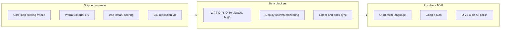

# Wottle beta relaunch — status and next priorities

## Verdict

The product is **feature-complete for an Icelandic closed/open beta**. Specs `001`–`019`, `042`, and `043` are on `main`; Warm Editorial Phases 1–6 are shipped (CLAUDE still marks Phase 6 “In progress” — stale). Last meaningful code landed ~July 7 (dictionary curation). Development has been quiet since; the gap is **stability + ops + backlog triage**, not missing game systems.

**Beta definition used here:** Icelandic invite playtest on Vercel + Supabase Cloud, username session auth acceptable. Full public MVP (Google auth + per-language deploy) comes after beta is stable.

---

## What is done

| Area                                                                                                                                                                         | Status                                                                                                      |
| ---------------------------------------------------------------------------------------------------------------------------------------------------------------------------- | ----------------------------------------------------------------------------------------------------------- |
| Lobby → matchmaking → 5-round match → scoring/freeze → rematch/Elo → disconnect/claim-win → profiles/landing                                                                 | Complete on `main`                                                                                          |
| Instant first-mover scoring ([O-57](https://linear.app/minni/issue/O-57), spec 042)                                                                                          | Shipped                                                                                                     |
| Scoring resolution clarity ([O-73](https://linear.app/minni/issue/O-73), spec 043)                                                                                           | Shipped (PR #239) — Linear still **In Review**                                                              |
| Dictionary curation / BÍN exclusions ([O-69](https://linear.app/minni/issue/O-69), [O-70](https://linear.app/minni/issue/O-70), [O-81](https://linear.app/minni/issue/O-81)) | Shipped July 7                                                                                              |
| Round-resolution hardening (silent scoring abort, stuck-round recovery)                                                                                                      | Shipped PRs #244–#246                                                                                       |
| Wordlists for IS/EN/NO/DK/SE                                                                                                                                                 | Files exist under `[data/wordlists/](data/wordlists/)`; deploy-per-language **not** productized             |
| Auth today                                                                                                                                                                   | Username + `wottle-playtest-session` cookie only (`[app/actions/auth/login.ts](app/actions/auth/login.ts)`) |

Config note: `[lib/constants/game-config.ts](lib/constants/game-config.ts)` has `maxRounds: 5` (not 10). Older Linear bugs that cite “round 10” need reinterpretation.

---

## Linear active board ([team O](https://linear.app/minni/team/O/active))

### Still open — do these for beta

| Issue                                       | Status      | Why it matters                                                                  |
| ------------------------------------------- | ----------- | ------------------------------------------------------------------------------- |
| [O-77](https://linear.app/minni/issue/O-77) | Todo        | Zero-score move: swap highlight hangs — breaks trust in scoring UX              |
| [O-78](https://linear.app/minni/issue/O-78) | In Progress | Swapped letter vanishes before scored word paints — related to reveal/fade path |
| [O-80](https://linear.app/minni/issue/O-80) | In Progress | Time-expired / waiting state too weak — clock is core tension                   |
| [O-75](https://linear.app/minni/issue/O-75) | Todo        | Parent “Review errors” — close once children done                               |

### Close / triage (stale)

| Issue                                                                                    | Action                                                                          |
| ---------------------------------------------------------------------------------------- | ------------------------------------------------------------------------------- |
| [O-73](https://linear.app/minni/issue/O-73) In Review                                    | Mark **Done** (spec 043 / PR #239)                                              |
| [O-56](https://linear.app/minni/issue/O-56) Backlog                                      | Likely fixed by [O-72](https://linear.app/minni/issue/O-72) — verify and close  |
| [O-61](https://linear.app/minni/issue/O-61), [O-66](https://linear.app/minni/issue/O-66) | Re-reproduce on current `main`; many symptoms addressed by 042/043/reveal fixes |
| [O-60](https://linear.app/minni/issue/O-60)                                              | Re-check against `maxRounds: 5` + dual-clock end rules                          |

### Defer past beta (keep on board, don’t start)

| Issue                                                                                                                  | Reason                                               |
| ---------------------------------------------------------------------------------------------------------------------- | ---------------------------------------------------- |
| [O-48](https://linear.app/minni/issue/O-48) Multi-language epic                                                        | June plan Phase 2 — after Icelandic beta             |
| [O-76](https://linear.app/minni/issue/O-76) UI overhaul + [O-55](https://linear.app/minni/issue/O-55) resign placement | Polish, not launch-blocking                          |
| [O-84](https://linear.app/minni/issue/O-84) Reading-direction affordance                                               | Nice UX; helps scoring confusion but not a beta gate |

### Missing from Linear (create when restarting)

- **Google auth + username linking** (June Phase 3) — no O-issue exists
- **Production hardening**: Sentry/APM, cold-start dictionary SLA, Realtime limits
- Remaining correctness smell: `[ensureBoardSnapshot](lib/match/stateLoader.ts)` still regenerates a **random** board on parse failure (quality review §3; scoring abort §1 was fixed)

Ops: [O-63](https://linear.app/minni/issue/O-63) (GitHub secrets for `deploy-migrations.yml`) is still Backlog — needed if prod migrations auto-push.

Project [Orðusta MVP](https://linear.app/minni/project/ordusta-mvp-c9aa8dfefabd) is still **Backlog** with target date **2026-05-22** (past) — refresh status/dates when relaunching.

---

## Recommended work order

### Week 0 — Relaunch hygiene (1–2 days)

1. Merge open docs PR [#249](https://github.com/minniai/wottle/pull/249) (README truth-up).
2. Sync Linear: Done on O-73; triage O-56/O-61/O-66/O-60; refresh MVP project dates.
3. Smoke two-player match on current staging/prod URL (`wottle.vercel.app` appears in old issues) — confirm Realtime + cold start.

### Week 1 — Playability bugs (highest product impact)

Clear the [O-75](https://linear.app/minni/issue/O-75) cluster in order:

1. **O-77** — zero-score path must clear swap highlight / lock state.
2. **O-78** — keep swap highlight until score reveal, then transition to scored/frozen.
3. **O-80** — stronger time-expired + waiting affordances (builds on shipped [O-59](https://linear.app/minni/issue/O-59) timers).

Touch points: `[components/match/MatchClient.tsx](components/match/MatchClient.tsx)`, `[components/game/BoardGrid.tsx](components/game/BoardGrid.tsx)`, reveal/fade helpers from specs 042/043 (`revealFadeTiles`, `currentRoundScored`, partial summary).

### Week 2 — Beta ops gate

1. Complete [O-63](https://linear.app/minni/issue/O-63) migration secrets; verify `deploy-migrations.yml` against prod.
2. Confirm Vercel env + Supabase Cloud for beta (see `[docs/technical_documentation/260316-staging-deployment-analysis.md](docs/technical_documentation/260316-staging-deployment-analysis.md)`).
3. Add Sentry (CLAUDE P0); watch cold-start dictionary load (~2s first hit).
4. Fix `ensureBoardSnapshot` fail-loud (small correctness fix before inviting strangers).

### Then — invite Icelandic beta

Username auth is enough for invite beta. Run a short playtest loop; file new Linear bugs from real sessions before starting O-48 / Google auth.

### After beta — June MVP Phases 2–3

1. **O-48**: env/deploy-per-language (`GAME_LOCALE` + wordlist selection; separate URLs).
2. **Google auth** via Supabase Auth + username claim (create epic; see `[docs/prd_and_requirements/wottle_user_management.md](docs/prd_and_requirements/wottle_user_management.md)`).
3. Quality/structure: MatchClient split, layering inversion (quality review §4–6) as capacity allows.

---

## Explicit non-priorities for beta

- Bot opponents, spectate, replay (design deferred)
- Full EN↔IS UI i18n (`next-intl`) — separate from dictionary deploy
- Legacy `boards` table drop (cleanup only)
- Broad UI overhaul (O-76)

---

## Doc drift to fix while relaunching

- `[CLAUDE.md](CLAUDE.md)`: add 043 to completed specs; Phase 6 → Merged; Theme “Phase 1–3” → through 6; Node 20 → 22
- Linear O-73 / project dates
- June plan Phase 1 (opponent move reveal) is effectively done via 042 — mark complete in planning docs when convenient

