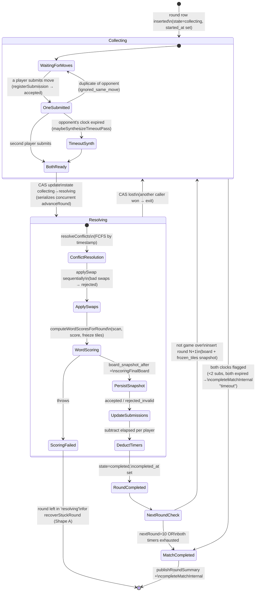

---
config:
  layout: dagre
  theme: mc
id: f2a35145-5458-4eea-8d69-b6b621575aa0
---

# Stöðumynd fyrir eina Round

```mermaid
stateDiagram
      [*] --> Collecting : round row inserted\n(state=collecting, started_at set)

      state Collecting {
          [*] --> WaitingForMoves
          WaitingForMoves --> OneSubmitted : a player submits move<br>(registerSubmission → accepted)
          OneSubmitted --> WaitingForMoves : duplicate of opponent<br>(ignored_same_move)
          OneSubmitted --> BothReady : second player submits
          OneSubmitted --> TimeoutSynth : opponent's clock expired<br>(maybeSynthesizeTimeoutPass)
          TimeoutSynth --> BothReady
      }

      Collecting --> MatchCompleted : both clocks flagged<br>(<2 subs, both expired →\ncompleteMatchInternal "timeout")

      BothReady --> Resolving : CAS update\nstate collecting→resolving<br>(serializes concurrent advanceRound)
      Resolving --> Collecting : CAS lost\n(another caller won → exit)

      state Resolving {
          [*] --> ConflictResolution : resolveConflicts\n(FCFS by timestamp)
          ConflictResolution --> ApplySwaps : applySwap sequentially\n(bad swaps → rejected)
          ApplySwaps --> WordScoring : computeWordScoresForRound\n(scan, score, freeze tiles)
          WordScoring --> ScoringFailed : throws
          WordScoring --> PersistSnapshot : board_snapshot_after =\nscoringFinalBoard
          PersistSnapshot --> UpdateSubmissions : accepted / rejected_invalid
          UpdateSubmissions --> DeductTimers : subtract elapsed per player
      }

      ScoringFailed --> [*] : round left in 'resolving'\nfor recoverStuckRound (Shape A)

      DeductTimers --> RoundCompleted : state=completed,\ncompleted_at set

      RoundCompleted --> NextRoundCheck

      state NextRoundCheck <<choice>>
      NextRoundCheck --> Collecting : not game over\ninsert round N+1\n(board + frozen_tiles snapshot)
      NextRoundCheck --> MatchCompleted : nextRound>10 OR\nboth timers exhausted

      MatchCompleted --> [*] : publishRoundSummary +\ncompleteMatchInternal
```
