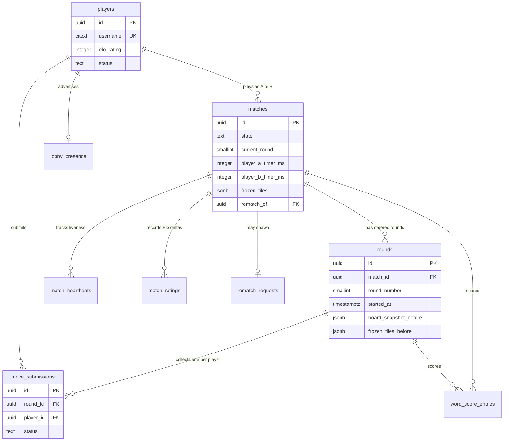

# Data Model & Persistence

Wottle stores all durable game state in a Supabase Postgres database. The schema is
built up through ordered SQL migrations under `supabase/migrations/`, evolving from
a single-board MVP into a two-player, server-authoritative match engine with Elo
ratings, rematch chains, and a disconnect safety net. This page catalogs the core
tables and their roles, the invariants Postgres itself enforces, the columns that
drive server-authoritative timing, and the Row-Level Security (RLS) posture.

Almost all writes are server-side: the match engine and API routes use the Supabase
`service_role`, which bypasses RLS. RLS therefore exists primarily to constrain what
authenticated end-user clients can *read* and the narrow set of rows they can *write*
directly (their own presence, their own move submission, their own profile).

Related runtime and operational pages: match-runtime (round lifecycle and clock
enforcement), matchmaking-lobby (presence and pairing), and the migrations
operations page (applying and verifying schema changes).

## Entity relationships

The heart of the schema is the `matches` → `rounds` → `move_submissions` chain,
anchored by `players`.

Entities and their relationships in the match subsystem.

## Core tables and their roles

- **`boards`** and **`moves`** (`20251105001_init.sql`): the original single-board MVP.
  `boards` holds one `grid` (`jsonb`) constrained to a singleton row, and `moves` is
  an append-only log of accepted/rejected swaps against that board. These predate the
  two-player match model and are governed by their own service/anon policies.
- **`players`** (`20251115001_playtest.sql`): the identity/profile table. `username`
  is a `citext` unique column; `status` tracks lobby state (`available`,
  `matchmaking`, `in_match`, `offline`). The Elo migration later added
  `elo_rating` plus `games_played`, `wins`, `losses`, `draws`.
- **`lobby_presence`**: ephemeral matchmaking presence keyed by `player_id`, carrying
  a `connection_id`, a `mode` (`auto` or `direct_invite`), an optional `invite_token`,
  and an `expires_at` used to detect stale presence.
- **`matches`**: the top-level game record — the two participants, `state`,
  `current_round`, per-player timers, `round_limit`, `winner_id`, `ended_reason`, and
  the cumulative `frozen_tiles` map. Later migrations added `completed_at`, and
  `rematch_of` for series chaining.
- **`rounds`**: ordered rounds within a match, unique on `(match_id, round_number)`,
  each carrying board snapshots and the timing/scoring baseline columns described below.
- **`move_submissions`**: at most one swap per player per round (unique on
  `(round_id, player_id)`), with a `status` enum describing how the submission was
  resolved.
- **`word_score_entries`**: per-word scoring rows for a round (letters points, length
  `bonus_points`, `total_points`, tile coordinates), plus an `is_duplicate` flag.
- **`scoreboard_snapshots`** and **`match_logs`**: per-round score snapshots and an
  event log for a match.
- **`match_invitations`**: direct-invite flow between a sender and recipient.
- **`match_heartbeats`** (`20260423001_match_heartbeats.sql`): per-player liveness
  rows keyed on `(match_id, player_id)`, upserted on every state poll.
- **`match_ratings`** (`20260315001_elo_rating.sql`): per-match, per-player Elo
  snapshot (`rating_before`, `rating_after`, `rating_delta`, `k_factor`, `match_result`).
- **`rematch_requests`** (`20260316001_rematch.sql`): one request per completed match
  (unique on `match_id`), linking a requester and responder and, once accepted, the
  `new_match_id` it produced.

Frozen tiles are not their own table: they live as a cumulative `jsonb` map in
`matches.frozen_tiles`, keyed by `"x,y"` coordinate strings with an `owner` value
(`20260214001_frozen_tiles.sql`). A follow-up added `rounds.frozen_tiles_before` so
both scoring paths score against the same pre-round baseline.

## Match / round / submission relationship and timing

A `match` is server-authoritative: clients never own the clock. Timing is driven by a
small set of columns.

- **`rounds.started_at`** records the server timestamp when a round entered the
  `collecting` state, set by the round engine when it creates the round
  (`20260225001_match_completion.sql`). Per-player elapsed time is computed from it,
  rather than trusting client-reported durations.
- **`matches.player_a_timer_ms`** and **`matches.player_b_timer_ms`** hold each
  player's remaining chess-clock budget (default `300000` ms). They are decremented
  server-side as rounds resolve.
- **`matches.current_round`** points at the active round number, and
  **`matches.state`** (`pending`, `in_progress`, `completed`, `abandoned`) drives the
  match lifecycle; **`rounds.state`** (`collecting`, `resolving`, `completed`) drives
  the per-round lifecycle.

The one-submission-per-player-per-round invariant (`unique (round_id, player_id)`)
means the round engine can treat the pair of submissions as a complete set and resolve
deterministically. `rounds.board_snapshot_before` / `board_snapshot_after` and
`frozen_tiles_before` preserve the exact inputs each round scored against, so scoring
is reproducible regardless of concurrent mid-round writes.

`matches`, `rounds`, `move_submissions`, `lobby_presence`, and `match_invitations` are
added to the `supabase_realtime` publication with `replica identity full`
(`20251119001_enable_realtime.sql`) so state changes broadcast to subscribed clients.

## DB-enforced invariants

The schema pushes safety into Postgres constraints and functions rather than relying
on application code alone:

- **Singleton primary board**: `boards.board_id` defaults to `'primary-board'` and a
  `boards_singleton` CHECK forbids any other value, so there is exactly one canonical
  board row.
- **Square board grid**: `board_grid_is_square(grid jsonb)` verifies the grid is a
  non-empty array of rows whose length equals the row count; a CHECK
  (`boards_grid_is_square`) rejects any non-square grid at write time.
- **Coordinate-in-bounds**: `board_coordinate_in_bounds(board, coordinate)` (built on
  `board_max_index`) gates every `moves` coordinate column, so no move can reference a
  cell outside the board. `move_submissions` uses simpler literal bounds
  (`between 0 and 9`) matching the 10×10 playtest board.
- **Move / submission result enums**: `moves.result` is constrained to
  `('accepted','rejected')`, and `move_submissions.status` to
  (`pending`, `accepted`, `rejected_invalid`, `ignored_same_move`, `timeout`), so only
  well-defined resolution states can be persisted.
- **Match / round enums and bounds**: `matches.state`, `matches.ended_reason` (later
  extended to include `abandoned`), `matches.round_limit` (`between 1 and 20`), and
  `rounds.state` are all CHECK-constrained.
- **Rating consistency**: on `players`, `elo_rating >= 100`, all stat counters are
  non-negative, and `games_played = wins + losses + draws` is enforced by CHECK.
  `match_ratings.k_factor` is constrained to `(16, 32)`.
- **Uniqueness guards**: `rounds (match_id, round_number)`,
  `move_submissions (round_id, player_id)`,
  `match_ratings (match_id, player_id)`, and `rematch_requests (match_id)` prevent
  duplicate rows for the same logical unit of state.

These invariants exist because the match engine is concurrent and server-authoritative:
constraints make illegal states unrepresentable even if two requests race, and keep
scoring and timing reproducible.

## Row-Level Security

`boards` and `moves` shipped with RLS from the start: a `service_all_*` policy for
`service_role` and an `anon_read_boards` read policy. The nine tables added by the
playtest migration were originally created **without** RLS; `20260325001_rls_playtest_tables.sql`
closes that gap by enabling RLS and defining read/write policies for each table.

The policy design is consistent:

- **Reads are scoped to participants or authenticated users.** `players` and
  `lobby_presence` are readable by any authenticated user (needed for lobby and
  opponent display). `matches` are readable by their two participants; `rounds`,
  `move_submissions`, `word_score_entries`, `scoreboard_snapshots`, `match_logs`, and
  `match_heartbeats` each gate reads on an `EXISTS` check that the caller is a
  participant of the parent match.
- **Direct client writes are minimal and self-scoped.** Players may update only their
  own profile (`id = auth.uid()`), upsert/delete only their own `lobby_presence`,
  insert only their own `move_submissions` (`player_id = auth.uid()`), and send/respond
  to their own `match_invitations`.
- **All other writes go through `service_role`,** which bypasses RLS. `match_ratings`
  makes this explicit with `WITH CHECK (false)` / `USING (false)` write policies, so no
  client can forge a rating change.
- **Anonymous users get nothing** on the playtest tables.

### How coverage is verified

`supabase/policies/policies.snapshot.json` is a committed snapshot of every RLS policy
across the tracked tables. It is produced by the `supabase:policies` script
(`scripts/supabase/policies/check.ts`), which connects to the database, queries
`pg_policies` for the tracked `TABLES` list, and writes the ordered result. Because the
snapshot is checked in, drift between the migrations' intended policies and the
database's actual policies becomes a reviewable diff — a change that adds, removes, or
alters a policy without regenerating the snapshot shows up in code review.

## Mapping to `lib/types`

TypeScript interfaces in `lib/types` describe the shapes the application works with;
they are not the DB rows themselves. Row-to-type mapping happens explicitly at the data
boundary, converting `snake_case` columns to `camelCase` fields:

- `lib/types/match.ts` defines the domain and DTO types: `PlayerIdentity`,
  `MatchState`, `RoundSummary`, `SubmissionStatus`, `FrozenTileMap`, `RematchRequest`,
  Elo types, and so on. Some of these mirror DB rows closely (`MoveSubmission` uses
  `snake_case` because it is a near-verbatim row shape); most are richer projections
  assembled server-side.
- `lib/types/board.ts` defines `Coordinate`, `BoardGrid`, and Zod schema factories that
  validate coordinates and grids against the active `GameConfig` — the application-side
  analog of the DB's bounds and square-grid CHECKs.
- Mapping functions do the translation. `mapPlayer` in `lib/matchmaking/service.ts`
  turns a `players` row into a `PlayerIdentity` (`display_name` → `displayName`,
  `avatar_url` → `avatarUrl`, `elo_rating` → `eloRating`), and
  `mapPlayerRow` in `lib/match/stateLoader.ts` builds match-time player profiles the
  same way (with fallbacks when a row is missing).

Because the DTO types are decoupled from raw rows, the same enum concept can appear
under different names across the stack — for example the length bonus is
`word_score_entries.bonus_points` in the DB, `bonusPoints` in the `WordScore` broadcast
type, and `lengthBonus` in `WordScoreBreakdown`, all denoting `(word_length - 2) * 5`.
