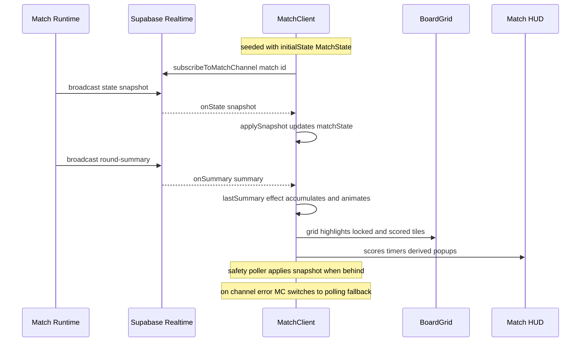

# Frontend & Client State

The frontend is the Next.js App Router client layer that presents matches, the
lobby, matchmaking, and player profiles. Its defining architectural rule is that
**the client renders authoritative state produced by the server and never
computes game outcomes itself**. Scores, round summaries, timers, and match
completion all originate server-side and arrive over Supabase Realtime (with a
REST/poller fallback); the client's job is to display them, animate the
transitions between them, and provide sensory and accessibility feedback. All
client-only transforms are presentation shaping of that authoritative data, not
game logic.

## Root layout and global chrome

`app/layout.tsx` is the root shell. It loads the two brand fonts (Fraunces as
`--font-fraunces` for display, JetBrains Mono as `--font-jetbrains-mono` for
mono), imports the global and feature stylesheets, and wraps every route in a
`ToastProvider` and a persistent `TopBar`. The `TopBar` lives above every route
including match pages, which is why match views publish the viewer's color to a
global store rather than passing it down (see
[Self color store](#self-color-store)).

## Component structure

The client is organized by surface, each directory a cohesive feature area:

- **`components/game`** — the interactive board. `BoardGrid` is the large,
  stateful grid that renders tiles, handles selection and swap interaction, runs
  FLIP swap animations, and paints the many overlay layers (frozen tiles,
  locked-swap lifts, per-player scored-tile highlights, opponent reveals).
  `Board` is a lighter wrapper that owns an optimistic grid plus `MoveFeedback`.
- **`components/match`** — the in-match HUD and panels (player panels, HUD cards,
  round history, scored-words and tiles-claimed cards, timer display,
  disconnection modal, score-delta popup) and the post-game surfaces
  (`FinalSummary`, scoreboard, verdict, round-by-round chart, rematch banner).
- **`components/lobby`** and **`components/matchmaking`** — lobby directory,
  invites, "play now"/queue entry, and the matchmaking search experience.
- **`components/profile`** and **`components/player`** — profile page, rating
  chart, match history, and the player-profile modal.
- **`components/ui`** — shared Warm Editorial primitives (`Button`, `Card`,
  `Badge`, `Avatar`, `Dialog`, `Toast`/`ToastProvider`, `TopBar`, `GearMenu`,
  `SettingsPanel`, `UserMenu`).

## MatchClient: the authoritative-state consumer

`components/match/MatchClient.tsx` is the heart of the in-match UI and the
clearest example of the render-authoritative-state pattern. It is seeded with an
`initialState: MatchState` from the server, then keeps a single `matchState`
React state object that is replaced only by server snapshots — never by locally
computed scoring.

### Subscription and fallback transports

MatchClient runs three overlapping transports so a client never gets stuck on a
stale round:

1. **Realtime (primary).** It subscribes to `match:${matchId}` via
   `subscribeToMatchChannel`, handling `state` broadcasts (`onState` →
   `applySnapshot`), `round-summary` broadcasts (`onSummary`), presence
   `onOpponentLeave`, and channel errors. On channel error or CLOSED it flips to
   polling.
2. **Primary polling (fallback).** Only when Realtime is confirmed down
   (`usePolling`), it polls `/api/match/{matchId}/state` on an interval and
   applies each snapshot.
3. **Background safety-net poller (always on).** A slow (2 s) poller runs even
   while Realtime is primary; it fetches and applies a snapshot only when
   `shouldApplySafetySnapshot` decides the client is behind (round advance, match
   completion, disconnect flips, mid-round instant-scoring changes). This
   recovers from silent Realtime delivery failures.

Caption: MatchClient subscribes to Realtime, folds each authoritative snapshot
and summary into local state, and drives the board and HUD from it, with polling
and a safety-net poller as recovery paths.

### applySnapshot invariants

`applySnapshot` merges a server snapshot into local state but deliberately guards
two race conditions: it preserves the previously-seen non-zero `scores` when a
snapshot reports zeros (round advanced before the scoreboard row was written),
and preserves `lastSummary` when the snapshot omits it. This keeps the displayed
scoreboard monotonic even when snapshots temporarily under-report.

### Animation and reveal state machine

MatchClient owns a large amount of transient presentation state that sequences
the round transition without ever recomputing scores: a `round-recap`
`animationPhase`, per-tile `highlightPlayerColors` and a persistent
`currentRoundScored` map, move-lock state (`moveLocked`, `lockedSwapTiles`),
opponent mid-round swap reveal (`externalSwap`, `opponentSwapTiles`, dedupe refs
keyed by `${playerId}-${submittedAt}`), instant-scoring partial reveals, and a
round-announce overlay. The recap is driven off `matchState.lastSummary` as the
single source of truth so it fires reliably regardless of whether the `state` or
`round-summary` broadcast arrives first, deduped by `${matchId}-${roundNumber}`.

### Clock display

The HUD clock is a local visual tick, not a client-owned timer. MatchClient reads
the authoritative `remainingMs`/`status` from `matchState.timers`, resets a local
reference whenever the server sends new timer data, and decrements the *displayed*
seconds locally between updates. Enforcement of timeouts remains server-side; the
client only smooths the display.

### Board submission path

Tile swaps are submitted by `BoardGrid` through `POST /api/match/{matchId}/move`
(`submitSwapRequest`), not through client scoring. The server returns the move
result and the authoritative board; the client applies it optimistically and then
reconciles against the next state snapshot. MatchClient locks the board after a
submit until that round's scoring is revealed.

## Presentation-only derive helpers

The `derive*` helpers under `components/match` (and `components/profile`) are pure
transforms that reshape authoritative data for display. They contain no game
rules and compute no authoritative scores; they only re-slice values the server
already produced:

- `deriveScoreDelta` — splits a round summary's per-player words into
  `letterPoints`/`lengthBonus` for the score-delta popup, returning `null` when
  the player scored zero.
- `deriveRoundHistory` — buckets accumulated word/score rows by round into
  per-player slices for the round history panel.
- `deriveClockUrgency` — maps `status` + remaining seconds to a `ClockTone`
  (active/warning/critical/expired/waiting) and urgency ratio, shared by desktop
  and mobile clocks so they never drift.
- `deriveHighlightPlayerColors` / `derivePostGameHighlightColors`,
  `deriveRevealSequence`, `deriveCallouts` (`deriveBiggestSwing`,
  `deriveHighestScoringWord`), and the `lib/match` partial-reveal / current-round
  helpers similarly shape reveal ordering, highlight colors, and callouts from the
  authoritative summary.

## Client state management

### Local React state

The dominant state store is MatchClient's own `useState`/`useRef` set described
above. Transient match presentation lives here rather than in a global store
because it is scoped to a single match view's lifecycle.

### Zustand stores

Two global stores use Zustand (`lib/match/selfColorStore.ts`,
`lib/match/timerStore.ts`):

#### Self color store

`useSelfColorStore` holds the current viewer's slot color (a design token such as
`var(--p2)`) while a match is active. Because the `TopBar` avatar sits above match
routes in the root layout, it cannot read match state directly; match views
(`MatchClient`, `FinalSummary`) publish the viewer's color on mount and clear it
on unmount so the global avatar stays consistent with how the player is colored
inside the match. Outside a match the value is `null` and the avatar falls back to
its identity gradient.

#### Timer store

`useTimerStore` is a Zustand store modeling per-slot timer state and pause flags.
It is defined and unit-tested but is not the path that drives the live HUD clock —
MatchClient reads authoritative timer data from the match snapshot and renders its
own local tick. Treat the store as the timer-state abstraction; the rendered clock
is driven from `matchState.timers`.

### Persisted preferences

`lib/preferences/useSensoryPreferences.ts` reads and writes sensory preferences
(sound and haptics enabled) to `localStorage` under a fixed key, seeded from
`SENSORY_PREFERENCES_DEFAULT`. The `GearMenu`/`SettingsPanel` UI toggles these,
and MatchClient passes them into the audio and haptics hooks.

## Sensory feedback

MatchClient wires three feedback systems, all gated by preferences and reduced
motion:

- **Audio** — `lib/audio/useSoundEffects.ts` synthesizes tones with the Web Audio
  API (tile select, valid swap, invalid move, word discovery, match start/end).
  It lazily creates and closes an `AudioContext` and no-ops when sound is
  disabled.
- **Haptics** — `lib/haptics/useHapticFeedback.ts` triggers `navigator.vibrate`
  with fixed patterns for valid swap, invalid move, and match start/end, no-oping
  when haptics are disabled or the API is unavailable.
- **Reduced motion** — MatchClient reads
  `prefers-reduced-motion: reduce` via `matchMedia` and, when set, skips the
  recap highlight animation entirely while still applying the static scored-tile
  mark, so the game remains fully playable without motion.

## Accessibility

Accessibility is delivered through ARIA live regions and focus management rather
than a single component:

- **Live announcements.** `MoveFeedback` renders an `aria-live` region (polite for
  success, assertive for errors) plus a `role="status"`/`role="alert"` toast, so
  move results are announced to assistive technology. Live regions also appear in
  `Toast`/`ToastProvider`, the disconnection modal, the round summary panel, and
  the score-delta popup.
- **Focus and roles.** `lib/a11y` provides `useFocusTrap` and `rovingFocus`
  helpers for dialogs and grid-like navigation; UI toggles use `role="switch"`
  with `aria-checked`, and interactive surfaces carry visible focus rings.

## Warm Editorial visual system

The visual language is the "Warm Editorial" theme defined in `tailwind.config.ts`:
an OKLCH paper/ink palette with `ochre` and per-player `p1`/`p2` families, brand
scales, `surface`/`text`/`accent` semantic aliases, Fraunces (display) and
JetBrains Mono fonts, and named swap/shake/highlight transition durations. Prefer
Tailwind utility classes; `lib/ui/tokens.ts` mirrors the brand/surface/text/accent
scales as raw hex for the few TS contexts (canvas avatar gradients, inline styles)
that need literal values, and `lib/ui/avatarGradient.ts` derives deterministic
avatar gradients. Shared primitives in `components/ui` build the rest of the
chrome on top of this theme.

## Lobby, matchmaking, and profile

- **Matchmaking** — `MatchmakingClient` polls the `startQueue` server action while
  searching, transitions through `searching → found → starting` phases with timed
  holds, then routes to the match. Like the match view, it renders
  server-authoritative queue/match results and owns only presentation timing.
- **Lobby** — `components/lobby` renders the directory, invites, stats, and
  play-now entry points that feed into matchmaking.
- **Profile** — `components/profile` renders the profile page, rating chart, and
  match history; `deriveProfileChartData` shapes rating history for the chart the
  same presentation-only way the match derives work.

## Related pages

- **Realtime & presence** (`realtime-and-presence`) — the `match:${matchId}`
  channel, broadcast events, and presence semantics this UI subscribes to.
- **Match runtime** (`match-runtime`) — the server that produces the authoritative
  `MatchState`, round summaries, timers, and completion this UI renders.
- **Play a match** (`play-a-match`) — the end-to-end player workflow across these
  surfaces.
