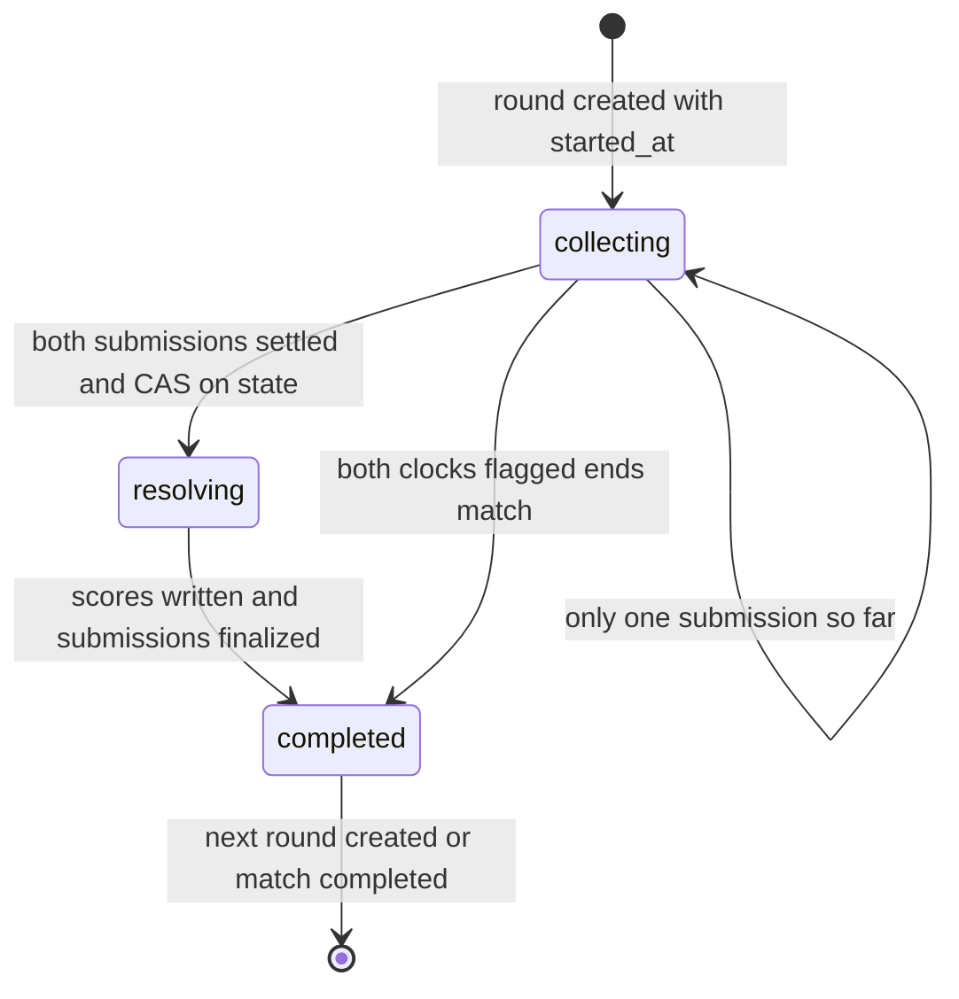
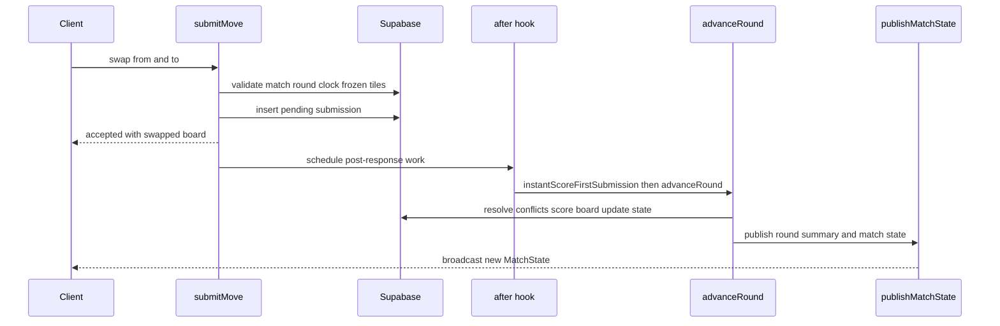

# Match & Round Runtime

Wottle runs a two-player word duel as a **server-authoritative** match engine.
Clients submit exactly one tile swap per round; the server owns the board, the
clocks, conflict resolution, scoring, and every state transition. All engine
writes go through the Supabase `service_role`, so the runtime — not the browser
— decides what happened in each round.

This page traces the match lifecycle end to end: how a round collects both
players' moves, how `advanceRound` resolves once both submissions are settled,
how the chess clock is enforced against `rounds.started_at`, how the
instant-scoring fast path reveals the first mover's words mid-round, how stalled
pipelines self-heal, and how a match finally completes and triggers Elo.

**Game-rules guardrail.** This page documents the *runtime mechanics* only. The
substance of scoring, word validation, and freezing lives in the game-rules
concept pages: see the scoring concept page, the board & words concept page, the
frozen-tiles concept page, and the round-resolution workflow page. Where this
page mentions "score the round" or "froze tiles," treat those concept pages as
authoritative for *what* the rules are; here we cover *when and how* the runtime
invokes them.

## States and phases

Two nested state machines govern the runtime: the **match** state and the
per-**round** phase.

Match `state` (`matches.state`) moves `pending → in_progress → completed`
(with `abandoned` as an alternate terminal). A match is created `pending`; the
first `/state` read for a `pending` match lazily seeds round 1, flips the match
to `in_progress`, and sets `current_round = 1`
([`loadMatchState`](repo://lib/match/stateLoader.ts#L405-L433)).

Round `phase` (`rounds.state`) moves `collecting → resolving → completed`. The
pure helpers in [`stateMachine.ts`](repo://lib/match/stateMachine.ts) model this
in-memory: `registerSubmission` marks the round `resolving` once both slots are
non-`pending`, `markRoundCompleted` flips it to `completed`, and
`nextRoundNumber` returns `null` at the round limit (default 10). The database
transitions are driven by [`advanceRound`](repo://lib/match/roundEngine.ts),
which uses `resolving` as a lock (see below), not merely a display phase.

*Round lifecycle phases as enforced by `advanceRound` in `roundEngine.ts`.*

The presentation layer collapses these for the client: `mapState` in
`stateLoader.ts` reports a *completed round while the match is still
in_progress* as `resolving`, so a finished round is never mistaken for a
finished match, and match-level terminal states (`completed`, `abandoned`,
`pending`) always take precedence over the round phase
([`mapState`](repo://lib/match/stateLoader.ts#L94-L121)).

## Submitting a move

[`submitMove`](repo://app/actions/match/submitMove.ts) is the sole client
entrypoint into the round. It is a rate-limited server action (30 submissions
per 60s per player) that validates and records one swap, then hands the heavy
work to post-response hooks. Before inserting, it enforces a chain of guards:

- the match must be `in_progress` and the caller must be player A or B;
- the current round must be in `collecting`;
- the caller's **server-authoritative clock must not be expired** (see below);
- coordinates must be in bounds and not a self-swap;
- neither endpoint may be a currently **frozen** tile
  ([frozen-tile gate](repo://app/actions/match/submitMove.ts#L118-L137));
- the player must not already have a submission for the round (also enforced by
  a `(round_id, player_id)` unique constraint, caught as Postgres `23505`).

On success it inserts a `pending` row into `move_submissions`, returns the
optimistically-swapped board for immediate UI feedback, and schedules two
Next.js [`after()`](repo://app/actions/match/submitMove.ts#L182-L228) hooks that
run post-response at full serverless CPU: one broadcasts state so the opponent
sees the submitter's timer pause, and one runs
`instantScoreFirstSubmission` **then** `advanceRound` sequentially.

*Post-response flow: submitMove records the move, then the after hook fires the fast path and advanceRound, which publishes the new state.*

## Resolving a round: advanceRound

[`advanceRound`](repo://lib/match/roundEngine.ts#L140-L516) is the heart of the
engine and is idempotent-by-guard: it only proceeds when the match is
`in_progress` and the current round is still `collecting`. Its pipeline:

1. **Collect submissions.** Read all `pending` submissions for the round.
2. **Both-flagged shortcut.** If fewer than two submissions exist and both
   players' clocks have expired, complete the match immediately with reason
   `timeout` (the chess "mutual flag" case)
   ([both-flagged branch](repo://lib/match/roundEngine.ts#L194-L211)).
3. **Synthesize a timeout pass.** If exactly one player submitted and the
   *absent* player's clock has expired, insert a synthetic `timeout`
   submission for them so resolution can proceed
   ([`maybeSynthesizeTimeoutPass`](repo://lib/match/roundEngine.ts#L80-L115)).
4. **Wait if incomplete.** With fewer than two settled submissions, return
   `waiting` and leave the round `collecting`.
5. **Resolve conflicts.** Timeout submissions are filtered out (they lock no
   tiles), and the remaining moves go through
   [`resolveConflicts`](repo://lib/match/conflictResolver.ts).
6. **Apply swaps.** Accepted moves are applied sequentially to the round's
   `board_snapshot_before` via `applySwap`; a swap that throws is demoted to
   rejected.
7. **CAS lock into `resolving`.** A conditional update sets `state = 'resolving'`
   *only where* `state = 'collecting'`. This serializes the two `advanceRound`
   hooks that both players' near-simultaneous submissions produce — the loser of
   the compare-and-swap exits cleanly, preventing duplicate `word_score_entries`
   ([CAS transition](repo://lib/match/roundEngine.ts#L266-L292)).
8. **Score the round.** `computeWordScoresForRound` scores against the freeze
   baseline as of round start (`rounds.frozen_tiles_before`), writes
   `word_score_entries`, and returns the freeze-aware final board.
9. **Persist and finalize.** The word engine's authoritative board is saved to
   `board_snapshot_after`, submission statuses are updated to `accepted` /
   `rejected_invalid` in parallel, and the round is marked `completed`.
10. **Deduct clocks, advance, publish.** Elapsed time is deducted from each
    player's timer, the next round is created (or the match completed), and the
    round summary + match state are published.

The word engine's `scoringFinalBoard` — not the raw post-swap board — is what
seeds the next round's `board_snapshot_before`, because a same-round move can be
rejected mid-pipeline when an earlier player's word froze the tiles it would
have touched
([next-round board seeding](repo://lib/match/roundEngine.ts#L408-L426)).

If scoring throws, `advanceRound` **re-raises** rather than swallowing the
error: the round is deliberately left in `resolving` (already CAS-locked) so the
recovery path can roll it forward idempotently, instead of persisting an
unscored board as if resolution had succeeded
([abort-on-scoring-failure](repo://lib/match/roundEngine.ts#L325-L340)).

### Conflict resolution

[`resolveConflicts`](repo://lib/match/conflictResolver.ts#L8-L47) implements
first-come-first-served tile locking. Submissions are sorted by `created_at`;
each move's two coordinates are checked against a set of already-locked tiles.
If either endpoint is locked, the move is rejected (`rejection_reason` "Tile
conflict with earlier submission"); otherwise it is accepted and both endpoints
are locked. This is how two players contending for overlapping tiles in the same
round are arbitrated — the earlier valid submission wins.

## Server-authoritative clock enforcement

The chess clock is computed, never trusted from the client. Each round row
carries `started_at`; each player carries a stored remaining budget
(`matches.player_a_timer_ms` / `player_b_timer_ms`, defaulting to 300000ms).
The pure functions in [`clockEnforcer.ts`](repo://lib/match/clockEnforcer.ts)
derive everything deterministically from an injectable `now`:

- `computeRemainingMs` = `storedRemainingMs − (now − started_at)`, floored at 0;
- `isClockExpired` is true when remaining time reaches 0;
- `computeElapsedMs` is how much time a submission consumed since round start.

`submitMove` gates every submission on `isClockExpired`: an expired player is
rejected with "Your time has expired" and `advanceRound` is fired in the
background so the server can synthesize the expired player's timeout pass or
complete a mutually-flagged match
([clock gate](repo://app/actions/match/submitMove.ts#L75-L90)). At resolution,
`advanceRound` deducts each player's *actual* elapsed-to-submission time from
their stored timer; a player with no submission keeps their timer unchanged
([`deductTimerMs`](repo://lib/match/roundEngine.ts#L117-L125)). A round is the
last one when `current_round + 1` exceeds 10 **or** both timers reach 0.

On the read path, `loadMatchState` recomputes each player's live remaining time
from `started_at` while `collecting`, marks a player who already submitted as
`paused`, and exposes `expired` once the match is `completed`
([timer derivation](repo://lib/match/stateLoader.ts#L486-L606)).

## Instant-scoring fast path (spec 042)

Normally a round's words are revealed only after *both* players submit. The
instant-scoring fast path reveals the **first mover's** scored words and freezes
on both boards immediately, closing the awkward gap where the first player sees
nothing until their opponent moves.
[`instantScoreFirstSubmission`](repo://lib/match/instantScoring.ts#L102-L286)
runs in `submitMove`'s `after()` hook, *before* `advanceRound`, and is always
best-effort — its return value is ignored and any failure is non-fatal.

Its control flow and guards:

- **Race window (FR-007).** If two or more pending submissions already exist,
  or the round is no longer `collecting`, it returns `deferred-to-combined`
  and does no scoring — the combined `advanceRound` path handles it instead
  ([race-window checks](repo://lib/match/instantScoring.ts#L170-L189)).
- **Shared baseline.** It scores the first mover's single move against the same
  round-start freeze map (`frozen_tiles_before`) that `advanceRound` uses, so
  the later combined pass re-derives identical words rather than rejecting the
  first mover's swap on their own freshly-frozen tiles.
- **Pre-write guard.** After warming the Icelandic dictionary (the dominant
  cold-start cost), it *re-reads the round state* and aborts if the round is no
  longer `collecting`. Scoring writes are delete-then-insert on the round's
  `word_score_entries`, so this guard prevents a detached, timed-out run from
  wiping the canonical combined entries
  ([pre-write recheck](repo://lib/match/instantScoring.ts#L217-L233)).
- **Zero-score guard.** If the first mover's swap produced no valid words, it
  returns `no-score` without publishing a partial reveal
  ([zero-score branch](repo://lib/match/instantScoring.ts#L257-L259)).
- **Timeout budget.** The whole run races an internal 5000ms timeout
  (`INSTANT_SCORING_TIMEOUT_MS`), sized to absorb a cold dictionary load and
  cross-region round-trips on serverless; on timeout it logs and returns
  `failed`, and the combined path proceeds normally.

On success it writes the first mover's `word_score_entries`, merges their new
freezes into `matches.frozen_tiles`, and broadcasts a fresh `MatchState`.
`loadMatchState` then derives a `partialSummary` from the single-player word
entries so that polling clients converge on the same reveal that realtime
broadcasts carry
([`buildPartialSummary`](repo://lib/match/stateLoader.ts#L254-L290)).

## State publishing and safety polling

[`publishMatchState`](repo://lib/match/statePublisher.ts) loads a fresh
`MatchState` via `loadMatchState` and broadcasts it on the `match:<id>` Supabase
Realtime channel, bounded by a 2000ms subscribe timeout — broadcast delivery is
best-effort because clients recover via a 2s safety poll and the DB writes are
authoritative. On the client side,
[`shouldApplySafetySnapshot`](repo://lib/match/safetySnapshot.ts) decides when a
polled snapshot should replace local state: it applies whenever the round
advanced, the match completed, the disconnect flag flipped, the frozen-tile key
set grew, or the partial summary changed — exactly the signals a dropped
broadcast would otherwise lose, including the fast path's mid-round freezes.

## Resilience: recovering stuck rounds

Because `advanceRound` runs in a serverless `after()` hook, Vercel can terminate
it mid-pipeline. `loadMatchState` detects three stall shapes on every `/state`
read and dispatches a **single** background repair per match (deduplicated
through a `pendingSelfHeals` set):

- a round still `collecting` with two real submissions → re-fire `advanceRound`
  ([collecting self-heal](repo://lib/match/stateLoader.ts#L544-L550));
- a round stuck in `resolving` past a 10000ms staleness threshold, a completed
  round while the match is still `in_progress`, or a completed match missing a
  `winner_id` → hand off to `recoverStuckRound`
  ([recovery dispatch](repo://lib/match/stateLoader.ts#L463-L484)).

[`recoverStuckRound`](repo://lib/match/recoverStuckRound.ts#L75-L120) rolls a
stalled advance forward idempotently across three shapes:

- **Shape A (`resolving`):** finalize scoring if
  `word_score_entries` are absent, update submission statuses, and mark the
  round `completed`, then fall through to Shape B.
- **Shape B (`completed` round, `in_progress` match):** deduct timers, and —
  critically, *before* advancing the match — create the next round row so
  `current_round` never points at a non-existent round (O-79), or complete the
  match for terminal rounds.
- **Shape C (`completed` match, no `winner_id`):** re-invoke
  `completeMatchInternal`, which early-returns when a winner is already set.

Every branch is idempotent: re-scoring is gated on the presence of
`word_score_entries`, next-round creation tolerates the `(match_id,
round_number)` unique-violation (`23505`) from a racing `advanceRound`, and
`completeMatchInternal` is a no-op once the match is `completed`
([idempotent recovery](repo://lib/match/recoverStuckRound.ts#L275-L297)).
On the client, the background **safety-net poller** decides whether to apply a
fetched snapshot via `shouldApplySafetySnapshot` above, so a silently-dropped
broadcast still surfaces the recovered state.

## Completing the match

[`completeMatchInternal`](repo://app/actions/match/completeMatch.ts#L100-L217)
is the single funnel for match completion, called from `advanceRound` (round
limit or timeout), from `recoverStuckRound`, and from `completeMatchAction`
(a participant-authorized wrapper). It is idempotent: if the match is already
`completed`, it returns the existing winner without re-running side effects.

Otherwise it:

1. Reads the latest `scoreboard_snapshots` row for final scores.
2. Determines the winner via
   [`determineMatchWinner`](repo://lib/match/resultCalculator.ts#L15-L35):
   higher total score wins; on a tie, the player with more exclusively-owned
   **frozen tiles** wins; still tied is a draw. `abandoned` matches record no
   winner, and disconnect flows may pass a `forcedWinnerId` (forfeit).
3. Writes `state = completed`, `winner_id`, and `ended_reason` to the match.
4. **Triggers Elo.** Unless the match was `abandoned`, it fetches both players'
   ratings and games-played, computes new ratings via `calculateElo` /
   `determineKFactor`, and persists the deltas through `persistRatingChanges`
   ([rating application](repo://app/actions/match/completeMatch.ts#L240-L317)).
   A rating failure is logged, not thrown, so completion still succeeds.
5. Resets both players' presence to `available`, writes a match log, and
   broadcasts the final state.

For terminal rounds, `advanceRound` **awaits** `publishRoundSummary` (bounded by
a 3000ms outer timeout) before calling `completeMatchInternal`, because that
summary writes the final round's `scoreboard_snapshots` row that the recap
chart reads; a fire-and-forget publish was being killed by function termination
and dropping round 10 from the chart
([terminal-round summary](repo://lib/match/roundEngine.ts#L448-L491)).

## Where to look

- Engine core and resolution pipeline: [`roundEngine.ts`](repo://lib/match/roundEngine.ts).
- Submission entrypoint and hooks: [`submitMove.ts`](repo://app/actions/match/submitMove.ts).
- Clock math: [`clockEnforcer.ts`](repo://lib/match/clockEnforcer.ts) (unit tested in `tests/unit/lib/match/clockEnforcer.test.ts`).
- Fast path: [`instantScoring.ts`](repo://lib/match/instantScoring.ts) (spec 042; covered by the `tests/unit/match/instantScoring.*` suites and `tests/integration/match/instantScoring.*`).
- Recovery: [`recoverStuckRound.ts`](repo://lib/match/recoverStuckRound.ts) (unit tested in `tests/unit/lib/match/recoverStuckRound.test.ts`).
- Read-model, self-heal dispatch, and timer derivation: [`stateLoader.ts`](repo://lib/match/stateLoader.ts).

For the *rules* invoked here — scoring, word validation, and tile freezing —
consult the scoring, board & words, and frozen-tiles concept pages, and the
round-resolution workflow page.
