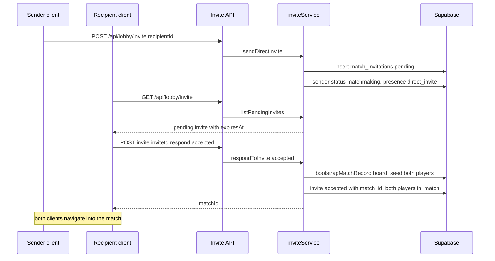

# Matchmaking, Lobby & Presence

This subsystem covers the path from "a player opens the app" to "two players share
a match row". It owns four concerns:

- **Session & identity** — turning a username into a persistent `players` row and a signed session cookie.
- **Presence** — tracking who is currently in the lobby, keeping that view fresh with heartbeats, and expiring stale entries.
- **Matchmaking** — two ways to pair players: auto-queue and direct invites.
- **Match bootstrap** — creating the `matches` row (with a `board_seed` and both player ids) that the [match runtime](./match-runtime.md) then drives.

The server logic lives under `lib/matchmaking/` and `lib/lobby/`, is exposed
through Server Actions in `app/actions/matchmaking/` and REST routes in
`app/api/lobby/`, and is fed live updates by the Supabase Realtime presence
channel in `lib/realtime/`. Persistence details for `players`,
`lobby_presence`, `match_invitations`, and `matches` are documented on the
[data model](./data-model.md) page; the play-a-match end-to-end flow continues on
the [match runtime](./match-runtime.md) page.

## Sessions and authorization

A player logs in with a username. `performUsernameLogin` validates it (3–24
characters, letters incl. Icelandic, digits, `_`, `-`), lowercases it into a
canonical `username`, upserts the `players` row via `upsertPlayerIdentity`, and
writes an initial `lobby_presence` record before returning a random session
token (`lib/matchmaking/profile.ts`).

`persistLobbySession` base64url-encodes the `{ token, player, issuedAt }`
session and stores it in the `wottle-playtest-session` cookie: `httpOnly`,
`sameSite=lax`, a four-hour `maxAge`, and a `secure` flag decided by
`shouldUseSecureCookies()` (env override, CI off-switch, else `NODE_ENV`).

Every Server Action and lobby API route authorizes the caller the same way:
`readLobbySession()` reads and decodes the cookie and validates it with a Zod
schema, returning `null` on any missing, malformed, or schema-invalid value.
The action then trusts `session.player.id` as the acting player — clients never
pass their own id. Actions short-circuit with an `unauthenticated` status (and
the routes with HTTP 401) when the session is absent
(`app/actions/matchmaking/startQueue.ts`, `cancelQueue.ts`, `sendInvite.ts`;
`app/api/lobby/invite/route.ts`, `presence/route.ts`).

Server-side matchmaking mutations run through `getServiceRoleClient()` (the
Supabase service-role key), so authorization is enforced entirely by the cookie
check rather than by row-level security.

## Lobby presence lifecycle

Presence is stored in three places that must be reconciled:

- **`lobby_presence` table** — the authoritative record, with `player_id`, `connection_id`, `mode`, `invite_token`, and an `expires_at` deadline. Login and every heartbeat push `expires_at` forward by `PLAYTEST_PRESENCE_TTL_SECONDS` (default 300s).
- **Server-side presence cache** (`lib/matchmaking/presenceCache.ts`) — a process-global `Map` keyed by player id, keyed off `Symbol.for("wottle.presenceCache")` so it survives module reloads. Entries expire after `PLAYTEST_PRESENCE_CACHE_TTL_MS` (default 300000ms) and are pruned lazily on read/write. It smooths over brief windows where a just-written DB row is not yet visible to a snapshot query.
- **Client Zustand store** (`lib/matchmaking/presenceStore.ts`) — the browser's live view of who is in the lobby.

**Heartbeat.** The client store starts a heartbeat on connect that `POST`s to
`/api/lobby/presence` immediately and then every 60s. The route re-upserts the
presence row with a fresh `expires_at` and mirrors the player into the
server-side cache. Without the heartbeat, the row written at login expires after
the TTL and the player silently disappears from every other client's lobby view.

**Expiry and departure.** On disconnect the store `DELETE`s
`/api/lobby/presence`, which calls `expireLobbyPresence` (a hard row delete for
fast propagation) and `forgetPresence` on the cache. A player also drops out
passively once `expires_at` lapses, because the snapshot query filters on it.

**Snapshot.** `fetchLobbySnapshot` (used by `GET /api/lobby/players`) selects
`lobby_presence` rows whose `expires_at` is still in the future, joins each to
its `players` row, then merges in the server-side cache, de-duplicates by id, and
sorts by username. This is the polling fallback source; the primary transport is
Realtime presence.

**Directory ordering.** For rendering the lobby list, `orderDirectory`
(`lib/lobby/directoryOrdering.ts`) pins the viewer first, then ranks everyone
else by (1) lobby status (`available` < `matchmaking` < `in_match` < `offline`),
(2) closeness of Elo rating to the viewer's (default 1200 when unrated), and (3)
most-recently-seen. It caps the visible list at `LOBBY_DIRECTORY_CAP` (24) and
returns the overflow as a separate `hidden` bucket.

### Realtime transport and fallback

The client store subscribes through `subscribeToLobbyPresence`
(`lib/realtime/presenceChannel.ts`) to a Supabase Realtime channel named
`lobby-presence`, translating `sync`/`join`/`leave` presence events into store
updates. When the channel emits `CHANNEL_ERROR` or `TIMED_OUT`, it starts a
polling fallback against `GET /api/lobby/players` (2s cadence) and a separate
exponential-backoff reconnect loop (5s → 10s → 20s → 40s, capped at 60s); the
poller stops as soon as the WebSocket resubscribes. The store's `onSync` handler
also refuses to shrink the roster on a stale/poller sync, merging incoming
players instead of replacing, to avoid flicker. The deeper Realtime mechanics are
covered on the realtime-and-presence page.

## Matchmaking modes

Both modes converge on `bootstrapMatchRecord`, and both are gated by a
per-player guardrail: a player may only be in one active (`pending` or
`in_progress`) match at a time, checked via `findActiveMatchForPlayer`
(`lib/matchmaking/service.ts`). (The `PLAYTEST_MAX_CONCURRENT_MATCHES` env var,
default 20, is a documented deployment-wide soak-test guardrail rather than a
check enforced in these code paths.)

### Auto-queue

`startQueueAction` → `startAutoQueue` (`lib/matchmaking/inviteService.ts`):

1. If the player already has an active match, return `matched` with that match id and normalize their status/presence.
2. If the player's status is already `in_match` (locked by an opponent mid-pairing), return `queued` to avoid a race.
3. Otherwise mark the player `matchmaking`, fetch up to five other `matchmaking` players, and pick the least-recently-seen one via `selectQueueOpponent`.
4. If no opponent exists, return `queued` with an `estimatedWaitSeconds` of `PLAYTEST_QUEUE_WAIT_SECONDS` (default 15).
5. Otherwise **atomically claim** the opponent with a conditional update (`status = matchmaking → in_match`); if the update matches zero rows another queuer won the race, so return `queued`.
6. On a successful claim, call `bootstrapMatchRecord`, set both players to `in_match`, reset both presence modes to `auto`, and return `matched` with the new match id.

`cancelQueueAction` (`app/actions/matchmaking/cancelQueue.ts`) reverts a queued
player back to `available`, but refuses if their status is already `in_match`
(returning `in_match`) so it cannot yank a player out of a match that has already
been formed.

### Direct invite

`sendInviteAction` → `sendDirectInvite`: rejects self-invites, requires the
recipient to exist and be `available`, and rejects a duplicate pending invite for
the same sender/recipient pair. It inserts a `pending` row in
`match_invitations`, sets the sender to `matchmaking`, and stamps the sender's
presence `mode = direct_invite` with `invite_token` = the invite id.

`respondInviteAction` → `respondToInvite`: only the invite's `recipient_id` may
respond, and only while it is still `pending`.

- **Declined** — marks the invite `declined` and restores the sender to `available` / presence `mode = auto`.
- **Accepted** — calls `bootstrapMatchRecord`, writes the resulting `match_id` back onto the invite, sets both players `in_match`, resets both presence modes to `auto`, and returns the `matchId`.

**Expiry.** Invites live for `PLAYTEST_INVITE_EXPIRY_SECONDS` (default 30s).
`calculateInviteExpiry`/`isInviteExpired` compute the deadline from
`created_at`, and `listPendingInvites` decorates each pending invite with a
derived `expiresAt`. `expireStaleInvites` batch-marks pending invites older than
the TTL as `expired`, restores their senders to `available`, and clears those
senders' presence `invite_token`/`mode`.

Caption: the direct-invite handshake from send to an accepted, bootstrapped match.

## Match bootstrap

`bootstrapMatchRecord` (`lib/matchmaking/service.ts`) is the single chokepoint
that creates a match. It upserts a `matches` row (conflict target `id`) with:

- a `board_seed` — a `randomUUID()` generated by the caller, which makes each match's board deterministic and reproducible;
- `player_a_id` and `player_b_id` — the pairing (sender/queuer is A, recipient/claimed opponent is B);
- `round_limit` defaulting to 10, an optional `rematch_of` link, and an initial `state` of `pending`.

It returns the match id, which flows back through the action/route to the client
so it can navigate into the [match runtime](./match-runtime.md).

## Lobby API routes

The `app/api/lobby/*` routes are the browser-facing REST surface; the Server
Actions in `app/actions/matchmaking/` are the same operations invoked directly
from React. All routes send `cache-control: no-store` and authorize via
`readLobbySession`.

| Route | Method | Purpose | Backing logic |
| --- | --- | --- | --- |
| `/api/lobby/players` | GET | Lobby snapshot for the polling fallback | `fetchLobbySnapshot` |
| `/api/lobby/presence` | POST / DELETE | Heartbeat / explicit departure | `upsertLobbyPresence` + cache / `expireLobbyPresence` + `forgetPresence` |
| `/api/lobby/invite` | POST / GET | Send a direct invite / list pending invites | `sendDirectInvite` / `listPendingInvites` |
| `/api/lobby/invite/[inviteId]/respond` | POST | Accept or decline an invite | `respondToInvite` |
| `/api/lobby/stats/matches-in-progress` | GET | Count of `in_progress` matches for lobby stats | direct `matches` count query |

The invite POST route and `sendInviteAction`, and the respond route and
`respondInviteAction`, are interchangeable entry points into the same
`inviteService` functions; both derive the acting player from the session and
never trust a client-supplied actor id.

## Invariants and failure semantics

- **Single active match per player.** Both modes call `findActiveMatchForPlayer` before pairing; auto-queue also claims the opponent with a conditional `matchmaking → in_match` update so simultaneous queuers cannot double-match.
- **Session is the sole source of the acting player.** No route or action accepts a caller-provided player id; `session.player.id` is authoritative.
- **Presence must be refreshed.** A live lobby entry depends on continued heartbeats; miss them for `PLAYTEST_PRESENCE_TTL_SECONDS` and the row's `expires_at` filters the player out of the snapshot.
- **Status can get stuck.** If a match completion aborts mid-way a player's `players.status` can remain `in_match` with no active match; `healStuckInMatchStatus` runs on lobby load, verifies via `findActiveMatchForPlayer`, resets the status to `available`, and never throws so a transient DB blip cannot crash the lobby.
- **Invite guards.** Self-invites, unavailable recipients, duplicate pending invites, responses from a non-recipient, and responses to a non-`pending` invite are all rejected before any write.

## Configuration

| Env var | Default | Effect |
| --- | --- | --- |
| `PLAYTEST_PRESENCE_TTL_SECONDS` | 300 | Lifetime added to `lobby_presence.expires_at` at login and each heartbeat |
| `PLAYTEST_PRESENCE_CACHE_TTL_MS` | 300000 | Lifetime of server-side presence cache entries |
| `PLAYTEST_INVITE_EXPIRY_SECONDS` | 30 | Direct-invite TTL used for expiry and derived `expiresAt` |
| `PLAYTEST_QUEUE_WAIT_SECONDS` | 15 | Reported `estimatedWaitSeconds` when auto-queue finds no opponent |
| `PLAYTEST_SESSION_SECURE` | (unset) | Overrides the `secure` flag on the session cookie |
| `NEXT_PUBLIC_DISABLE_REALTIME` | (unset) | When `true`, the store uses polling-only presence instead of Realtime |
| `PLAYTEST_MAX_CONCURRENT_MATCHES` | 20 | Documented deployment-wide soak-test guardrail (not enforced in these code paths) |

## Related pages

- [Data model](./data-model.md) — schemas for `players`, `lobby_presence`, `match_invitations`, and `matches`.
- [Match runtime](./match-runtime.md) — what happens after a match row is bootstrapped (the play-a-match workflow).
- realtime-and-presence — the Supabase Realtime channel mechanics behind the lobby presence transport.
