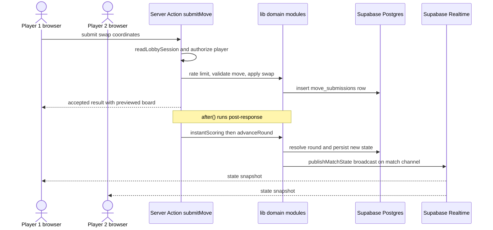

# System Architecture Overview

Wottle is a real-time two-player competitive word game built on the Next.js App
Router. This page explains how its major systems fit together: the browser
client, the server-side entrypoints (Server Actions and API Route Handlers), the
domain logic in `lib/`, and Supabase as the persistence, auth, and realtime
transport layer. For the underlying database entities see the data model page,
and for the round-by-round scoring pipeline see the match runtime page.

## Layered architecture

The system is organized in three layers plus Supabase as the backing service.

- **Top layer — `app/`.** Route segments render UI (`app/(landing)`,
  `app/(lobby)`, `app/match`, `app/matchmaking`, `app/profile`). Two families of
  server entrypoints live alongside them: Server Actions under `app/actions/*`
  (grouped into `auth`, `match`, `matchmaking`, `player`) and API Route Handlers
  under `app/api/*` (`auth`, `cron`, `lobby`, `match`). These are the only places
  client input crosses into trusted server code.
- **Middle layer — `lib/`.** Framework-agnostic domain modules hold the real
  logic. Server entrypoints stay thin and orchestrate these modules; the modules
  own the game rules, state transitions, and persistence calls.
- **Backing service — Supabase.** Postgres stores all durable state, Supabase
  Realtime carries broadcast/presence traffic between clients, and Supabase Auth
  primitives back the session model. Both entrypoint families reach Postgres and
  Realtime exclusively through the domain modules and the two Supabase clients in
  `lib/supabase/`.

A one-off server-startup hook, `instrumentation.ts`, pre-warms the Icelandic
dictionary via `loadDictionary("is")` so the first round of the first match does
not pay the cold-start cost; failures are swallowed so the server still boots.

## The server-authoritative boundary

Wottle treats the browser as view-only: every mutation of game state happens
server-side. This is enforced by which Supabase client is reachable where.

- `lib/supabase/server.ts` builds a **service-role** client from
  `SUPABASE_SERVICE_ROLE_KEY`, which bypasses row-level security. The module
  imports `./server-only` (which imports the `server-only` package) and calls
  `ensureServerContext()` to throw if it is ever evaluated with a `window`
  present, so it can only run on the server.
- `lib/supabase/browser.ts` builds a **anon-key** client
  (`NEXT_PUBLIC_SUPABASE_ANON_KEY`) marked `"use client"`. The browser never
  receives the service role key; its client is used only for subscribing to
  realtime channels and RLS-scoped reads, never for authoritative writes.
- The `guard:no-service-role` script
  (`scripts/guards/no-service-role-in-client.ts`, wired in `package.json`) scans
  `app/` and `components/` for the literals `SUPABASE_SERVICE_ROLE_KEY` and
  `service_role` and fails CI if any appear, keeping service-role usage confined
  to server-only modules.

Because the service-role client bypasses RLS, the authorization checks that RLS
would otherwise provide are re-implemented in the entrypoints: for example
`submitMove` calls `readLobbySession()`, rejects unauthenticated callers, and
verifies the caller is one of the match's two players before touching any row.

## Server Actions vs. API Route Handlers

Both entrypoint families run server-side with the service-role client, but they
serve different callers:

- **Server Actions (`app/actions/*`, `"use server"`)** are the primary pattern
  for in-app, type-safe mutations invoked directly from React components. They
  return typed results (e.g. `submitMove` returns a `MoveResult` or
  `{ error }`), call `revalidatePath` to refresh server-rendered views, and use
  Next.js `after()` to run follow-up work (realtime broadcast, instant scoring,
  round advancement) after the response so it executes at full function CPU
  priority instead of being throttled.
- **API Route Handlers (`app/api/*`)** exist for callers that are not React
  render calls: external schedulers and plain HTTP clients. `api/cron/sweep-stale-matches`
  is triggered by a scheduler and authenticates with a `Bearer ${CRON_SECRET}`
  header rather than a user session; `api/match/start` accepts a `POST` and
  reuses the same session check and domain services as the actions. Route
  handlers set `Cache-Control: no-store` to keep responses uncacheable.

## Request-to-broadcast flow

Client to Server Action to lib domain logic to Supabase, with the resulting
state broadcast back to both clients over Realtime.

The move path in `app/actions/match/submitMove.ts` is representative: it reads
the session, applies a per-user rate limit, gates on the server-authoritative
clock (`isClockExpired`), rejects duplicate or illegal swaps, inserts a
`move_submissions` row, and immediately returns an optimistic board preview. The
heavier work — `instantScoreFirstSubmission`, then `advanceRound`, then
`publishMatchState` — is deferred into `after()` callbacks so it happens after
the response. Broadcast delivery is treated as best-effort:
`publishMatchState` gives up after a short subscribe timeout and relies on the
client's periodic safety poll to reconcile if the WebSocket broadcast is missed.

## Realtime transport

`lib/realtime/` owns the WebSocket contract. Servers publish via
`lib/match/statePublisher.ts` (`publishMatchState`), which loads the current
`MatchState` and sends a `state` broadcast on the `match:<matchId>` channel using
the service-role client. Clients subscribe with the anon client through
`subscribeToMatchChannel` in `lib/realtime/matchChannel.ts`, which listens for
`state`, `round-summary`, and `rematch` broadcast events and, when a presence key
is supplied, surfaces opponent-disconnect signals from presence `leave` events.
Lobby presence has both a realtime implementation (`presenceChannel.ts`) and a
polling fallback (`presenceChannel.polling.ts`).

## Major owned systems

The domain lives in `lib/`, one directory per concern:

- **Game engine — `lib/game-engine/`.** Pure word-game rules: board and swap
  mechanics (`board.ts`), directional scanning (`boardScanner.ts`), cross-word
  validation (`crossValidator.ts`), the per-language dictionary
  (`dictionary.ts`), tile freezing (`frozenTiles.ts`), letter scoring
  (`scorer.ts`, `letter-values/`), and the orchestrating `wordEngine.ts`.
- **Match / round runtime — `lib/match/`.** The server-authoritative match
  lifecycle: `roundEngine.ts` resolves and advances rounds, `instantScoring.ts`
  is the fast path when both submissions arrive, `stateLoader.ts` /
  `statePublisher.ts` load and broadcast snapshots, `clockEnforcer.ts` enforces
  server clocks, and modules like `recoverStuckRound.ts` and
  `findOrphanedMatches.ts` handle failure recovery.
- **Scoring — `lib/scoring/`.** Round-summary assembly (`roundSummary.ts`) and
  word highlighting (`highlights.ts`) presented to players after each round.
- **Matchmaking & lobby — `lib/matchmaking/` and `lib/lobby/`.** Queueing and
  invites (`inviteService.ts`, `service.ts`), presence (`presenceStore.ts`,
  `presenceCache.ts`), session/identity (`profile.ts`), and lobby presentation
  helpers.
- **Realtime channels — `lib/realtime/`.** Match and presence channel wiring, as
  described above.
- **Rating / Elo — `lib/rating/`.** `calculateElo.ts` computes rating deltas
  (K-factor 32 for new players under 20 games, 16 after, with a rating floor of
  100) and `persistRatingChanges.ts` writes them at match completion.
- **Rate limiting — `lib/rate-limiting/`.** `middleware.ts` provides an
  in-process, per-scope sliding-window limiter (`assertWithinRateLimit`) used by
  entrypoints such as `submitMove`, with env flags to disable scopes.
- **Observability — `lib/observability/`.** Structured logging (`log.ts`, with an
  analytics-hook mechanism for `round.completed` / `match.completed` events),
  performance timing (`perf.ts`), and instant-scoring instrumentation.
- **Shared types — `lib/types/`.** Zod schemas and TypeScript types shared across
  layers (`board.ts`, `match.ts`, `game-config.ts`, `lobby.ts`), giving the same
  contracts to entrypoints, domain modules, and realtime payloads.

## Session, security, and operations

Sessions are cookie-based: `lib/matchmaking/profile.ts` defines the
`wottle-playtest-session` cookie with a 4-hour TTL and a Zod-validated payload,
and `readLobbySession()` is the shared authentication check across actions and
route handlers. Application security is layered further at the edge:
`next.config.ts` emits deny-by-default `Permissions-Policy`, `X-Frame-Options:
DENY`, `nosniff`, and a `Referrer-Policy`, adding HSTS only in production.
Operational upkeep is handled out-of-band by the cron sweep route, which
completes orphaned matches as `abandoned` and logs structured sweep metrics.
