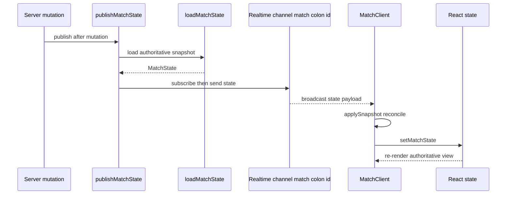

# Realtime Channels & State Broadcasting

This subsystem is the transport layer that carries **authoritative** game state
from the server to connected clients. The server is the single source of truth:
it computes scores, resolves rounds, and advances match state, then publishes a
snapshot over a Supabase Realtime channel. Clients **render** what they receive;
they never compute scores or decide round outcomes locally. Because Realtime
delivery is best-effort, every broadcast path is backed by a polling fallback so
the UI still converges when the WebSocket transport is unavailable.

See also: [Match Runtime](./match-runtime.md) for the round/scoring pipeline
that produces the state being broadcast, [Matchmaking & Lobby](./matchmaking-lobby.md)
for lobby presence, and the performance testing suite (`tests/perf/`) for the
latency budgets asserted against this system.

## The per-match channel

All match-scoped realtime traffic flows over a single Supabase channel named
`match:${matchId}`. Both the server (publisher) and the client (subscriber)
open the channel under that same topic, and three distinct broadcast events are
multiplexed over it:

| Event | Payload | Produced by | Consumed by |
| --- | --- | --- | --- |
| `state` | `MatchState` snapshot | `publishMatchState` (`lib/match/statePublisher.ts`) | `onState` in `subscribeToMatchChannel` |
| `round-summary` | `RoundSummary` | `publishRoundSummary` (`app/actions/match/publishRoundSummary.ts`) | `onSummary` |
| `rematch` | `RematchEvent` | `broadcastRematchEvent` (`lib/match/rematchBroadcast.ts`) | `onRematchEvent` |

`subscribeToMatchChannel` registers one `broadcast` listener per event and
dispatches each to the matching callback (`onState`, `onSummary`,
`onRematchEvent`). Optionally it also joins Supabase **presence** under a
`presenceKey` (the local player's id) so it can detect an opponent's WebSocket
dropping via a presence `leave` event.

## Server publish flow

The publisher path is deliberately simple and stateless. `publishMatchState`
loads the current authoritative snapshot with `loadMatchState`, opens the
`match:${matchId}` channel, waits for `SUBSCRIBED`, sends the `state` broadcast,
then tears the channel down again with `removeChannel`. `publishRoundSummary`
and `broadcastRematchEvent` follow the same subscribe-send-teardown shape for
their respective events.

Publishes are triggered after every state-changing mutation:

- **Move submitted** — `submitMove` calls `publishMatchState(matchId)` inside
  `after(...)` so the broadcast (which shows the submitting player's paused
  timer) runs after the HTTP response returns.
- **Round resolved / match completed** — `roundEngine` publishes the
  `round-summary` and the follow-up `state` snapshot when a round advances, and
  again on game-over via `completeMatchInternal`.
- **Rematch signal** — the rematch actions (`requestRematch`,
  `respondToRematch`, `cancelRematch`) call `broadcastRematchEvent` to notify
  the opposite player.

Caption: authoritative server publish flowing through the Realtime channel into
a client re-render; the client applies the received snapshot rather than
computing it.

### Best-effort delivery and the subscribe timeout

Publishing is treated as best-effort. `publishMatchState` and
`publishRoundSummary` cap the wait for `SUBSCRIBED` at a **2 s** subscribe
timeout (`BROADCAST_SUBSCRIBE_TIMEOUT_MS`). Supabase's own default is ~10 s,
which would stall the round-advancement pipeline because `roundEngine` awaits
the summary broadcast. On timeout the publisher logs, removes the channel, and
resolves anyway rather than blocking the mutation. `roundEngine` adds a further
outer 3 s guard (`PUBLISH_SUMMARY_OUTER_TIMEOUT_MS`) around `publishRoundSummary`
so a pathological Supabase hang cannot pin the pipeline. If a broadcast is lost,
clients recover through the safety-net poll (below).

## Client subscription and reconciliation

`MatchClient` subscribes on mount via `subscribeToMatchChannel`, passing
`presenceKey: currentPlayerId` and the callbacks:

- **`onState`** — merges the snapshot into local React state through
  `applySnapshot`, and flips the disconnect UI based on
  `snapshot.disconnectedPlayerId`.
- **`onSummary`** — sets `lastSummary`/`scores` from the server payload and
  fires the round-recap overlay. Round-history accumulation and the recap
  animation are driven by a `lastSummary` effect (deduped by round number) so
  they fire reliably regardless of whether the `state` or `round-summary`
  broadcast arrives first.
- **`onOpponentLeave`** — when a peer's presence drops, the surviving client is
  responsible for telling the server (`handlePlayerDisconnect`), because the
  departing client cannot be trusted to fire a request on its way out.
- **`onError`** and the `system` CLOSED/CHANNEL_ERROR handler — set
  `usePolling = true`, switching the client to the REST polling transport.

`applySnapshot` is the reconciliation point: it spreads the server snapshot over
prior state but **preserves accumulated non-zero scores when the snapshot
reports zeros** (a race where a round advances before the scoreboard snapshot
row is written) and preserves a prior `lastSummary` when the snapshot omits one.
The client renders derived views (score deltas, reveal highlights, round
history) from this authoritative state; it does not recompute the scores
themselves.

On teardown the effect calls `client.removeChannel(channel)` rather than a plain
`unsubscribe`, so the server-side join state for `match:${matchId}` is fully
released. A plain unsubscribe leaves the channel cached on the client, and a
re-subscribe (e.g. React StrictMode double-mount in dev) collides with the prior
join and stalls at `TIMED_OUT`, so presence never joins.

### Client-side fallbacks

Three client-side mechanisms guard against silent broadcast loss:

1. **Primary polling** — active only once `usePolling` is set (Realtime
   confirmed down, or `NEXT_PUBLIC_DISABLE_REALTIME=true`). It fetches
   `/api/match/{matchId}/state` on `pollIntervalMs` and applies every snapshot.
2. **Background safety-net poll** — runs *always*, even when Realtime is the
   primary transport, at a slow 2 s cadence (`SAFETY_POLL_INTERVAL_MS`). It
   only applies a snapshot when `shouldApplySafetySnapshot` reports a
   broadcast-carried change the client has not yet seen: round advance, match
   completion, a disconnect-flag flip, or an instant-scoring change (frozen
   tiles / partial summary). This closes the gap when the server-side broadcast
   fails silently (local act/Docker, CI runners).
3. **`pagehide` sendBeacon** — best-effort disconnect notification to
   `/api/match/{matchId}/disconnect` before the tab dies, with the server-side
   heartbeat staleness check as the ultimate backstop.

## Rematch as a realtime signal

Rematch signaling reuses the same `match:${matchId}` channel as a lightweight
signal path rather than a state broadcast. When a player requests, accepts,
declines, or cancels a rematch, the corresponding server action calls
`broadcastRematchEvent(matchId, event)`, which subscribes to the channel, sends
a `rematch` broadcast, and removes the channel. Unlike the state/summary
publishers, `broadcastRematchEvent` **rejects** on `CHANNEL_ERROR`/`TIMED_OUT`
(it has no subscribe-timeout resolution), so its callers see broadcast failures.
The receiving client handles the event through `onRematchEvent` to drive its
rematch UI.

## Presence channels

Presence is used for two things: lobby occupancy and match-level opponent-leave
detection. The lobby presence implementation lives in
`lib/realtime/presenceChannel.ts` (`subscribeToLobbyPresence`) and is wired into
the lobby via the `presenceStore` (`lib/matchmaking/presenceStore.ts`).

`subscribeToLobbyPresence` joins the `lobby-presence` channel and emits
`onSync`/`onJoin`/`onLeave`. Two resilience loops run in parallel when the
channel errors or times out:

- A **reconnect loop** re-attempts the subscription with exponential back-off
  (5 s → 10 s → 20 s → 40 s, capped at 60 s), intentionally gentle so a broken
  Realtime service is not hammered.
- A **polling fallback** starts only while Realtime is down. When present, its
  `poller` runs on `pollIntervalMs` (2 s in the lobby) and delivers results via
  `onSync(result, "poller")`. Crucially the fallback is **not** run
  unconditionally: doing so would fire `onSync` with source `"poller"` every
  interval and overwrite the `"realtime"` connection flag, leaving the UI stuck
  showing "Polling" even when Realtime works. On a successful `SUBSCRIBED` the
  fallback is stopped and the reconnect counter reset.

The `presenceStore` consumes the `source` argument to set `connectionMode`
(`"realtime"` vs `"polling"`), clearing the error banner when Realtime recovers.
It also runs a periodic presence heartbeat (`POST /api/lobby/presence`) so the
server-side `lobby_presence.expires_at` keeps rolling forward independently of
the WebSocket.

### The polling-only fallback

`lib/realtime/presenceChannel.polling.ts` (`subscribeToLobbyPresencePollingOnly`)
is a separate implementation that **skips Realtime entirely** and only polls. It
is selected instead of `subscribeToLobbyPresence` when
`NEXT_PUBLIC_DISABLE_REALTIME=true`. It exposes the same `PresenceSubscription`
shape (a mock channel plus `stopPolling`/`updatePresence` no-ops) so callers are
transport-agnostic. It exists for environments where WebSockets are blocked,
for testing without Realtime, and for debugging presence issues. Because it
polls as the sole transport, its default interval is tighter (500 ms) than the
degraded-mode fallback inside `subscribeToLobbyPresence`.

The distinction is important: `presenceChannel.ts` uses polling **only while
Realtime is unavailable** and prefers the live WebSocket, whereas
`presenceChannel.polling.ts` uses polling **always** and is opt-in via the
environment flag.

## Latency budgets and how they are tested

Two budgets constrain this subsystem:

- **Realtime broadcast < 100 ms (p95)** — the round-resolution broadcast must
  land within 100 ms per the project SLA.
- **Move round-trip < 200 ms** — move submission RTT.

These are asserted by the Artillery scenarios under `tests/perf/`.
`round-resolution.yml` ensures move submission median and p95 stay under 200 ms
and documents the < 100 ms broadcast SLA within a < 400 ms end-to-end
round-resolution envelope (scoring compute plus broadcast); `swap.yml` asserts
swap p95/median under 200 ms; `lobby-presence.yml` asserts the lobby presence
snapshot endpoint stays well under its polling cadence. The subscribe-timeout
constants (2 s broadcast, 3 s outer guard) bound worst-case pipeline latency
when Realtime is slow, keeping the mutation path responsive even when a
broadcast is ultimately dropped.

## Failure and lifecycle summary

- The server is authoritative; clients render received `MatchState` and never
  compute scores locally.
- All match realtime traffic (state, round-summary, rematch) shares one
  `match:${matchId}` channel; presence is joined on the same channel when a
  `presenceKey` is supplied.
- State/summary publishes are best-effort with a 2 s subscribe timeout and log
  rather than throw; rematch broadcasts reject on channel failure.
- Every broadcast is backstopped: the match view by the always-on safety poll
  and (when Realtime is confirmed down) the primary poll; the lobby by the
  degraded-mode polling fallback plus reconnect back-off.
- Channel teardown uses `removeChannel` to release server-side join state and
  avoid re-subscribe collisions.
