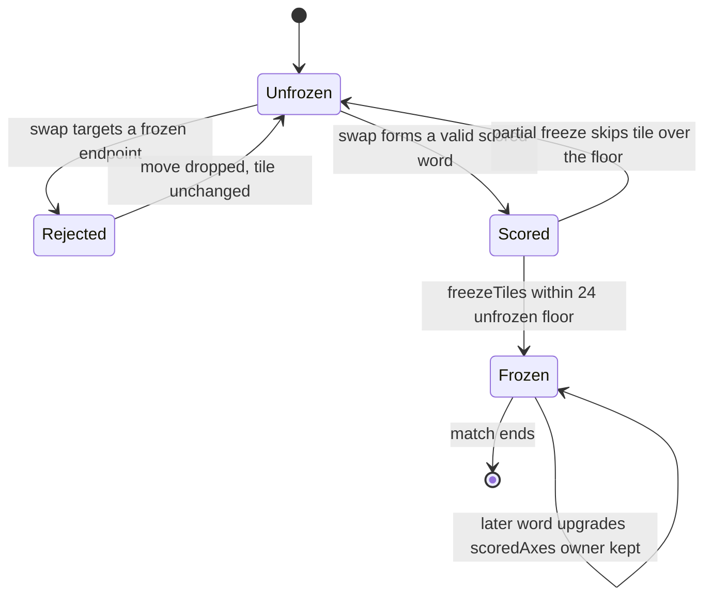
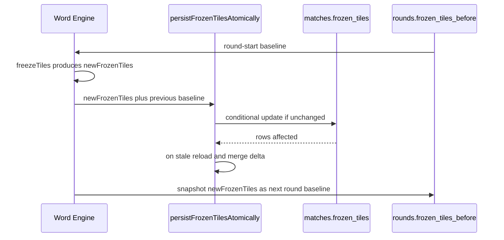

# Frozen Tiles Mechanic

Freezing is the spatial memory of a Wottle match. Every time a swap scores a
word, the tiles of that word become **frozen**: locked in place, attributed to
the player who scored them, and carried forward as immovable terrain for the
rest of the match. Frozen tiles can no longer be swapped, they constrain where
future words may form, and opponent-owned frozen tiles are excluded from a
player's letter score even when a word runs through them. The result is a board
that steadily hardens into a contested map of owned territory.

This page explains the `FrozenTileMap` data structure and its ownership model,
when and how tiles freeze after scoring, how the frozen state persists and
merges across rounds, and how freezing shapes both swap validation and scoring.

> **Guardrail.** The canonical rules live in
> `docs/prd_and_requirements/wottle_game_rules.md`. That document's central
> warning is that a tile's `scoredAxes` is **audit-only** and MUST NOT gate
> validation — the *physical* frozen state is the only signal validation and
> scoring may consult. Most historical scoring regressions came from gating on
> `scoredAxes`; do not reintroduce that. This page documents behavior; the game
> rules doc is the source of truth for the rule set. See also
> [scoring](../architecture/data-model.md) and
> [match-runtime](../architecture/match-runtime.md).

## The FrozenTileMap structure and ownership

A frozen-tile set is a plain map keyed by `"x,y"` coordinate strings. Keys are
built by `toFrozenKey`, and membership (`key in frozenTiles`) is the physical
test for whether a coordinate is frozen at all.

```ts
export type FrozenTileOwner = "player_a" | "player_b";
export type ScoredAxis = "horizontal" | "vertical";

export interface FrozenTile {
  owner: FrozenTileOwner;
  /** Which axis(es) this tile was scored on. Absent for legacy data. */
  scoredAxes?: ScoredAxis[];
}

/** Keys are "x,y" coordinate strings. Values indicate ownership. */
export type FrozenTileMap = Record<string, FrozenTile>;
```

Each entry records exactly one `owner` — the player slot (`player_a` or
`player_b`) credited with the tile — plus the optional `scoredAxes` audit trail
of which axes the tile participated in when it was scored. Ownership is
resolved by **first-owner-wins**: once a tile is frozen, `resolveOwnership`
keeps the existing owner and refuses to reassign it, even if the other player
later scores a word through the same tile.

> **Note — `owner` is single-valued in code.** The game-rules prose describes a
> third `owner` value `both` (for a tile both players scored). The implemented
> `FrozenTileOwner` type and `freezeTiles` never produce it: ownership is always
> one slot under strict first-owner-wins, and no `"both"` value appears anywhere
> in the engine. Treat ownership as single-valued when reading the code.

`scoredAxes` is inferred from a word's tile coordinates (`inferAxis`: same `y`
is horizontal, same `x` is vertical) and merged without duplicates
(`mergeAxes`), so a tile scored on both axes carries
`["horizontal", "vertical"]`.

## Lifecycle: when tiles freeze

Freezing happens at the end of the per-move scoring pass, after words are
validated and scored, inside `freezeTiles` (`lib/game-engine/frozenTiles.ts`).
The word engine calls it once per processed swap.



*Tile state transitions across a match. Freezing is monotonic — a frozen tile never thaws mid-match.*

`freezeTiles` receives the round's `scoredWords`, the existing frozen map, and
both player IDs, and returns a `FreezeResult` with the `updatedFrozenTiles`, the
list of `newlyFrozen` coordinates, a `wasPartialFreeze` flag, and the
`unfrozenRemaining` count. Its behavior:

- **Deterministic order.** Candidate tiles are deduplicated by coordinate and
  sorted in reading order (row first, then column) so partial freezes are
  reproducible.
- **Ownership upgrades cost nothing.** Tiles already frozen are updated in place
  — their `scoredAxes` gains any new axes and their owner is re-resolved under
  first-owner-wins (so the owner never actually changes) — without consuming
  freeze capacity.
- **The 24-unfrozen floor.** The board must always keep at least
  `MIN_UNFROZEN_TILES = 24` unfrozen tiles, so at most
  `MAX_FROZEN_TILES = BOARD_TILE_COUNT - 24 = 76` tiles may be frozen. When a
  round's newly-scored tiles would breach the floor, freezing is **partial**:
  new tiles are frozen in reading order up to the remaining capacity, the rest
  are left unfrozen, and `wasPartialFreeze` is set. Partial freeze affects only
  freezing — the words still score their full points.

## How freezing constrains swaps

Each round every player submits exactly one swap, and **a swap may not target a
frozen tile on either endpoint**. Enforcement is physical and coordinate-based:
the word engine's per-move handler rejects a move outright when either the
`from` or `to` key is already present in the frozen map — including tiles frozen
earlier in the same round by a prior move — returning empty breakdowns and
leaving the board unchanged.

Because freezing is monotonic and accumulates, the set of legal swap targets
shrinks over the match. Players must plan around a growing lattice of immovable
tiles, which is the core of the spatial strategy: freezing a tile denies it to
the opponent as a swap target and fixes a letter that future words on both axes
must accommodate. `isFrozen` and `isFrozenByOpponent` expose these physical
tests for validation and rendering.

## How opponent-frozen tiles affect scoring

A word may legitimately run *through* tiles the opponent already froze — the
word is still valid — but those tiles do not pay out to the current player:

- **Letter points exclude opponent-owned tiles.** When scoring a word,
  `scoreBoardWords` blanks out any tile whose frozen `owner` is the opponent
  slot before summing letter values, so only the player's own tiles (and
  unfrozen tiles the word is about to freeze) contribute letter points.
- **Length bonus is not reduced.** The length bonus uses the full word length,
  including opponent-frozen tiles in the run.
- **Word discovery tracks the excluded set.** During delta detection,
  `getOpponentFrozenKeys` computes, per candidate word, the coordinates owned by
  the opponent, so the exclusion is carried alongside each attributed word.

This makes an opponent's frozen tiles a double-edged feature of the terrain:
they can complete your word's shape, but you earn no letter points for the
letters they own.

## Cross-round persistence and the round-start baseline

The cumulative frozen map lives on `matches.frozen_tiles`, and a per-round
snapshot lives on `rounds.frozen_tiles_before`. The distinction is essential to
correctness under the instant-scoring fast path.



*Frozen-tile persistence for one round. The next round scores against the snapshot, not the live map.*

- **Scoring baseline.** Both scoring passes for a round — the instant-scoring
  fast path and `advanceRound`'s combined pass — score against the map as it
  stood at round start (`rounds.frozen_tiles_before`), falling back to
  `matches.frozen_tiles` only for legacy rounds. This is the spec-042 invariant:
  the fast path merges the first mover's freezes into `matches.frozen_tiles`
  mid-round to gate *new swap submissions* (the frozen-endpoint guard reads the
  live map), but those same-round freezes must never feed back into the same
  round's scoring. Feeding them back would make the frozen-coordinate guard
  reject the first mover's own swap and wipe their `word_score_entries` rows via
  the pipeline's delete-then-insert.
- **Atomic persistence.** `persistFrozenTilesAtomically` writes the updated map
  via a conditional `update_frozen_tiles_if_unchanged` RPC. If the stored value
  changed under it (0 rows affected), it reloads the fresh map and re-applies
  only *this* round's new freezes.
- **Merge on the stale-retry path.** That re-application is
  `mergeNewFreezesOntoFresh` (`lib/match/frozenTileMerge.ts`), a pure helper that
  layers the delta (`computed` keys absent from `baseline`) onto the
  freshly-loaded map. Because freezes are monotonic, the delta is exactly this
  round's additions, so a concurrent round's freezes are preserved instead of
  clobbered.
- **Baseline for the next round.** When `advanceRound` creates round N+1, it
  writes the canonical post-round freeze map into the new round's
  `frozen_tiles_before`, so round N+1's passes share a stable baseline even if
  the fast path later mutates `matches.frozen_tiles` mid-round.

## Summaries: counting frozen tiles per player

For post-game reporting, `computeFrozenTileCountByPlayer`
(`lib/match/matchSummary.ts`) walks the final `FrozenTileMap` and tallies how
many tiles each slot owns. Because ownership is single-valued under
first-owner-wins, each tile contributes to exactly one player's count. Match
completion (`completeMatch`) and the summary page consume this to show each
player's frozen-tile territory.
