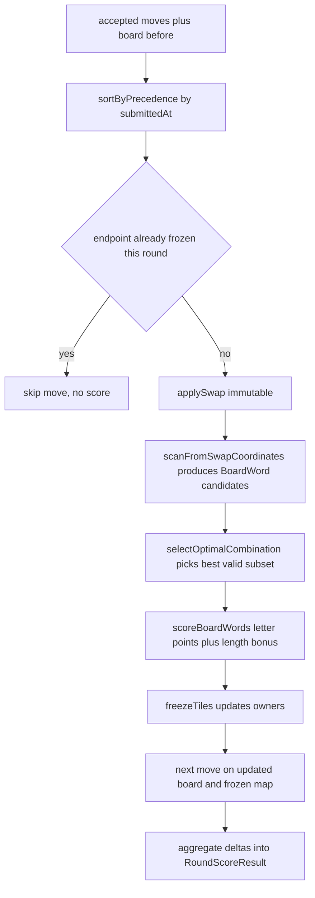

# Game Engine: Board, Swaps & Word Finding

The game engine (`lib/game-engine/`) is the pure core of Wottle: given a
pre-round board and the accepted tile swaps, it computes which words were formed,
validates them against the dictionary and the game's placement rules, and scores
them. It has no knowledge of persistence, HTTP, or match orchestration — callers
in `app/actions/` and `lib/match/` supply board state and moves and consume the
returned result objects.

> **Mandatory guardrail.** Any edit to files under `lib/game-engine/*` must be
> checked against every rule in [`wottle_game_rules.md`](../../docs/prd_and_requirements/wottle_game_rules.md)
> §1–§8, which is the *authoritative* specification of scoring and validation.
> Scoring regressions are the single most common class of bug in this codebase;
> if the rules doc and the code disagree, resolve the contradiction in the
> document first and add a regression test. The details of scoring,
> cross-word validation, and frozen tiles are documented on their own pages —
> this page covers the board, swap, scan, and word-finding layer that feeds them.

## Board representation and swap semantics

The board is a `BoardGrid`, a plain `string[][]` (rows of single-character
strings), defined in `lib/types/board.ts`. Coordinates use `{ x, y }` where `x`
is the column and `y` is the row, so a cell is indexed as `grid[y][x]`. A Zod
schema validates that the grid is `boardSize × boardSize` (default 10×10) and
that each cell is a single Icelandic-or-Latin letter or a space, and coordinates
are constrained to `0..boardSize-1`.

`applySwap` (`lib/game-engine/board.ts`) is immutable: it clones the grid,
exchanges the two named cells, and returns the new grid, leaving the input
untouched. It rejects a swap of a tile with itself and validates both endpoints
before mutating the clone. `cloneGrid`, `serializeGrid`, and `deserializeGrid`
are supporting helpers for copying and round-tripping a grid to and from a
newline-joined string.

## The word-finding pipeline

The end-to-end flow for a round is orchestrated by `processRoundScoring` in
`lib/game-engine/wordEngine.ts`, matching `wottle_game_rules.md` §7.1.

Flow of a round from accepted swaps through scan, validation, scoring, and freezing.

### Orchestration and ordering

`processRoundScoring` first guards the zero-move case, loads the dictionary and
per-language letter values, then sorts moves with `sortByPrecedence`: ascending
by `submittedAt`, with `player_a` winning ties for determinism. Each move is
processed *sequentially* through `processPlayerMove`, threading the mutated board
and the growing frozen-tile map forward so the second player sees the first
player's result. `processPlayerMove` rejects a swap outright if either endpoint
is already frozen (including tiles frozen earlier in the same round), otherwise
it runs apply → scan → cross-validate → score → freeze. The aggregate result is
a `RoundScoreResult` carrying per-player word breakdowns, score deltas, the new
frozen-tile map, `wasPartialFreeze`, the duration, and the final board.

### Scanning from swap coordinates

`scanFromSwapCoordinates` (`lib/game-engine/boardScanner.ts`) is the candidate
generator. For each of the two swap coordinates it walks the two **orthogonal**
axes (horizontal and vertical) that pass through that cell, traces backward to
the line start, then exhaustively enumerates every subsequence that *includes*
the swap index and meets `config.minimumWordLength` (default 3). Both the forward
and reversed reading of each subsequence are checked, and only subsequences whose
NFC-normalized, lowercased text is in the dictionary become `BoardWord`
candidates. Results are deduplicated by a `text:direction:startX,startY` key.
Diagonals are intentionally excluded here; only swap-adjacent lines are scanned,
which bounds the work per move.

The same file also exposes `scanBoard`, a whole-board scanner over all four
canonical direction vectors (with forward and reverse readings, covering all
eight directions including diagonals) that returns a `ScanResult` with timing.
`scanBoard` is not used by the swap pipeline; it backs `deltaDetector`.

### Cross-validation and scoring

The raw candidate list is passed to `selectOptimalCombination`
(`lib/game-engine/crossValidator.ts`), which enumerates every non-empty subset of
candidates, prunes same-axis conflicts, checks each survivor for cross-word and
same-axis standalone violations, and returns the maximum-scoring valid subset.
There is deliberately **no per-candidate pre-filter**: one candidate's per-letter
coverage can depend on another candidate in the same subset, so validation is
deferred to the subset stage. The selected words are then scored by
`scoreBoardWords` in `wordEngine.ts` (letter points plus a length bonus, with
opponent-frozen letters excluded from letter points) and their tiles frozen. The
cross-word rules (§7.2–§7.5) and freezing (§6) are the subject of the
cross-validation and frozen-tiles pages.

### word-finder.ts: the cross-word helper

`lib/game-engine/word-finder.ts` provides an alternate, tile-run-based view used
for cross-word checking. `extractLine` traces the contiguous non-blank run
through a coordinate along a given axis (stopping at spaces and edges);
`extractValidCrossWords` validates that both swapped tiles participate in a valid
horizontal or vertical word; and `hasCrossWordViolation` checks that no
perpendicular crossing through a word's tiles forms an invalid or too-short
sequence. These helpers apply the "must read in either direction and be at least
`minimumWordLength`" rule consistently with the rest of the engine.

### deltaDetector.ts: what changed after a swap

`deltaDetector.detectNewWords` answers a different question from the scoring
pipeline: *which words are new this round and who created them?* It uses a
three-scan diff — scan `boardBefore` (baseline), apply Player A's swaps and scan
again (intermediate), then scan the final board. Player A's words are those in
the intermediate scan absent from the baseline; Player B's are those in the final
scan absent from the intermediate (and baseline). Attribution then applies the
same guards used elsewhere: only orthogonal directions score, sub-words are
suppressed so only the longest word in a tile run counts (`removeSubwords`),
suffix/prefix overlaps whose union is not a dictionary word are dropped
(`removeSuffixOverlaps`), and both cross-word and inline-extension violations are
rejected against frozen and same-round-established tiles. It returns
`AttributedWord`s carrying each word's opponent-frozen tile keys for partial
letter scoring.

## Dictionary loading

`lib/game-engine/dictionary.ts` loads a language wordlist into an in-memory
`Set<string>` for O(1) lookups. `loadDictionary(language)` reads the entire file
synchronously, splits on newlines, and — because the wordlists are pre-normalized
(NFC) and pre-lowercased — builds the `Set` directly without per-line
normalization. Loaded dictionaries are cached per language in a module-level map;
`resetDictionaryCache` clears the caches for tests and benchmarks. `lookupWord`
normalizes and lowercases its input before checking membership, so ad-hoc lookups
are case- and normalization-safe.

Loading is defensive: an empty file, a missing file (`ENOENT`), or a file with
fewer than the language's configured `minEntries` all raise a
`DictionaryLoadError` rather than letting the game run on a corrupt dictionary.
Each successful load emits a structured `dictionary.loaded` log with the entry
count and duration.

### The Icelandic wordlist and exclusions overlay

Icelandic (`is`) is the primary language and the default. Its dictionary comes
from `data/wordlists/word_list_is.txt`, a large BÍN-derived list whose
`minEntries` floor is 2,000,000. On top of it, `applyExclusions` subtracts every
entry listed in `data/wordlists/word_list_is_exclusions.txt`, a small,
hand-curated overlay (blank lines and `#` comments ignored). The overlay is
**removal-only** by design: the dictionary accepts BÍN entries and nothing else,
so a missing real word is treated as an upstream extraction bug to fix, never an
in-repo addition. Only rejected-but-scoring words (for example `sýs`) are removed
through the overlay.

The other language wordlists (`en`, `se`, `no`, `dk`, each with much smaller
`minEntries` floors and matching `letter-values/` scoring tables) are holdovers;
Wottle runs on Icelandic.

## Retries and failure semantics

`lib/game-engine/retry.ts` provides `withRetry`, an exponential-backoff wrapper
(default 3 attempts, 100 ms base delay) that throws a `ScoringPipelineError`
wrapping the last error once attempts are exhausted, with `onRetry` and
`onExhausted` hooks for logging. It applies to *transient* failures of the whole
scoring pipeline, not to individual engine functions: the only caller is
`computeWordScoresForRound` in `app/actions/match/publishRoundSummary.ts`, which
wraps `executeScoringPipeline` so a flaky round-scoring attempt (for example a
transient dictionary or persistence hiccup) is retried before surfacing an error.
Deterministic failures such as `DictionaryLoadError` from a corrupt wordlist will
simply repeat and then exhaust.

## Configuration and invariants

Board size and `minimumWordLength` come from `GameConfig`
(`DEFAULT_GAME_CONFIG`), so the scanners and validators are parameterized rather
than hard-coding a 10×10 board or a 3-letter minimum. The engine upholds the
post-scoring invariants enumerated in `wottle_game_rules.md` §8 — every scored
letter belongs to a dictionary word of length ≥ minimum, no below-minimum scored
runs exist, no swap targets a frozen tile, and the board retains at least the
minimum unfrozen tiles. When changing anything here, state which invariants the
change affects and pin the outcome with a test, per §8–§9 of the rules doc.
