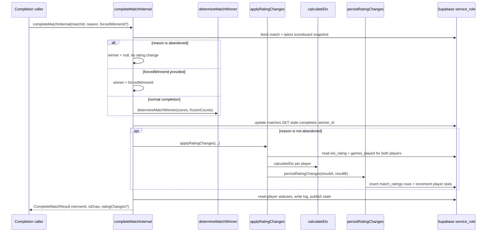

# Elo Rating & Match Results

When a Wottle match finishes, the runtime must answer two questions: **who won**,
and **how does that change each player's skill rating**. This page documents that
end-to-end flow — winner/draw determination from round scores, the Elo math and
K-factor selection, and how the resulting rating changes are persisted and read
back. The completion mechanics that *trigger* this flow (round limit, timeout,
disconnect forfeit, stale-match sweep) are covered by the [Match & Round
Runtime](../architecture/match-runtime.md) page; here we cover what happens once a
match is being finalised.

## Where the rating flow is invoked

`completeMatchInternal` in `app/actions/match/completeMatch.ts` is the single
funnel every terminal path routes through (round-limit completion, timeout,
disconnect claim, and the stale-match sweep all call it). It runs the full
finalisation sequence: resolve the outcome, flip the `matches` row to
`completed`, apply rating changes, reset both players to `available`, write a
match log, publish the final state, and emit observability.

*Finalisation sequence inside `completeMatchInternal`, from outcome resolution
through Elo persistence.*

`completeMatchInternal` short-circuits when the match row is already
`completed`, returning the persisted winner without recomputing ratings — this
makes completion **idempotent** so retried or racing callers cannot double-apply
rating changes. `completeMatchAction` is the authenticated wrapper: it verifies
the caller is a participant before delegating to `completeMatchInternal`.

## Determining the winner

`determineMatchWinner` in `lib/match/resultCalculator.ts` derives the outcome
purely from the final `ScoreTotals` and per-player frozen-tile counts, returning
a `MatchWinnerResult` (`winnerId`, `loserId`, `isDraw`):

1. Higher total score wins outright.
2. If scores are tied, the player owning **more exclusively-owned frozen tiles**
   wins — the tiebreaker. See the [Frozen Tiles](./frozen-tiles.md) concept page
   for what "exclusively owned" means.
3. If both scores and frozen-tile counts are equal, the match is a **draw**
   (`winnerId` and `loserId` are `null`, `isDraw` is `true`).

This function is deterministic and side-effect free, which is why the summary
page can re-run it from the latest scoreboard snapshot when a match row was
persisted with `winner_id = null` (regression coverage for issue #117, where a
56 vs 96 match had rendered as a draw).

Two completion paths bypass `determineMatchWinner`:

- **Forfeit (`forcedWinnerId`)** — disconnect and win-claim flows award the
  still-connected player regardless of score, because loss of connection is
  treated as a forfeit.
- **Abandoned** — a sweep-finalised match with no live presence on either side
  records **no winner** (`winnerId = null`) and, critically, **skips the rating
  update entirely**, since there is no reliable signal for who should have won.

## The Elo calculation

`calculateElo` in `lib/rating/calculateElo.ts` implements standard Elo. Given a
player rating, opponent rating, an `actualScore` (`1.0` win / `0.5` draw / `0.0`
loss), and a `kFactor`, it computes:

- **Expected score** — `1 / (1 + 10^((opponent - player) / 400))`.
- **Delta** — `kFactor * (actualScore - expectedScore)`.
- **New rating** — `player + delta`, then rounded to the nearest integer and
  clamped up to the **rating floor of 100**.
- The returned `delta` is the *effective* change (`clampedRating - player`), so a
  floor clamp shrinks the reported delta rather than letting the stored rating
  drop below 100. A player already at the floor who loses records a delta of `0`.

`determineKFactor` selects the volatility: **32** for new players with fewer than
20 games, **16** for established players with 20 or more games. This makes early
ratings converge quickly and stabilise once a player has a track record. The
per-player K-factor is chosen from that player's own `games_played` count, so the
two participants in one match can use different K-factors.

`applyRatingChanges` (a private helper in `completeMatch.ts`) orchestrates a
single match's rating update: it reads both players' current `elo_rating` and
`games_played`, maps the winner result to symmetric actual scores
(`scoreB = 1.0 - scoreA`, with `0.5` each on a draw), runs `calculateElo` once
per player, builds a `MatchRatingResult` for each, and hands both to
`persistRatingChanges`.

## Persisting rating changes

`persistRatingChanges` in `lib/rating/persistRatingChanges.ts` commits the result
in two steps against the Supabase `service_role` client:

1. **Insert two `match_ratings` rows** — one per player — capturing
   `rating_before`, `rating_after`, `rating_delta`, `k_factor`, and
   `match_result` as an immutable per-match snapshot.
2. **Increment each player's aggregate stats** via `incrementPlayerStats`, which
   writes the new `elo_rating` to the `players` row and bumps `games_played`
   plus exactly one of `wins` / `losses` / `draws` according to `matchResult`.

It then emits a `rating.updated` structured log with both players' before/after
ratings, deltas, K-factors, and results.

**Failure isolation.** `completeMatchInternal` wraps `applyRatingChanges` in a
try/catch that logs a `rating.update.error` event and swallows the error. A
rating-update failure therefore does not roll back or block match completion: the
match is still marked `completed`, players are still freed, and state is still
published — only the rating snapshot is missing. Note that `persistRatingChanges`
is **not transactional** across its inserts and updates, so a partial failure can
leave `match_ratings` and `players` aggregates inconsistent.

## Rating types

The rating flow uses several types defined in `lib/types/match.ts`:

- **`EloCalculationInput` / `EloCalculationResult`** — the pure inputs
  (`playerRating`, `opponentRating`, `actualScore`, `kFactor`) and outputs
  (`newRating`, `delta`, `expectedScore`) of `calculateElo`.
- **`MatchRatingResult`** — one player's per-match record (`playerId`,
  `ratingBefore`, `ratingAfter`, `ratingDelta`, `kFactor`, `matchResult`). This is
  the shape written to and read back from `match_ratings`.
- **`RatingChange`** — the compact summary returned on `CompleteMatchResult`
  (`playerADelta`, `playerBDelta`, `playerARatingAfter`, `playerBRatingAfter`),
  intended for the caller and the post-match summary rather than persistence.

## Surfacing ratings

`getMatchRatings` in `app/actions/match/getMatchRatings.ts` is the authenticated
read path for a single match's rating outcome. It requires a lobby session,
validates the `matchId` as a UUID, selects the two `match_ratings` rows for that
match, and maps them into `MatchRatingResult[]`. It distinguishes three states in
`GetMatchRatingsResult.status`: `ok` (rows found), `not_found` (no rows — e.g. an
abandoned match that never got a rating snapshot), and `error` (auth or query
failure).

The persisted `match_ratings` history also backs the **player profile / stats
display**: `getPlayerProfile` in `app/actions/player/getPlayerProfile.ts` reads
`match_ratings` to build the recent rating trend (last 5 `rating_after` values),
the full rating history, the peak rating (max `rating_after`, falling back to the
current `elo_rating`), and the last-10 W/L/D form line, alongside the aggregate
`wins`/`losses`/`draws`/`games_played` counters maintained on the `players` row.

## Schema and invariants

The `20260315001_elo_rating` migration backs the whole feature:

- On `players` it makes `elo_rating` `NOT NULL` with a default of **1200**
  (backfilling existing nulls), and adds the `games_played`, `wins`, `losses`, and
  `draws` counters. A `CHECK` enforces `elo_rating >= 100` (the same floor
  `calculateElo` clamps to), and `chk_games_played_consistency` enforces the
  invariant `games_played = wins + losses + draws` — the exact invariant
  `incrementPlayerStats` preserves by bumping the total and exactly one outcome
  counter together.
- It creates the `match_ratings` table keyed by `(match_id, player_id)` with a
  **unique constraint**, so each player can have at most one rating row per match
  — a database-level guard against double-applying a rating even if completion is
  retried. `rating_before` / `rating_after` carry the same `>= 100` floor, and
  `k_factor` is constrained to `IN (16, 32)`, matching `determineKFactor`.
- Row-level security makes `match_ratings` **public to read** (`SELECT USING
  true`) but **writable only by the service role**: the insert/update/delete
  policies use `false`, so all writes must go through `getServiceRoleClient`, as
  `persistRatingChanges` does.

## Tests that pin the behavior

- `tests/unit/lib/rating/calculateElo.spec.ts` locks the Elo math: symmetric
  ±16 deltas for an even K=32 game, small gains for a favored winner, large gains
  for an underdog upset, zero delta on an even draw, rating convergence on an
  uneven draw, the rounding rule, and the 100 floor (which forces the reported
  delta to `0`).
- `tests/unit/lib/match/resultCalculator.test.ts` pins winner determination:
  higher score wins regardless of frozen tiles, the frozen-tile tiebreaker on
  tied scores, the equal-everything draw, and the issue #117 regression.
