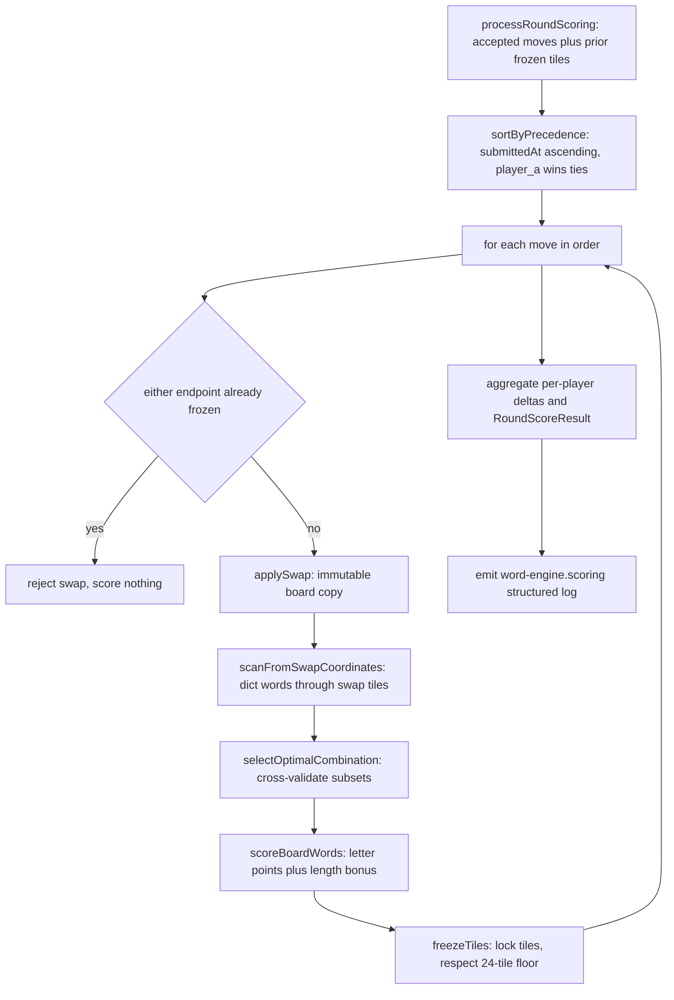

# Scoring & Cross-Validation

Scoring is a **pure, server-side function** of the board after both players' swaps
have been applied plus the prior round's frozen state. The whole pipeline lives
in the game engine and is orchestrated by
[`processRoundScoring`](repo://lib/game-engine/wordEngine.ts). This page documents
the scoring formula, the per-letter coverage rule, cross-word validation, and how
round scores and UI highlights are aggregated.

> **Scoring is the single most fragile area of this codebase.** The authoritative
> spec [`wottle_game_rules.md`](repo://docs/prd_and_requirements/wottle_game_rules.md)
> keeps a change log (§10) in which *every past regression* is a scoring bug.
> Any change to `lib/game-engine/*` or to the scoring constants in
> [`game-config.ts`](repo://lib/constants/game-config.ts) MUST be checked against
> every rule in §1–§6 of that spec and MUST land with a regression test that
> encodes the *rule*, not just the scenario. Several past regressions came from
> gating validation on `scoredAxes`; that field is audit-only and must never gate
> a validation decision.

Related pages: [game-engine](repo://openwiki/concepts/game-engine.md),
[frozen-tiles](repo://openwiki/concepts/frozen-tiles.md),
[match-runtime](repo://openwiki/architecture/match-runtime.md).

## The scoring pipeline

Per-round scoring pipeline in `processRoundScoring`, from accepted swaps to the returned `RoundScoreResult`.

Moves are processed **sequentially** in submission order: the first submitter's
swap, scan, validation, scoring, and freezing all complete before the second
submitter runs — and the second submitter runs against the board and frozen map
*updated by the first*. A swap whose endpoints were frozen (including tiles frozen
earlier in the same round) is rejected outright and scores nothing. The whole pass
is budgeted to complete in well under 50ms.

## The scoring formula

Each candidate word's total is `lettersPoints + lengthBonus`, computed in
[`scorer.ts`](repo://lib/game-engine/scorer.ts) and applied per word in
[`scoreBoardWords`](repo://lib/game-engine/wordEngine.ts#L41-L73):

- **`lettersPoints`** — the sum of per-letter values from the active language's
  scoring table, with **opponent-frozen tiles excluded**. `scoreBoardWords`
  builds an `ownLetters` string that blanks out any tile whose frozen `owner` is
  the opponent slot, so a word may span opponent tiles and still score, but those
  opponent letters contribute nothing.
- **`lengthBonus`** — `(word_length - 2) * 5`, computed from the *full* word length
  including opponent-frozen tiles. So the length bonus is never reduced by
  opponent participation, only the letter points are.
- **Unknown characters default to a value of 1** in `calculateLetterPoints`.

For example a 5-letter word contributes `(5 - 2) * 5 = 15` length-bonus points on
top of its letter values; a 2-letter run gets a length bonus of 0 — though 2-letter
runs never score at all because `minimumWordLength` is 3.

### The specified combo bonus is not implemented

The spec (§5.3) defines a **multi-word combo bonus** (`+2` for two words, `+5` for
three, `+7 + (n-4)` for four or more). The live code does **not** apply it: both
[`scoreBoardWords`/`computeDeltas`](repo://lib/game-engine/wordEngine.ts#L78-L94)
and [`aggregateRoundSummary`](repo://lib/scoring/roundSummary.ts#L52-L96) sum only
per-word `totalPoints` with no combo term, and `roundSummary.ts` explicitly notes
"pure word point sums — no combo bonus". Round deltas are therefore just the sum of
each player's word totals. Treat the spec's combo bonus as a documented-but-unbuilt
rule when reasoning about actual scores.

## Letter values per language

Letter values live in [`letter-values/`](repo://lib/game-engine/letter-values/) as
one plain map per language, keyed to the `Language` union `'is' | 'en' | 'se' |
'no' | 'dk'` from [`game-config.ts`](repo://lib/types/game-config.ts#L2).
`wordEngine.ts` and `roundSummary.ts` each keep a `LETTER_VALUES_BY_LANGUAGE`
lookup that selects the map from the round's `language`.

- **Icelandic (`is`) is the live default.** `DEFAULT_GAME_CONFIG.language = 'is'`,
  `processRoundScoring` falls back to `'is'` when no language is passed, and
  `scorer.ts` defaults its `letterValues` parameter to `LETTER_SCORING_VALUES_IS`.
- The Icelandic table is the **Krafla distribution** (32 letters, no C/Q/W/Z; e.g.
  `A=1`, `Á=3`, `Ð=2`, `Æ=4`, `Þ=7`, `X=10`) sanctioned for Icelandic tournament
  play. See [`letter_scoring_values_is.ts`](repo://lib/game-engine/letter-values/letter_scoring_values_is.ts).
- English, Swedish, Norwegian, and Danish tables
  ([`_en`](repo://lib/game-engine/letter-values/letter_scoring_values_en.ts),
  [`_se`](repo://lib/game-engine/letter-values/letter_scoring_values_se.ts),
  [`_no`](repo://lib/game-engine/letter-values/letter_scoring_values_no.ts),
  [`_dk`](repo://lib/game-engine/letter-values/letter_scoring_values_dk.ts)) are
  wired into both lookup tables but ship behind the default; each has its own
  alphabet and values (e.g. Swedish `Å/Ä/Ö`, Danish/Norwegian `Æ/Ø/Å`).

## Cross-word validation

The scanner returns raw candidate `BoardWord`s that are already
`≥ minimumWordLength` and in the dictionary. It is
[`selectOptimalCombination`](repo://lib/game-engine/crossValidator.ts#L236-L274)
that enforces the *board-global* invariants and picks which words actually score.

### selectOptimalCombination: enumerate, validate, maximize

The function enumerates **all `2^n - 1` non-empty subsets** of the candidate list
(n is small per swap) and, for each subset:

1. Prunes subsets that contain a **same-axis conflict** between candidates via
   [`hasNoSameAxisConflict`](repo://lib/game-engine/crossValidator.ts#L324-L332):
   two words on the same axis may neither overlap nor be physically adjacent
   (each scored word must end at an unscored tile or the board edge). Perpendicular
   words may share exactly one crossing tile.
2. Runs [`isSubsetValid`](repo://lib/game-engine/crossValidator.ts#L340-L380),
   which validates each word treating *every other candidate's tiles in the subset*
   as "extra established" tiles.
3. Among valid subsets, keeps the one with the **maximum total score**
   (letter points + length bonus per word, summed by `scoreWord`).

There is **no per-candidate pre-filter** before subset enumeration: a candidate's
coverage can depend on another candidate in the same round (the spec's #136 `BÁS`
example only reaches a length-3 horizontal run if `BÆN` is also in the subset), so
validation is deferred to the subset stage where mutual "extra" tiles are available.

### Two physical validation rules

`isSubsetValid` applies two sibling checks per candidate word — both purely
**physical** (they read frozen board state, never `scoredAxes`):

- **Cross-axis per-letter coverage** —
  [`hasCrossWordViolation`](repo://lib/game-engine/crossValidator.ts#L62-L141).
  For each tile of the word, it traces the maximal contiguous run on the
  perpendicular axis through `frozenTileSet ∪ extraTileSet`. A run of length 1 is
  fine; a run of length `2..(min-1)` is always a violation; a longer run must
  contain a dictionary sub-run of length `≥ minimumWordLength` covering that tile,
  tested by
  [`runContainsValidSubRunCoveringIndex`](repo://lib/game-engine/crossValidator.ts#L18-L40)
  (which checks the sub-run forward and reversed, NFC-normalized and lowercased).
  Already-frozen tiles are skipped unless a new extra tile creates a fresh
  adjacency.
- **Same-axis standalone invariant** —
  [`violatesFrozenAdjacencyOnSameAxis`](repo://lib/game-engine/crossValidator.ts#L162-L212).
  Per-letter coverage is trivially satisfied on the word's own axis, so this check
  catches the cross-round case: if the candidate physically abuts a **frozen** tile
  at either end of its axis, the maximal combined same-axis run (frozen extensions
  plus the word) must itself be a dictionary word, or the word is rejected. It reads
  only prior-round frozen tiles (not same-round candidate tiles), so an *unfrozen*
  adjacent letter never triggers it.

### Why scoredAxes must not gate validation

Both rules deliberately ignore `scoredAxes`. A frozen letter is physically on the
board regardless of which axis it was originally scored on. The change log (§10)
records that PR #185 skipped frozen tiles whose `scoredAxes` didn't match the axis
being validated, which admitted below-min and uncovered runs like `ML`, `NÐ`,
`TKH` (#195), and that deleting the same-axis check (#198) then admitted invalid
combined runs like `ÖRLTEL` and `NMÚL` (#200). The two-rule design above is the fix.
Do not reintroduce a `scoredAxes`-gated skip.

## Round score aggregation and UI highlights

After the per-move loop, `processRoundScoring` splits the accumulated
`WordScoreBreakdown[]` into `playerAWords` / `playerBWords`, computes per-player
`deltas` with [`computeDeltas`](repo://lib/game-engine/wordEngine.ts#L78-L94), and
returns a `RoundScoreResult` carrying the words, deltas, the updated
`newFrozenTiles`, `wasPartialFreeze`, `durationMs`, and the `finalBoard`.

The scoring library layers the presentation-facing summary on top:

- [`aggregateRoundSummary`](repo://lib/scoring/roundSummary.ts#L52-L96) groups
  word scores by the actual match player slots (so a score lands in the right
  column even when a player scored zero words), computes round `deltas`, adds them
  to `previousTotals` to produce cumulative `totals`, and builds a `RoundSummary`
  with a `highlights` array of per-word coordinate lists and a `resolvedAt`
  timestamp. `calculateWordScore` in the same file mirrors the engine's
  letter-points + `(length - 2) * 5` formula for summary rows.
- [`highlights.ts`](repo://lib/scoring/highlights.ts) turns those word coordinates
  into UI overlays: `extractHighlights` yields one coordinate array per word,
  `getUniqueCoordinates` de-duplicates overlapping tiles for a combined overlay,
  and `isHighlighted` tests whether a given tile is part of any scored word — the
  data behind the round's reveal animation.

## Configuration and invariants that matter

- `minimumWordLength = 3` in [`game-config.ts`](repo://lib/constants/game-config.ts#L9)
  is read across the pipeline (scanner, cross-validator, delta detector). Changing it
  re-enables shorter-word scoring end-to-end; it is the single knob behind the
  "runs of length 2 are always invalid" behavior.
- Freezing (documented on [frozen-tiles](repo://openwiki/concepts/frozen-tiles.md))
  runs after scoring and never feeds back into the same round's scoring; both the
  instant-scoring fast path and the combined pass score against the round-start
  freeze baseline.
- Focused tests that pin these rules live in
  [`crossValidator.test.ts`](repo://tests/unit/lib/game-engine/crossValidator.test.ts),
  [`wordEngine.test.ts`](repo://tests/unit/lib/game-engine/wordEngine.test.ts), and
  [`scorer.test.ts`](repo://tests/unit/lib/game-engine/scorer.test.ts), plus the
  integration test [`roundScoring.test.ts`](repo://tests/integration/roundScoring.test.ts).
  Per the spec's testing discipline, a scoring test names the invariant or rule
  section it pins and asserts against the spec rather than current behavior.
