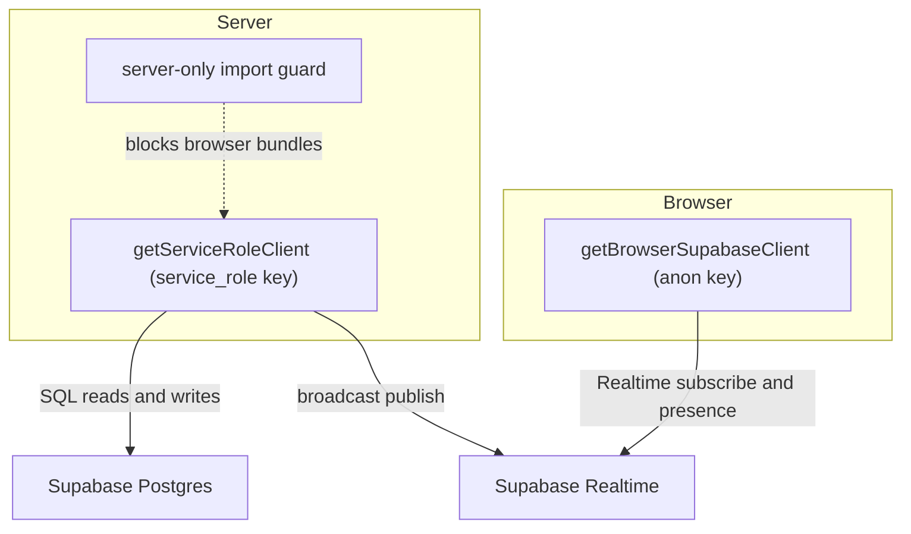

# Supabase Integration

Supabase is Wottle's single backend platform. It provides the Postgres
database that stores every durable game record, the Realtime service that
carries live match state and lobby presence between clients, and the hosted API
gateway that both surfaces reach. This page consolidates how the application
talks to that platform: the two client factories and the boundary that keeps
them apart, the three usage surfaces (Postgres, Realtime, and session/auth), and
how the local stack in `supabase/config.toml` maps to the environment defaults
the code reads.

Related pages: [System Architecture Overview](../architecture/overview.md),
[Data Model & Persistence](../architecture/data-model.md),
[Realtime Channels & State Broadcasting](../architecture/realtime-and-presence.md),
[Matchmaking, Lobby & Presence](../architecture/matchmaking-lobby.md).

## Two client factories and the server-only boundary

Wottle constructs Supabase clients through two factories with deliberately
different privileges, keys, and execution contexts.

The **service-role server client** lives in `lib/supabase/server.ts`.
`getServiceRoleClient()` returns a process-wide cached client built from
`NEXT_PUBLIC_SUPABASE_URL` and `SUPABASE_SERVICE_ROLE_KEY`; `requireEnv()`
throws immediately if either variable is missing, and `createServiceRoleClient()`
can build a fresh (uncached) instance when needed. Both entry points call
`ensureServerContext()`, which throws `"Supabase service_role client must never
run in the browser"` when `window` is defined. The module's very first line is
`import "./server-only"`, and `lib/supabase/server-only.ts` in turn imports the
`server-only` package, so any client-side bundle that transitively imports this
module fails the build rather than shipping the service-role key to browsers.

The **anon browser client** lives in `lib/supabase/browser.ts`, marked
`"use client"`. `getBrowserSupabaseClient()` lazily creates and memoizes a
single client from the public `NEXT_PUBLIC_SUPABASE_URL` and
`NEXT_PUBLIC_SUPABASE_ANON_KEY`, throwing a descriptive error when either is
absent. It disables all Supabase Auth session machinery
(`persistSession: false`, `detectSessionInUrl: false`,
`autoRefreshToken: false`) because Wottle does not use Supabase Auth for user
identity — the anon client exists only to open Realtime WebSocket channels from
the browser.

*The anon client only reaches Realtime from the browser; the service-role client owns all Postgres access and server-side broadcast, and the server-only guard keeps it out of client bundles.*

## Surface 1: Postgres persistence, SQL functions, and RLS

All database reads and writes flow through the service-role client, which is
passed explicitly into repository-style functions rather than imported inside
them. `lib/matchmaking/service.ts` centralizes the lobby and match persistence
primitives: `upsertPlayerIdentity` (upsert on `players` keyed by `username`),
`upsertLobbyPresence` / `clearLobbyPresence` / `expireLobbyPresence` (the
`lobby_presence` table), `bootstrapMatchRecord` and `findActiveMatchForPlayer`
(the `matches` table), `recordScoreSnapshot` (`scoreboard_snapshots`), and
`fetchMatchState`. Each function unwraps the `{ data, error }` result and
rethrows a descriptive `Error` on failure, so callers never see a raw Supabase
error object. `lib/matchmaking/profile.ts` builds on the same client for login
(`performUsernameLogin`), the deduplicated `fetchLobbySnapshot`, and repair
routines like `healStuckInMatchStatus`. Match-runtime writes go through the same
service-role client from the `lib/match/*` modules.

Beyond table access, the integration uses a **SQL function** invoked via RPC:
`lib/match/findOrphanedMatches.ts` calls `supabase.rpc("find_orphaned_matches")`,
delegating orphan detection to server-side SQL rather than reconstructing it in
TypeScript.

**Row Level Security** is enabled on the playtest tables by
`supabase/migrations/20260325001_rls_playtest_tables.sql`. The policy design is
important to understand operationally: read policies are written against
`auth.uid()` and `auth.role() = 'authenticated'`, and all inserts/updates/deletes
are "handled by service_role only." Because Supabase's `service_role` key
**bypasses RLS**, and Wottle performs every write through the service-role
client, those policies protect direct client access rather than the application's
own server paths. Anonymous/unauthenticated clients get nothing. See
[Data Model & Persistence](../architecture/data-model.md) for the full schema.

## Surface 2: Realtime channels (match, presence, rematch)

Realtime is used two ways: **broadcast** channels for match state and rematch
events, and **presence** channels for the lobby roster and opponent-disconnect
detection.

Channel *subscription* on the client is centralized in `lib/realtime/`.
`subscribeToMatchChannel` (`lib/realtime/matchChannel.ts`) joins
`match:<matchId>` and wires broadcast events `state`, `round-summary`, and
`rematch` to callbacks. When a `presenceKey` is supplied it also joins Supabase
presence under that key, tracks the local player on `SUBSCRIBED`, and filters
presence `leave` events so consumers only see *opponent* disconnects — an
explicitly best-effort signal that complements the `sendBeacon` and polling
fallbacks. `subscribeToLobbyPresence` (`lib/realtime/presenceChannel.ts`) owns
the `lobby-presence` channel and its resilience machinery: an exponential
reconnect back-off (5s→10s→20s→40s, capped at 60s), a polling fallback that runs
only while Realtime is unavailable, and re-tracking of the pending presence
payload after each reconnect. `subscribeToLobbyPresencePollingOnly`
(`lib/realtime/presenceChannel.polling.ts`) is a Realtime-free variant selected
when `NEXT_PUBLIC_DISABLE_REALTIME=true`; it returns a mock channel and drives
the UI purely from the poller.

Channel *publishing* happens on the server through the service-role client.
`lib/match/statePublisher.ts` (`publishMatchState`) and
`lib/match/rematchBroadcast.ts` (`broadcastRematchEvent`) each open
`supabase.channel("match:<matchId>")`, wait for `SUBSCRIBED`, then `send` a
`broadcast` event and remove the channel. `publishMatchState` treats delivery as
best-effort: it caps the subscribe wait with `BROADCAST_SUBSCRIBE_TIMEOUT_MS`
(2s) and resolves anyway on timeout, because the round-advancement pipeline
awaits it and clients recover through the 2-second safety poll. The disconnect
action in `app/actions/match/handleDisconnect.ts` publishes state the same way.

The tables carried over Realtime are declared in
`supabase/migrations/20251119001_enable_realtime.sql`, which adds
`lobby_presence`, `matches`, `rounds`, `move_submissions`, and
`match_invitations` to the `supabase_realtime` publication and sets
`replica identity full` so non-primary-key column changes (status, timers) are
broadcast. See
[Realtime Channels & State Broadcasting](../architecture/realtime-and-presence.md)
for the end-to-end flow and
[Matchmaking, Lobby & Presence](../architecture/matchmaking-lobby.md) for the
presence lifecycle.

## Surface 3: Session and auth

Wottle does **not** use Supabase Auth for player identity. The anon browser
client explicitly disables session persistence and token refresh, and no code
path calls `supabase.auth`. Instead, `lib/matchmaking/profile.ts` implements a
lightweight, cookie-based lobby session: `performUsernameLogin` validates a
username and upserts a `players` row via the service-role client, and
`persistLobbySession` writes an encoded, `httpOnly`, `sameSite: "lax"` cookie
named `wottle-playtest-session` with a four-hour TTL. `readLobbySession` decodes
and Zod-validates that cookie, returning `null` on any failure. API routes such
as `app/api/match/start/route.ts` gate on `readLobbySession()` and then act with
the service-role client, so the session cookie authorizes the request while
Postgres access runs with full privilege. This is why the RLS policies keyed on
`auth.uid()` do not govern the application's own server traffic.

## Configuration and the local stack

`supabase/config.toml` defines the local Supabase stack used in development and
CI under `project_id = "wottle-local"`. It fixes the API gateway to port
`54321`, Postgres to `54322` (with shadow DB on `54320`, `major_version = 17`),
and Studio to `54323`, and enables the `public` and `graphql_public` schemas
with `max_rows = 1000`. Analytics and the Edge Runtime are disabled on purpose:
the project ships no `supabase/functions/`, and the Edge Runtime's flaky health
check was aborting the Artillery perf gate, so leaving it off only saves startup
time.

These ports map directly to the environment defaults the clients read. The
local env files set `NEXT_PUBLIC_SUPABASE_URL=http://127.0.0.1:54321` — the
`[api]` port from `config.toml` — alongside the demo `NEXT_PUBLIC_SUPABASE_ANON_KEY`
and `SUPABASE_SERVICE_ROLE_KEY` JWTs consumed by the browser and server
factories respectively. `NEXT_PUBLIC_DISABLE_REALTIME=true` selects the
polling-only presence path. The URL is shared by both clients; only the key (and
therefore the privilege level) differs between them.
