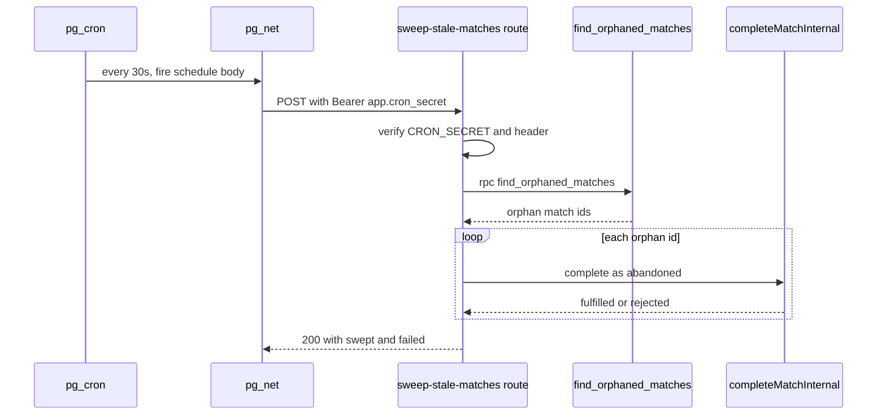

# Database Migrations & Scheduled Jobs

This page covers two operational concerns that live in `supabase/migrations/`:
the ordered SQL migration workflow that is the source of truth for the database
schema, and the **stale-match sweep** — a pg_cron job that periodically finalizes
matches abandoned mid-play. Both are described from an operator's point of view:
what runs, when, how it is guarded, and how to configure and verify it.

## Migrations are the schema source of truth

The entire Postgres schema — tables, constraints, RLS policies, SQL functions,
Realtime publication, and scheduled jobs — is defined by timestamp-ordered SQL
files under `supabase/migrations/`. There is no separate ORM schema or generated
DDL; the migration files themselves are authoritative. Reading them in order is
the canonical way to understand the current shape of the database.

Filenames encode an ordering prefix (`YYYYMMDDNNN_<name>.sql`), and the Supabase
CLI applies them in lexicographic order. Representative files include:

| Migration | Role |
| --- | --- |
| `20251105001_init.sql` | Foundational `boards`/moves schema and the `pgcrypto` extension |
| `20251115001_playtest.sql` | Playtest lobby, players, matches, rounds tables |
| `20251119001_enable_realtime.sql` | Adds tables to the Supabase Realtime publication |
| `20260315001_elo_rating.sql` | Elo rating columns and helpers |
| `20260316001_rematch.sql` | Rematch support |
| `20260325001_rls_playtest_tables.sql` | Row-level security policies for playtest tables |
| `20260423001_match_heartbeats.sql` | `match_heartbeats` liveness table |
| `20260424001_sweep_stale_matches.sql` | `find_orphaned_matches()` + pg_cron sweep schedule |

Migrations are applied with `pnpm supabase:migrate`, which wraps
`supabase migration up`. Because ordering matters, a migration may only depend on
schema established by earlier files (for example the sweep migration assumes the
`matches` and `lobby_presence` tables already exist).

New migrations should be **idempotent and re-runnable** wherever the CLI or a
cloud deploy might replay them. The sweep migration illustrates the conventions:
`drop constraint if exists` before re-adding a CHECK, `create or replace
function`, `create extension if not exists`, and unscheduling any prior cron job
before re-registering it.

## The stale-match sweep

### Problem

A match row stays in state `in_progress` until something finalizes it. Normal
completion happens through round-limit exhaustion, timeout, forfeit, draw, or an
explicit disconnect flow. But if **both** players vanish — tab closed, network
lost, `pagehide`/`sendBeacon` and Realtime presence both failing — nothing on the
client can finalize the match, and it lingers forever as `in_progress`. Such a
row makes the lobby overcount "players in match" and never releases the
participants. The sweep is the backstop that catches these orphaned matches.

### `find_orphaned_matches()` — the detection query

`supabase/migrations/20260424001_sweep_stale_matches.sql` ships a `stable` SQL
function `public.find_orphaned_matches()` that returns the ids of `in_progress`
matches for which **neither** participant has a live `lobby_presence` row
(`expires_at > now()`). "Live presence for either player" is the invariant that
keeps a match out of the orphan set; a match is only considered abandoned when
both sides have let their presence expire.

```sql
select m.id
from public.matches m
where m.state = 'in_progress'
  and not exists (
    select 1
    from public.lobby_presence lp
    where lp.player_id in (m.player_a_id, m.player_b_id)
      and lp.expires_at > now()
  );
```

The same migration also extends the `matches_ended_reason_check` CHECK
constraint to allow the value `'abandoned'`, the reason recorded for
sweep-finalized matches.

### `findOrphanedMatches.ts` — the client counterpart

`lib/match/findOrphanedMatches.ts` is the thin TypeScript wrapper the application
uses to call the SQL function. It acquires the service-role Supabase client and
invokes `supabase.rpc("find_orphaned_matches")`, returning the ids as a
`string[]` (an empty array when the RPC returns `null`) and throwing when the RPC
reports an error. Detection logic lives entirely in Postgres; this module only
transports the result across the boundary.

### The `/api/cron/sweep-stale-matches` route

`app/api/cron/sweep-stale-matches/route.ts` exposes a `POST` handler that
performs one sweep pass:

1. **Auth gate.** It requires `CRON_SECRET` to be configured (otherwise it
   returns `500`), then checks that the `Authorization` header equals
   `Bearer <CRON_SECRET>`, returning `401` on mismatch. Detection never runs for
   an unauthorized request.
2. **Detect.** It calls `findOrphanedMatches()`. If that RPC throws, the route
   logs `sweep_stale_matches.find_failed` and returns `500`.
3. **Finalize.** For each returned id it calls
   `completeMatchInternal(id, "abandoned")`, running all finalizations with
   `Promise.allSettled` so a single failing match does not abort the batch.
4. **Report.** It returns `200` with `{ swept, failed }` — the ids finalized and
   per-match `{ matchId, error }` for those that threw — and emits a structured
   `sweep_stale_matches` log with `swept_count`, `failed_count`, and
   `duration_ms`.

`completeMatchInternal` is the shared finalization path used across the match
lifecycle. For the `"abandoned"` reason it records **no winner** (there is no
reliable signal for who should have won), **skips Elo rating changes**, resets
both players to `available`, writes a `match.abandoned` log, and republishes match
state. It is idempotent: if the match is already `completed` it short-circuits
without re-finalizing, which makes a concurrent client completion and a sweep
pass safe to race.



*Sequence of one sweep tick, from the pg_cron trigger through detection to
per-match finalization.*

### Scheduling with pg_cron and pg_net

The migration schedules the sweep inside a guarded `do $$ ... $$` block that:

- `create extension if not exists pg_cron` and `pg_net`;
- unschedules any existing job named `sweep-stale-matches` (idempotent re-runs);
- registers `cron.schedule('sweep-stale-matches', '*/30 * * * * *', ...)`, i.e.
  **every 30 seconds**, whose body issues `net.http_post` to
  `current_setting('app.app_url', true) || '/api/cron/sweep-stale-matches'` with
  an `Authorization: Bearer` header built from
  `current_setting('app.cron_secret', true)`.

The route is therefore guarded on both ends by the same shared secret: the
Vercel-side `CRON_SECRET` env var and the Postgres-side `app.cron_secret`
database setting must match.

### Local Docker stack: safe no-op

pg_cron and pg_net are Supabase Cloud features. The schedule block is wrapped so
migrations never break in environments that lack them:

- The whole `do` block has `exception when undefined_file` (and a catch-all
  `when others`) handlers that merely `raise notice` and continue, so a stack
  without the extensions still applies the migration cleanly.
- Even where pg_cron **is** loaded locally, the schedule body reads settings with
  `current_setting(..., true)`. When `app.app_url` / `app.cron_secret` are unset
  they resolve to `NULL`, and `net.http_post` no-ops harmlessly rather than
  firing a real request.

Either way, `find_orphaned_matches()` remains available for direct invocation, so
ad-hoc cleanup works on any stack regardless of scheduling support.

## Production setup

After deploying the code and the migration:

1. **Vercel:** set `CRON_SECRET` in the project environment to any random value.
2. **Supabase (SQL editor):** point Postgres at the deployment and share the
   secret so the scheduled `net.http_post` can reach and authenticate to the
   route:

   ```sql
   alter database postgres set app.app_url = 'https://wottle.example.com';
   alter database postgres set app.cron_secret = 'same-value-as-CRON_SECRET';
   ```

   `app.cron_secret` **must** equal the Vercel `CRON_SECRET`, or every tick will
   be rejected with `401`.

## Verifying the job

pg_cron records every tick in `cron.job_run_details`. To confirm the sweep is
firing and getting `200` responses:

```sql
select start_time, status, return_message
from cron.job_run_details
where jobname = 'sweep-stale-matches'
order by start_time desc
limit 5;
```

A healthy job shows recent rows roughly every 30 seconds. A network blip needs no
handling at the application layer: pg_cron records the failure and the next tick
fires 30 seconds later.

## Related tests

- `tests/unit/app/api/sweepStaleMatches.test.ts` exercises the route's contract:
  `401` on missing/mismatched bearer, `500` when `CRON_SECRET` is unset, `200`
  with an empty result when there are no orphans, that every orphan is finalized
  with reason `"abandoned"`, that per-match failures are collected into `failed`
  while the batch continues, and `500` when detection throws.
- `tests/unit/lib/match/findOrphanedMatches.test.ts` verifies the wrapper calls
  `rpc("find_orphaned_matches")`, maps `null` data to `[]`, and throws on RPC
  error.

## Related pages

- [Data Model](../architecture/data-model.md) — the `matches`, `lobby_presence`,
  and `match_heartbeats` tables the sweep reads and writes.
- [Environment & Setup](./environment-and-setup.md) — `CRON_SECRET` and other
  environment variables, and local Supabase stack setup.
<!-- openwiki: broken internal link [../architecture/rematch-and-disconnect.md] file "../architecture/rematch-and-disconnect.md" does not exist. Fix the href or restore the target, then delete this comment. -->
- [Rematch & Disconnect](../architecture/rematch-and-disconnect.md) — the normal
  disconnect and completion flows that the sweep backstops.
