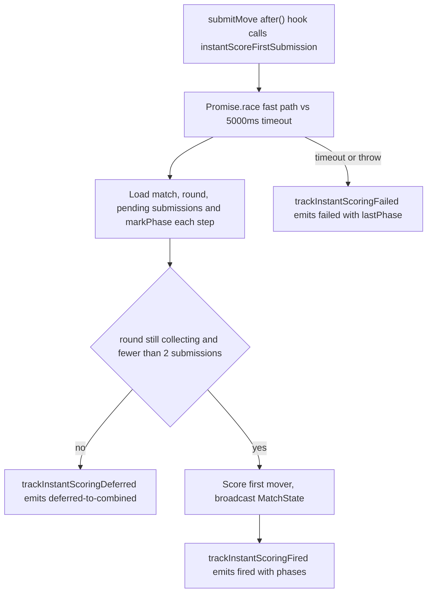

# Observability & Logging

This page documents how the application observes itself: the structured
JSON log helpers in `lib/observability/log.ts`, the instant-scoring
diagnostics in `lib/observability/instantScoring.ts`, the durable match
audit log written by `lib/match/logWriter.ts`, the perf-timer utility in
`lib/observability/perf.ts`, and the `scripts/supabase/log-export.ts`
tooling that reads the audit log back out. It also covers
`instrumentation.ts`, the Next.js server-startup hook.

Two complementary channels exist. **Structured stdout logs** are
best-effort, single-line JSON records emitted with `console.log` /
`console.error` for aggregation by the platform's log pipeline. The
**durable match log** is a `match_logs` Postgres table that records
significant lifecycle transitions for later audit and export. The two are
independent: a match-lifecycle action typically writes both a durable
`match_logs` row and one or more stdout analytics lines.

## Structured logging helpers (`lib/observability/log.ts`)

`logPlaytestInfo` and `logPlaytestError` are the primitives. Each builds a
payload with `level`, `event`, an ISO `timestamp`, and a `playtest: true`
marker, merges any `metadata` keys onto the top level, and prints a single
JSON line — `logPlaytestInfo` via `console.log`, `logPlaytestError` via
`console.error`. When an `error` is supplied, an `Error` is flattened to
`error` (message) and `stack`; any other value is stringified.

On top of these primitives the module exposes three typed event trackers
that the match flow calls at specific transition points:

- `trackInviteAccepted` — emits `matchmaking.invite.accepted`.
- `trackRoundCompleted` — emits `round.completed` with `acceptedMoves`,
  `rejectedMoves`, `durationMs`, and `isGameOver`.
- `trackMatchResult` — emits `match.completed` with `winnerId`, `loserId`,
  `endedReason`, `isDraw`, `totalRounds`, and `scores`.

Each tracker does two things: it logs the JSON line **and** dispatches a
strongly-typed `AnalyticsEvent` through `emitAnalyticsEvent`. That fan-out
invokes every hook registered via `registerAnalyticsHook` (each wrapped in
its own try/catch so one failing hook cannot break the others) and, in a
browser context (`typeof window !== "undefined"`), dispatches a
`playtest:analytics` `CustomEvent` on `window`. This lets in-page playtest
tooling subscribe to the same events the server logs.

### Where the trackers are emitted in the match flow

- `trackRoundCompleted` fires at the end of `advanceRound` in
  `lib/match/roundEngine.ts`, after the round summary broadcast, with
  `durationMs` computed as `Date.now() - roundStart`.
- `trackMatchResult` fires in the `completeMatch` server action
  (`app/actions/match/completeMatch.ts`) after the match state is
  published, carrying the final winner/loser, draw flag, `endedReason`,
  and score totals.

## Instant-scoring observability (`lib/observability/instantScoring.ts`)

The instant-scoring fast path (spec 042 / Linear O-57) has its own typed
observability module so post-ship analytics can answer "how often does the
fast path fire?", "how often does the race-window deferral happen?", and
"what is the failure rate?" without scraping arbitrary log strings. It
centralises the event names and payload shapes and delegates the actual
emission to `logPlaytestInfo` / `logPlaytestError`:

- `trackInstantScoringFired` → info event `instant-scoring.fired`
  (carries `wordCount`, `durationMs`, and per-phase `phases`).
- `trackInstantScoringDeferred` → info event
  `instant-scoring.deferred-to-combined` (currently only
  `reason: "race-window"`).
- `trackInstantScoringFailed` → error event `instant-scoring.failed`
  (carries a machine-readable `reason`, the `lastPhase` reached, and
  `phases`).

`phases` is a cumulative `Record<phaseName, elapsedMs>` — milliseconds from
the start of the fast path to the completion of each named phase
(`match-loaded`, `round-loaded`, `submissions-loaded`, `scoring`, …), not
per-phase deltas. On a `timeout` failure, `lastPhase` is the attribution:
the stall lives in whatever phase comes *after* the last one that
completed. This diagnostic record was added because 21 production timeouts
in one match previously logged only `roundNumber: 0` and no attribution.

### Fast-path control flow and where events fire

`instantScoreFirstSubmission` (in `lib/match/instantScoring.ts`) races the
fast path against an internal `INSTANT_SCORING_TIMEOUT_MS` (5000 ms) timer.
It builds a mutable `FastPathTrace` shared between the fast path and the
detached timeout branch, calls `markPhase` at each boundary, and emits an
instant-scoring event on each terminal outcome.

Terminal outcomes of the instant-scoring fast path and the observability event each emits.

The fast path runs inside `submitMove`'s `after()` hook, post-response, so
nothing user-facing blocks on it; it is best-effort and its
`InstantScoringResult` return value is ignored by the production caller.
See [match-runtime](../architecture/match-runtime.md) for the surrounding
submit/advance flow.

## Durable match log (`lib/match/logWriter.ts`)

`writeMatchLog` is a `"use server"` helper that inserts one row into the
`match_logs` table via the passed Supabase client. Each row records a
`match_id`, an `event_type`, and a JSON `payload` of `{ actorId, metadata }`.
`MatchLogPayload.eventType` is a typed union of the known lifecycle events —
`match.completed`, `match.timeout`, `match.disconnect`,
`match.rematch.requested`, `match.rematch.created` — but stays open to
arbitrary strings (`(string & {})`) so new events can be recorded without a
type change.

`writeMatchLog` is deliberately non-throwing: on insert error it logs
`[MatchLog] Failed to insert log entry` with `console.error` and returns
normally. Audit logging must never fail the surrounding match action, so
callers do not depend on its success.

Callers that write durable match-log rows include:

- `completeMatch` — `match.completed` on round-limit, otherwise
  `match.${reason}` (e.g. `match.timeout`).
- `resignMatch` and `handleDisconnect` — resignation/disconnect events.
- `requestRematch` and `respondToRematch` — the
  `match.rematch.requested` / `match.rematch.created` pair.

## Exporting match logs (`scripts/supabase/log-export.ts`)

`scripts/supabase/log-export.ts` is a `tsx` CLI that reads the durable
audit trail back out for a single match. Invoked as
`tsx scripts/supabase/log-export.ts <matchId>`, it builds a service-role
Supabase client, selects `match_id, event_type, payload, created_at` from
`match_logs` filtered by the match id and ordered by `created_at`
ascending, and prints a pretty-printed JSON document
`{ matchId, events }`. A missing `matchId` argument or a query error exits
with status 1. Because it uses the service-role client it bypasses RLS and
is intended for operator/debugging use, not end-user access. See
[supabase](../integrations/supabase.md) for the service-role client.

## Performance instrumentation (`lib/observability/perf.ts`)

`perf.ts` provides `createPerfTimer(event, metadata)`, which returns a
`PerfTimer` with `start()`, `success(extra?)`, and `failure(error, extra?)`.
The timer selects a monotonic clock: it prefers `globalThis.performance.now()`
when available and falls back to `Date.now()`. Calling any terminal method
auto-starts the timer if `start()` was never called, computes a
non-negative rounded `durationMs`, and emits a single JSON line —
`success` records `status: "success"` via `console.log`; `failure` records
`status: "error"` plus a flattened `error`/`stack` via `console.error`.
`createPlaytestPerfTimer` is a thin wrapper that pre-tags the metadata with
`playtest: true`.

### Relationship to latency budgets and Artillery perf assertions

`perf.ts` is the *in-process* timing primitive: it stamps a `durationMs`
onto emitted log lines so operators can reason about how long an operation
took. The *external* latency budgets are enforced separately by the
Artillery load tests under `tests/perf/` and the
`scripts/perf/assert-artillery-thresholds.ts` gate:

- The Artillery scenarios (`round-resolution.yml`, `instant-scoring.yml`,
  `swap.yml`, `lobby-presence.yml`) drive real HTTP requests and declare
  `ensure` expectations such as `median < 200` and `p95 < 200` for move
  submission, and `p95 < 400` for round-resolution broadcast (PERF-002).
- `assert-artillery-thresholds.ts` parses an Artillery JSON report and
  fails the perf gate unless the sample size and the median/p95 latencies
  clear a threshold (default 200 ms via `SWAP_LATENCY_THRESHOLD_MS`,
  minimum sample via `SWAP_LATENCY_MIN_SAMPLE`). It exits non-zero on a
  breach so CI can block regressions.

Together, `perf.ts` gives per-operation timing inside logs, while the
Artillery assertions gate end-to-end request latency against the
constitution's SLAs. The instant-scoring fast path's own `durationMs` and
`phases` timings (above) are what those budgets are compared against when a
timeout is investigated.

## Server startup hook (`instrumentation.ts`)

`instrumentation.ts` exports Next.js's `register()` instrumentation hook,
which runs once on server startup. When the runtime is Node
(`NEXT_RUNTIME === "nodejs"`) it dynamically imports and calls
`loadDictionary("is")` to pre-warm the Icelandic dictionary, so round 1
does not pay the ~600–1000 ms cold-start cost of loading its 3.7M entries.
The call is wrapped in try/catch: a dictionary load failure is swallowed
here (it is logged inside `loadDictionary`) so the server does not crash;
the game instead fails gracefully when a match first tries to resolve a
round.

## Testing

Focused unit coverage lives in
`tests/unit/observability/instantScoring.log.spec.ts`, which spies on
`console.log`/`console.error` and asserts the exact event names
(`instant-scoring.fired`, `instant-scoring.deferred-to-combined`,
`instant-scoring.failed`), levels, and payload fields the trackers emit.
The instant-scoring fast-path behaviour (timeout diagnostics, race-window
deferral, cold-start budget) is exercised by the
`tests/unit/match/instantScoring.*.spec.ts` suite.
