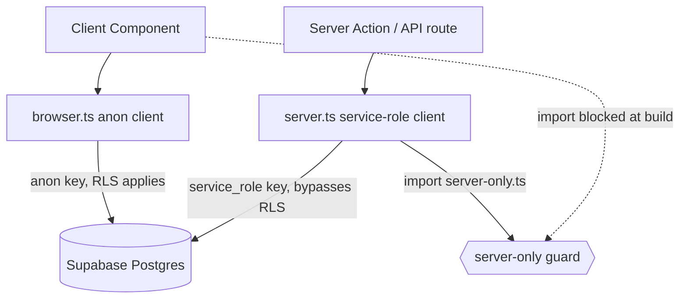
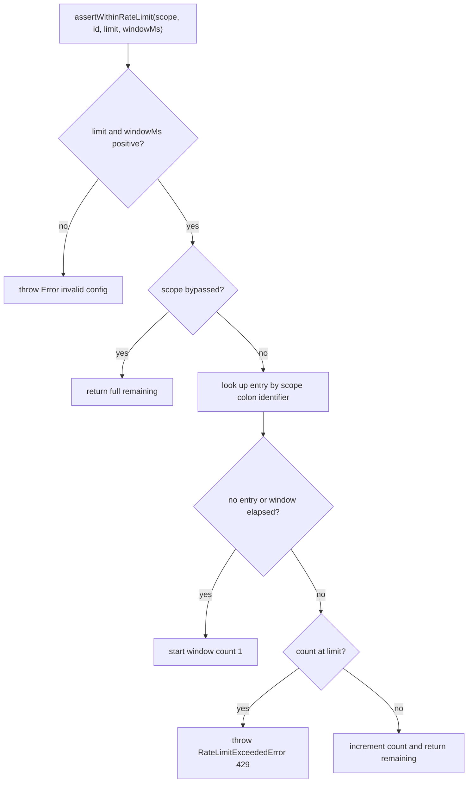

# Security, RLS & Rate Limiting

This page describes three layers of the runtime security posture:

1. **Client isolation** — a strict split between the privileged `service_role`
   Supabase client (server-only) and the `anon` browser client, enforced at
   import time and by a static CI guard.
2. **Row Level Security (RLS)** — database-enforced access rules on the playtest
   tables, so that even a leaked anon key cannot read or write another player's
   data.
3. **Rate limiting** — an in-process limiter (`assertWithinRateLimit`) applied
   inside Server Actions and auth routes to blunt abuse and accidental floods.

Together they implement a server-authoritative model: all game-state mutations
run server-side under the service role, clients only ever hold the anon key, and
the database is the last line of defense.

Related pages: [environment-and-setup](../operations/environment-and-setup.md),
[data-model](../architecture/data-model.md), and the
[authentication workflow](../workflows/authentication.md).

## Service-role vs anon client split

There are two distinct Supabase clients, each keyed differently and each
confined to one execution context.

- **Service-role client** (`lib/supabase/server.ts`) is created with
  `NEXT_PUBLIC_SUPABASE_URL` and `SUPABASE_SERVICE_ROLE_KEY`. The service role
  bypasses RLS entirely in Supabase, so this client can read and write any row.
  It is the only client used by Server Actions and other server code that mutate
  game state. `getServiceRoleClient()` returns a lazily-created, process-cached
  singleton; `createServiceRoleClient()` builds a fresh one. Both call
  `ensureServerContext()`, which throws
  `"Supabase service_role client must never run in the browser"` if
  `window` is defined, and `requireEnv()`, which throws on a missing URL or key.
  Sessions are disabled (`persistSession: false`, `autoRefreshToken: false`)
  because the client authenticates purely with the service-role key.
- **Browser (anon) client** (`lib/supabase/browser.ts`) is a `"use client"`
  module created with `NEXT_PUBLIC_SUPABASE_URL` and
  `NEXT_PUBLIC_SUPABASE_ANON_KEY`. It is cached per browser tab and is subject to
  RLS. It never holds the service-role key.

### The `server-only` import boundary

`lib/supabase/server.ts` begins with `import "./server-only";`, and
`lib/supabase/server-only.ts` is nothing but `import "server-only";`. The
`server-only` package throws a build-time error if a module that imports it is
pulled into a client bundle. This makes accidentally importing the service-role
client from a Client Component a compilation failure rather than a silent leak of
the privileged key into the browser.

Caption: The two Supabase clients and the `server-only` boundary that keeps the
service-role client out of the browser bundle.

### The `guard:no-service-role` static check

`scripts/guards/no-service-role-in-client.ts` (run via
`pnpm guard:no-service-role`) is a second, defense-in-depth check that runs
independently of the bundler. It recursively scans the `app` and `components`
directories for `.ts/.tsx/.js/.jsx/.mjs/.cjs` files and fails
(`process.exitCode = 1`) if any file contains `SUPABASE_SERVICE_ROLE_KEY` or the
literal `service_role`. On failure it prints a structured
`guard.no-service-role.failure` log whose remediation tells authors to move
service-role usage into server-only modules such as `lib/supabase/server.ts`; on
success it prints `guard.no-service-role.success`. This catches leaks that a
bundler boundary alone might miss (for example, a hardcoded key string).

## Row Level Security (RLS)

RLS is the database-level backstop. Even though clients hold only the anon key,
Postgres policies decide what each `authenticated` or `anon` role can see and
change.

### The playtest RLS migration

`supabase/migrations/20260325001_rls_playtest_tables.sql` closes a gap left by an
earlier migration that created nine playtest tables without RLS. It enables RLS
on and adds policies to: `players`, `lobby_presence`, `matches`, `rounds`,
`move_submissions`, `match_invitations`, `word_score_entries`,
`scoreboard_snapshots`, and `match_logs`. The consistent policy design is:

- **Writes are server-side.** Almost all `INSERT`/`UPDATE`/`DELETE` operations are
  performed by the service role, which bypasses RLS, so most tables carry no write
  policy at all. The migration comments this explicitly ("Writes handled by
  `service_role` only").
- **Reads are scoped to participants/owners.** `matches`, `rounds`,
  `move_submissions`, `word_score_entries`, `scoreboard_snapshots`, and
  `match_logs` grant `SELECT` only to the two match participants, checked via
  `player_a_id = auth.uid() OR player_b_id = auth.uid()` (directly or through an
  `EXISTS` join up to the parent match).
- **Directory-style tables are readable by any authenticated user.** `players` and
  `lobby_presence` grant `SELECT` to `auth.role() = 'authenticated'` because the
  lobby and opponent display need them.
- **A few client writes are allowed but ownership-checked.** Players can update
  their own `players` profile (`id = auth.uid()`), upsert/delete their own
  `lobby_presence` row (`player_id = auth.uid()`), insert their own
  `move_submissions` row, send `match_invitations` as themselves
  (`sender_id = auth.uid()`), and accept/decline invitations they received
  (`recipient_id = auth.uid()`).
- **Anonymous users get nothing** on these tables.

### The `supabase:policies` verification

`pnpm supabase:policies` runs `scripts/supabase/policies/check.ts`, which
connects to the Postgres instance and queries `pg_policies` for a fixed list of
tables (`boards`, `moves`, `players`, `lobby_presence`, `match_invitations`,
`matches`, `rounds`, `move_submissions`, `word_score_entries`,
`scoreboard_snapshots`, `match_logs`, `match_heartbeats`). It writes the result,
ordered by table and policy name, to
`supabase/policies/policies.snapshot.json` with a `generatedAt` timestamp. The
committed snapshot is the source of truth for the live policy set — reviewers can
diff it to see exactly which policies (with their `cmd`, `qual`, and `with_check`
clauses) exist in the database, catching drift between migrations and reality.
For example, the snapshot records that `boards` grants anon `SELECT`
(`auth.role() = 'anon'`) and a `service_role` `ALL` policy.

## Rate limiting

`assertWithinRateLimit` (`lib/rate-limiting/middleware.ts`) is a synchronous
fixed-window counter that Server Actions call before doing real work.

### Scope / identifier / limit / window model

Each call passes `RateLimitOptions`:

- `scope` — a logical bucket name (e.g. `match:submit-move`).
- `identifier` — who is being limited (a player id, or a client IP from
  `resolveClientIp`). Blank identifiers collapse to `"anonymous"`; identifiers are
  trimmed and lowercased.
- `limit` — max allowed requests per window.
- `windowMs` — window length in milliseconds.
- `errorMessage` (optional) — user-facing message on rejection.

The composite counter key is `` `${scope}:${identifier}` ``. On each call the
function looks up the entry: if none exists or the window has elapsed
(`resetAt <= now`), it starts a fresh window with `count = 1`; if the count has
reached `limit`, it throws; otherwise it increments. It returns a
`RateLimitSnapshot` (`remaining`, `resetAt`) on success. `limit <= 0` or
`windowMs <= 0` is rejected as an invalid configuration (a plain `Error`, not a
rate-limit error).

When the limit is exceeded it throws a `RateLimitExceededError` carrying the
`scope`, a `retryAfterSeconds` value (`ceil((resetAt - now) / 1000)`, at least 1),
and `statusCode = 429`. `isRateLimitError(error)` is the type guard callers use to
distinguish this from other failures — for example `claimWin` catches it and
returns a `rate_limited` result with `retryAfterSeconds`.

Caption: Control flow of a single `assertWithinRateLimit` call.

### The global in-memory store is per-process (not distributed)

Counters live in a single `Map` stashed on `globalThis` under
`__wottleRateLimitStore__` (via `getStore()`, which lazily initializes it). This
survives module reloads within one process but is **not shared across processes
or instances** — every serverless instance or replica keeps its own counters, so
the effective limit scales with instance count and the limiter is best-effort
rather than a strict global cap. Plan capacity and abuse assumptions
accordingly; for a hard distributed limit a shared store (e.g. Redis) would be
required. `resetRateLimitStoreForTests()` clears the store, but only when
`NODE_ENV === "test"`.

### Per-scope disabling

Bypasses are evaluated once at module load from the environment:

- `RATE_LIMIT_DISABLE_ALL` (or the alias `RATE_LIMIT_BYPASS`) — when truthy,
  `isRateLimitBypassed` returns `true` for every scope. Recognized truthy values
  are `1/true/on/yes` (and `0/false/off/no` for false).
- `RATE_LIMIT_DISABLED_SCOPES` — a comma-separated list of scope names to disable
  individually; entries are trimmed and empty ones dropped.

When a scope is bypassed the function short-circuits and returns a snapshot with
`remaining = limit` and `resetAt = now + windowMs` without touching the store.
See [environment-and-setup](../operations/environment-and-setup.md) for where
these variables are configured.

### Resolving the client IP

`resolveClientIp(headers)` derives an identifier for IP-based scopes (like login)
by checking, in order, `x-forwarded-for`, `x-real-ip`, `cf-connecting-ip`,
`true-client-ip`, `x-client-ip`, `fastly-client-ip`, and `x-cluster-client-ip`.
It returns the first (client) address from a comma-separated list, or `"unknown"`
when no header matches.

### Representative rate-limited scopes

The limiter is applied inside individual Server Actions and auth routes (not as
global middleware), each choosing its own scope, identifier, and budget:

| Scope | Limit / window | Identifier | Applied in |
| --- | --- | --- | --- |
| `match:submit-move` | 30 / 60s | player id | `app/actions/match/submitMove.ts` |
| `match:claim-win` | 1 / 60s | player id | `app/actions/match/claimWin.ts` |
| `match:resign` | 5 / 60s | player id | `app/actions/match/resignMatch.ts` |
| `match:rematch` | 5 / 60s | player id | `app/actions/match/requestRematch.ts`, `app/actions/match/respondToRematch.ts` |
| `auth:login` | 5 / 60s | client IP | `app/actions/auth/login.ts`, `app/api/auth/login/route.ts` |
| `auth:logout` | 10 / 60s | player id | `app/actions/auth/logout.ts` |

Match actions key on the authenticated player id from `readLobbySession()` (see
the [authentication workflow](../workflows/authentication.md)); login keys on the
client IP because the caller is not yet authenticated.

## Invariants and failure semantics

- Game-state mutations only happen through the service-role client on the server;
  the browser never holds the service-role key.
- A missing `SUPABASE_SERVICE_ROLE_KEY` / `NEXT_PUBLIC_SUPABASE_URL`, or an
  attempt to construct the service-role client in the browser, throws immediately
  rather than degrading silently.
- RLS denies cross-player reads even if the anon key leaks; the committed policy
  snapshot lets reviewers verify coverage.
- Rate-limit rejection is a typed `RateLimitExceededError` (HTTP 429 semantics)
  with `retryAfterSeconds`; callers should surface a retry hint rather than treat
  it as a generic error.
- Because the store is per-process, the enforced ceiling is per instance; do not
  assume a strict global cap.

## Tests that matter

`tests/unit/lib/rate-limiting/middleware.test.ts` pins the core contract: it
throws `RateLimitExceededError` after the configured limit, resets counters once
the window elapses, tracks each identifier independently, and derives the IP from
`x-forwarded-for` (falling back to `"unknown"`). Server Action unit and
integration tests mock `assertWithinRateLimit` so they can test business logic
without hitting the limiter.
