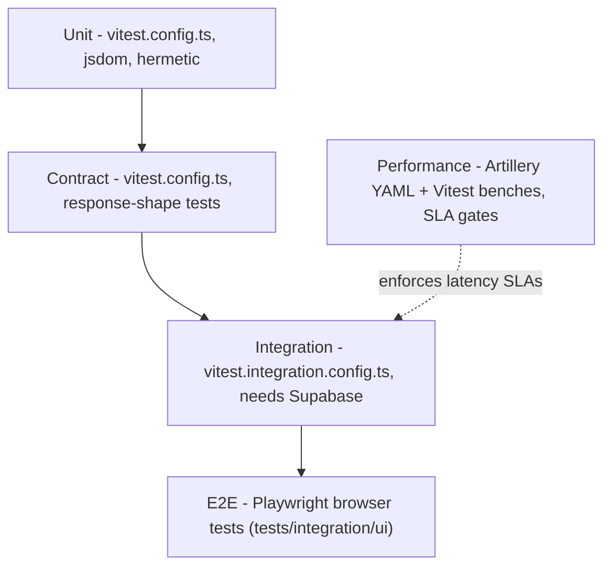

# Testing Strategy & Suites

Wottle organizes its automated tests into a pyramid: a broad base of fast, hermetic **unit** tests, a layer of **contract** tests that pin the shape of Server Action / API responses, narrower **integration** tests that exercise a live Supabase stack, **E2E** browser tests driven by Playwright, and a small set of **performance** checks that enforce latency SLAs. Each layer has a dedicated runner or config, and the constitution mandates that every code change arrive test-first via the Red → Green → Refactor cycle.



Caption: The test pyramid and which config drives each layer; performance checks sit alongside as SLA gates.

## Suites and their configs

### Unit and contract (`vitest.config.ts`)

The default Vitest project runs unit and contract tests. It uses the `jsdom` environment, enables `globals`, loads `tests/setup.ts`, and includes only `tests/unit/**` and `tests/contract/**` while explicitly excluding `tests/integration/**` and `tests/perf/**`. This suite is hermetic — it has no database and stubs the `server-only` module so server-side utilities can be imported in test.

- `pnpm test` / `pnpm test:unit` runs it (`vitest --config vitest.config.ts --run --passWithNoTests`).
- **Unit tests** (`tests/unit/`) cover the game engine, match orchestration, scoring, realtime, rating, rate limiting, a11y, and components.
- **Contract tests** (`tests/contract/`) lock the request/response contracts of the primary Server Actions and API endpoints — `post-move`, `post-match-start`, `post-invite`, `post-login`, `get-active-match`, and `get-round-summary` — so a change to a payload shape breaks a test rather than a client.

### Integration (`vitest.integration.config.ts`, requires Supabase)

Integration tests run under a separate Vitest config with the `node` environment. It includes `tests/integration/**` but **excludes `tests/integration/ui/**`** (those are the Playwright E2E specs, not Vitest). These tests talk to a running Supabase stack and exercise real DB reads/writes across the match and scoring pipelines — e.g. round scoring (`tests/integration/roundScoring.test.ts`), clock enforcement, auto-pass, forced winner, match completion/timeout, and frozen-tile tiebreakers under `tests/integration/match/`.

- `pnpm test:integration` runs it (`vitest --config vitest.integration.config.ts --run --passWithNoTests`).
- These tests **require a live Supabase instance**; bring it up with `pnpm quickstart` before running.

### E2E (Playwright)

Playwright drives real browsers against the running Next.js app. Its `testDir` is `tests/integration/ui`, and it defines two projects: `chromium` (Desktop Chrome, hardened launch flags under CI) and `playtest-firefox` (Desktop Firefox, with a longer timeout for cold-start presence settling). Locally the config starts the dev server itself (`pnpm dev`, `reuseExistingServer: true`); in CI the workflow starts services and the config skips its own `webServer` to avoid double-starting.

- Run everything: `pnpm exec playwright test`.
- These UI specs also need a **local Supabase instance running** (see `tests/integration/ui/README.md`); "Failed to load board from Supabase" means Supabase is not up.

### Performance (Artillery + Vitest benches)

Performance is enforced by Artillery load scenarios (`tests/perf/*.yml`) whose thresholds are asserted by `scripts/perf/assert-artillery-thresholds.ts`, plus Vitest micro-benchmarks such as `tests/perf/wordEngine.bench.ts` (word-engine <50 ms SLA) and `tests/perf/dictionaryLoad.bench.ts`. The npm scripts pin the p95 budgets: `pnpm perf:lobby-presence` (lobby broadcast <2 s p95), `pnpm perf:round-resolution` (round-resolution RTT <200 ms p95), and `pnpm perf:swap` (legacy swap-latency regression baseline). See [performance-testing](../operations/observability.md) for how these SLAs map to the constitution's real-time performance standards.

## Running a single test

The seed commands in `CLAUDE.md` cover targeted runs across all three runners:

```bash
# Single unit/contract file
pnpm test:unit -- path/to/test.spec.ts

# Single Playwright test by name
pnpm exec playwright test --grep "test name"

# Single integration file
pnpm test:integration -- path/to/integration-test.spec.ts
```

## Shared fixtures (`tests/helpers`)

`tests/helpers/` holds shared test doubles used across suites. The most significant is `supabaseClientStub.ts`, a queue-driven Supabase client stub: callers preload `boardFetch`/`boardLimit`/`boardUpdate`/`boardInsert`/`movesDelete` responses and inspect a recorded `history` of the tables, columns, filters, and payloads the code under test touched. This lets unit tests drive Supabase-dependent logic without a database — the counterpart to the integration suite, which uses a **live Supabase stack** rather than a stub. `tests/helpers/stubs/server-only.ts` is the stub aliased into both Vitest configs' `resolve.alias` so `import "server-only"` resolves in the test runner.

## TDD workflow and CI gates

The constitution makes TDD **non-negotiable**: every change follows **Red → Green → Refactor** — write a failing test that specifies one behavior, write the minimum code to pass it, then refactor with tests staying green. It further requires that all Server Actions, game-engine modules, and critical paths (move validation, scoring, clock management) carry tests, and that PRs show test commits landing before implementation commits.

Two static gates run zero-tolerance:

- `pnpm lint` — ESLint with `--max-warnings=0`, so any warning fails the build.
- `pnpm typecheck` — `tsc --noEmit`, matching the constitution's type-safe end-to-end requirement.

CI runs tests before allowing a merge; failing tests block the PR.

## Regression tests for scoring and rules changes

Scoring is the single most frequent class of regression in this codebase. `CLAUDE.md` requires that **any** change to `lib/game-engine/*`, `lib/match/roundEngine.ts`, `lib/match/stateMachine.ts`, `lib/scoring/*`, or `lib/constants/game-config.ts` be checked against `docs/prd_and_requirements/wottle_game_rules.md`, whose **§10 change log** records each past regression and names the rule (or invariant) that now catches it. The mandated practice when landing a scoring fix is to add a regression test that names the invariant it pins and to append a §10 row; if the spec and code disagree, both are updated in the same PR.

The engine and scoring tests that back these rules live in a few concentrated places:

- **Word engine / cross-validator** — `tests/unit/lib/game-engine/`, including `crossValidator.test.ts`, `wordEngine.test.ts`, `boardScanner.test.ts`, `deltaDetector.test.ts`, and `frozenTiles.test.ts`. The §10 log points here for the per-letter coverage rule (§4) and the cross-round standalone invariant.
- **Round engine baselines** — `tests/unit/lib/match/roundEngine.test.ts` and `roundEngine.frozenTilesBaseline.test.ts`, which pin the invariant that both scoring passes of a round share the round-start freeze baseline (`rounds.frozen_tiles_before`).
- **Instant-scoring fast path** — `tests/unit/match/instantScoring.*.spec.ts` (frozen baseline, race window, zero score, cold-start budget, failure/diagnostics) and the DB-state integration checks under `tests/integration/match/`, which pin the invariant that only the combined path may write a resolved round's `word_score_entries`.
- **Scoring summaries** — `tests/unit/lib/scoring/` and the `processRoundScoring` integration test at `tests/integration/roundScoring.test.ts`.

See [scoring](../concepts/scoring.md) and [match-runtime](../architecture/match-runtime.md) for the runtime these tests protect, and the [game engine](../concepts/game-engine.md) page for the cross-validator itself.

## Related pages

- [scoring](../concepts/scoring.md) — the scoring formula and pipeline these regression tests defend.
- [match-runtime](../architecture/match-runtime.md) — the round/state-machine flow exercised by integration and E2E suites.
- [performance-testing / observability](../operations/observability.md) — the latency SLAs enforced by the perf suite.
