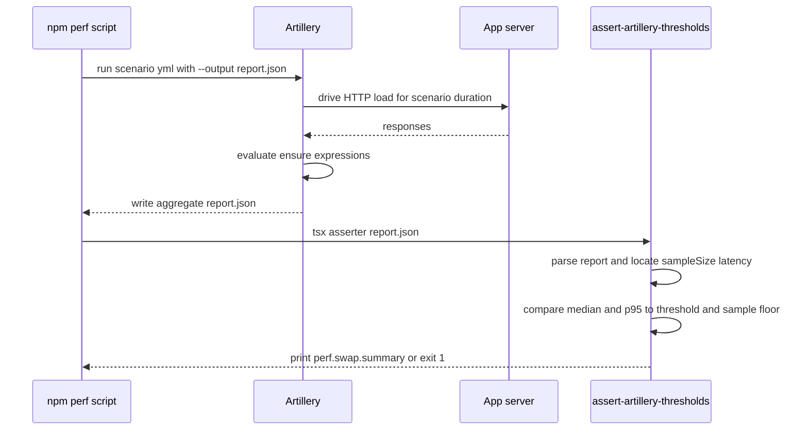

# Performance Testing & Latency Budgets

This page documents how the project turns the constitution's
[Real-Time Performance Standards](../../.specify/memory/constitution.md) into
executable gates. Two layers of tooling enforce those budgets:

- **Artillery load suites** (`tests/perf/*.yml`) drive HTTP traffic at a running
  server and check aggregate latency, backed by a second, stricter gate in
  `scripts/perf/assert-artillery-thresholds.ts`.
- **Frontend budgets** via Lighthouse CI (`.lighthouserc.json`) and a Playwright
  frame-rate check for swap animation smoothness.
- **Micro-benchmarks** (`tests/perf/*.bench.ts`) that assert per-operation SLAs
  for the word engine and dictionary load in isolation from the network.

The thresholds trace directly to constitution section II, *Real-Time Performance
Standards (NON-NEGOTIABLE)*: move RTT `<200ms` p95, word validation `<50ms`
server-side, board generation `<200ms`, realtime broadcast latency `<100ms`
between players, and 60 FPS for tile swap animations. Because these are declared
non-negotiable SLAs, exceeding a threshold is a build failure, not a warning.

## The Artillery perf scripts

Four npm scripts run one Artillery scenario each, write the aggregate report to
a JSON file with `--output`, and then re-validate that report with the
thresholds asserter. They live in `package.json`:

| Script | Scenario | Endpoint exercised | Thresholds enforced |
| --- | --- | --- | --- |
| `perf:swap` | `tests/perf/swap.yml` | `GET /api/board`, `POST /api/swap` | p95 `<200ms`, median `<200ms` (asserter defaults: 200ms, min 10 samples) |
| `perf:lobby-presence` | `tests/perf/lobby-presence.yml` | `GET /api/lobby/players` | p95 `<2000ms`, median `<1000ms`; asserter run with `SWAP_LATENCY_THRESHOLD_MS=2000`, min 20 samples |
| `perf:round-resolution` | `tests/perf/round-resolution.yml` | `POST /api/match/:id/move` | median/p95 `<200ms` move RTT plus a `<400ms` p95 broadcast label; asserter at 200ms, min 20 samples |
| `perf:instant-scoring` | `tests/perf/instant-scoring.yml` | `POST /api/match/:id/move` (fast-path) | median/p95 `<200ms` move-accept RTT; asserter at 200ms, min 20 samples |

Each script has two independent enforcement points. Artillery's own `ensure`
block fails the load run if its `expression` labels are violated, and the
follow-on `tsx scripts/perf/assert-artillery-thresholds.ts <report.json>` re-reads
the emitted report and applies an additional median/p95/sample-size gate. Because
they are chained with `&&`, either failing point fails the script.

### swap

`swap.yml` runs a 30-second steady load at `arrivalRate: 2`, fetching the board
and then posting an intentionally invalid swap (`from` and `to` at the same
coordinate) that must return `400`. It asserts both `p95 < 200` and
`median < 200`, mirroring the move-RTT SLA. `perf:swap` runs the asserter with no
env overrides, so it uses the built-in `200ms` threshold and `10`-sample floor.

### lobby-presence

`lobby-presence.yml` runs 60 seconds at `arrivalRate: 4` against
`GET /api/lobby/players` with `cache-control: no-store`, asserting `p95 < 2000`
and `median < 1000`. Lobby presence is a broadcast/snapshot path rather than a
move path, so its budget is relaxed to `2s` p95; `perf:lobby-presence` sets
`SWAP_LATENCY_THRESHOLD_MS=2000` and `SWAP_LATENCY_MIN_SAMPLE=20` so the asserter
agrees with the looser YAML `ensure`. See
[Realtime and presence](../architecture/realtime-and-presence.md) for the system
this suite probes.

### round-resolution

`round-resolution.yml` posts a move to `/api/match/test-match/move` (expecting a
`400` on the unauthenticated probe) for 60 seconds at `arrivalRate: 3`. It
asserts move-submission median/p95 `<200ms`, plus a documented `<400ms` p95
"round broadcast latency" label. The YAML comments (PERF-002) explain the budget
decomposition: the constitution requires the realtime broadcast leg to complete
`<100ms` p95, and the `<400ms` target bundles scoring computation
(~200-300ms) plus that broadcast. True end-to-end broadcast latency needs a
dual-client scenario, which the file flags as a TODO; today the suite measures
only the move-submission RTT. See the
[match runtime](../architecture/match-runtime.md) and
[scoring](../concepts/scoring.md) pages for the round-resolution workflow this
suite guards.

### instant-scoring

`instant-scoring.yml` targets the same `/api/match/:id/move` endpoint but focuses
on the `instantScoreFirstSubmission` fast path (Spec 042 / SC-005). Its comments
note that the fast path runs in an `after()` hook, so the HTTP response returns
*before* the partial-summary broadcast is emitted; the suite therefore measures
only leg 1 (move-accept RTT `<200ms` median/p95), and relies on the
constitution's independent `<100ms` p95 broadcast SLA to cover leg 2. Together
the two legs make up the SC-005 latency budget.

## How assert-artillery-thresholds.ts consumes the report

`scripts/perf/assert-artillery-thresholds.ts` is the shared gate invoked by every
perf script. It takes a single argument — the path to the Artillery `--output`
report — parses the JSON, extracts the aggregate metrics, and exits non-zero if
the latency budget or sample floor is not met.

Two environment knobs configure it, read once at module load:

- `SWAP_LATENCY_THRESHOLD_MS` — the maximum allowed median **and** p95 latency in
  milliseconds. Defaults to `200`. Both statistics are compared against this same
  value.
- `SWAP_LATENCY_MIN_SAMPLE` — the minimum number of completed requests required
  for the run to be considered statistically meaningful. Defaults to `10`. A run
  with fewer samples fails even if latency is within budget.

The asserter is defensive about Artillery's evolving report schema. It walks
several possible shapes to find the sample count (`aggregate.requestsCompleted`,
then `counters["http.requests"]`, `counters["http.responses"]`, nested
`http.requests.completed`, and finally `summaries["http.response_time"].count`),
and similarly probes multiple shapes for the latency bucket
(`aggregate.latency`, a `latencies` array/object, and nested
`summaries`/`histograms["http.response_time"]`). Median is read from any of
`median`/`p50`/`"50"`/`percentiles.*`, and p95 from `p95`/`"95"`/`percentiles.*`.
If it cannot locate a sample count, a latency object, or a median/p95 pair, it
logs the offending structure and throws, so a schema mismatch fails loudly rather
than silently passing.

On success it prints a single JSON summary line
(`event: "perf.swap.summary"`) with the threshold, sample size, median, p95, and
a `passed` boolean, then enforces three separate gates: sample size
`>= SWAP_LATENCY_MIN_SAMPLE`, median `<= SWAP_LATENCY_THRESHOLD_MS`, and p95
`<= SWAP_LATENCY_THRESHOLD_MS`. Any violation throws and `main()` exits `1`.
This machine-readable summary line is the tie-in to
[Observability](../operations/observability.md): the structured event can be
scraped from CI logs alongside the app's other structured telemetry.

*Perf-script control flow: Artillery drives load and applies its own ensure
gates, then the asserter re-validates the emitted report against the env-tuned
thresholds.*

### Reading the report shape

The committed `artillery-round-resolution.json` is an example of a *failing*
report: every virtual user timed out (`errors.ETIMEDOUT`), so `vusers.failed`
equals the created count and both `summaries` and `histograms` are empty. Against
that report the asserter would fail to find any latency bucket and throw — the
intended behavior when the server under test is unreachable or unhealthy, rather
than reporting a passing perf gate on zero good samples.

## Frontend performance: Lighthouse CI and swap FPS

`.lighthouserc.json` configures Lighthouse CI to collect three runs against
`http://localhost:3000/` under a throttled mobile form factor (375x812, 4x CPU
slowdown, simulated `150ms` RTT). Its `assert` block fails the run unless the
Lighthouse performance category scores at least `0.9`, largest-contentful-paint
stays under `2000ms`, and cumulative-layout-shift stays under `0.05`. Reports are
uploaded to temporary public storage. This is the frontend counterpart to the
Artillery backend gates.

The 60-FPS animation clause of the constitution is enforced separately by a
Playwright test, `tests/perf/ui/swap-fps.spec.ts`. It clicks two adjacent board
tiles to trigger a swap, samples `requestAnimationFrame` frame durations, and
asserts the p95 frame time stays at or below `16.7ms` (i.e. ~60 FPS).

## Micro-benchmarks (Vitest)

Two `*.bench.ts` files assert per-operation SLAs without a network in the loop:

- `tests/perf/wordEngine.bench.ts` (FR-021) runs `processRoundScoring` repeatedly
  and asserts p95 `< 50ms`, matching the constitution's `<50ms` word-validation
  budget.
- `tests/perf/dictionaryLoad.bench.ts` (FR-022 / SC-007) measures cold-start
  `loadDictionary` time. Its comment documents that the original `200ms` estimate
  assumed ~18k entries, but the real dictionary has ~2.76M inflected forms; the
  budget is therefore set to `1000ms` for cold start, with lazy singleton caching
  ensuring only the first request pays that cost.

These benchmarks complement the Artillery suites: the load tests validate the RTT
budget end-to-end over HTTP, while the micro-benchmarks isolate the compute cost
of the hottest engine operations so a regression can be localized. See the
[game engine](../concepts/game-engine.md) and [scoring](../concepts/scoring.md)
pages for the code under measurement, and the
[testing overview](./overview.md) for how these suites fit the wider test matrix.
