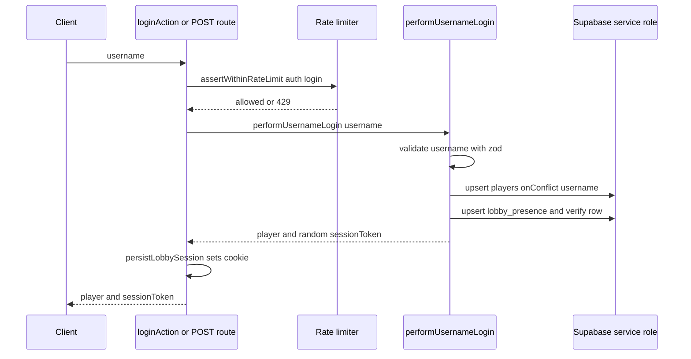

# Workflow: Authentication & Sessions

This page documents the authentication and session model used by the two-player
playtest build. It is deliberately lightweight: there are no passwords, no email
verification, and no Supabase Auth JWTs. A player "logs in" by choosing a
username; the server upserts a player row, issues an opaque session token, and
stores an encoded session in an HTTP-only cookie. That cookie is the sole
credential that later Server Actions and API routes read to authorize
server-authoritative gameplay.

> Playtest-oriented, not the intended production model. The PRD analysis in
> `repo://docs/prd_and_requirements/wottle_user_management.md` recommends
> Supabase Auth (virtual `username@wottle.local` accounts, RLS, JWT validation,
> and a database trigger to create profiles). The shipped code does **not**
> implement that: it uses a custom, self-encoded cookie session and a Supabase
> **service-role** client that bypasses RLS. Treat the PRD as the intended
> direction and this page as the current reality.

## Entrypoints

There are two ways to log in, both of which perform the same work, and one way
to log out:

- `loginAction` — a Server Action (`repo://app/actions/auth/login.ts`) invoked
  from a React form via `useActionState`-style `(prevState, formData)` signature.
  It returns a `LoginActionState` (`status`, optional `message`, `player`,
  `sessionToken`).
- `POST /api/auth/login` — an HTTP route
  (`repo://app/api/auth/login/route.ts`) that accepts a JSON body
  `{ username }` and returns `{ player, sessionToken }`. It exists as a
  programmatic/contract-testable counterpart to the Server Action.
- `logoutAction` — a Server Action (`repo://app/actions/auth/logout.ts`) that
  tears down the session, presence, and (optionally) an active match.

Both login paths call the same two functions from
`repo://lib/matchmaking/profile.ts`: `performUsernameLogin` (which validates the
username and upserts identity + presence) and `persistLobbySession` (which writes
the cookie). This keeps the Server Action and the API route behaviorally
identical, which the contract test relies on
(`repo://tests/contract/post-login.contract.test.ts`).

## Login flow

*The login path: rate limit, validate, upsert identity and presence, then set the session cookie.*

Step by step:

1. **Rate limiting.** Before any work, both login entrypoints call
   `assertWithinRateLimit` with scope `auth:login`, keyed by the client IP
   (`resolveClientIp`), allowing 5 attempts per 60s. On exceed, the API route
   returns HTTP 429 with a `retry-after` header; the Server Action returns an
   `error` status carrying the message. See
   `repo://app/actions/auth/login.ts#L36-L44` and
   `repo://app/api/auth/login/route.ts#L41-L49`. Rate-limiting mechanics are
   documented on [security-and-rate-limiting](../operations/security-and-rate-limiting.md).
2. **Username validation.** `performUsernameLogin` parses the input with a Zod
   schema requiring 3–24 characters from letters (including Icelandic glyphs),
   digits, underscore, or hyphen. Failures throw `LoginValidationError`, which
   the API route maps to HTTP 400 and the Server Action surfaces as an error
   message (`repo://lib/matchmaking/profile.ts#L35-L46`,
   `repo://lib/matchmaking/profile.ts#L71-L78`).
3. **Identity upsert.** The username is lowercased for storage and a display name
   is derived by capitalizing the first character. `upsertPlayerIdentity` upserts
   the `players` row with `onConflict: "username"`, so logging in with an
   existing username returns the same player rather than creating a duplicate
   (`repo://lib/matchmaking/profile.ts#L80-L89`,
   `repo://lib/matchmaking/service.ts#L54-L81`).
4. **Presence upsert + verification.** A `lobby_presence` row is upserted
   (`onConflict: "player_id"`, mode `auto`, TTL from
   `PLAYTEST_PRESENCE_TTL_SECONDS`, default 300s), then read back from the
   database to assert it persisted; a failed read-back throws
   (`repo://lib/matchmaking/profile.ts#L92-L116`,
   `repo://lib/matchmaking/profile.ts#L303-L314`). The player is also cached in
   the in-process presence cache via `rememberPresence`.
5. **Session token + cookie.** `performUsernameLogin` returns
   `sessionToken: crypto.randomUUID()`. `persistLobbySession` builds a
   `LobbySession` (`token`, full `player`, `issuedAt`), base64url-encodes the
   JSON, and writes it to the session cookie
   (`repo://lib/matchmaking/profile.ts#L121-L148`).
6. **Revalidation.** The Server Action calls `revalidatePath("/")` so the lobby
   re-renders with the authenticated player.

Identity and presence upserts run through the **service-role** Supabase client
(`getServiceRoleClient`), which bypasses row-level security; there is no per-user
JWT. Authorization is enforced entirely in application code against the cookie,
not by the database.

## The lobby session cookie model

The session is a self-contained, base64url-encoded JSON blob — not an opaque
server-side session id. Its shape and cookie attributes are the load-bearing
invariants of this workflow (`repo://lib/matchmaking/profile.ts#L20-L62`,
`repo://lib/matchmaking/profile.ts#L127-L165`):

- **Cookie name:** `wottle-playtest-session` (`SESSION_COOKIE_NAME`).
- **TTL:** `maxAge` of `SESSION_TTL_SECONDS` = 4 hours.
- **Attributes:** `httpOnly: true`, `sameSite: "lax"`, `path: "/"`, and
  `secure` decided by `shouldUseSecureCookies()`.
- **Contents:** the entire `player` identity (id, username, displayName,
  avatar, status, lastSeenAt, elo) is embedded in the cookie. Reads do **not**
  re-query the database for identity — the cookie is the source of truth for who
  the caller is.

### `PLAYTEST_SESSION_SECURE` and the `secure` flag

`shouldUseSecureCookies()` decides the cookie `secure` attribute
(`repo://lib/matchmaking/profile.ts#L328-L357`):

1. If `PLAYTEST_SESSION_SECURE` is set to a truthy token
   (`1/true/on/yes/enabled`) it forces `secure: true`; a falsy token
   (`0/false/off/no/disabled`) forces `secure: false`.
2. Otherwise, if `CI` is `true`/`1`, secure cookies are disabled (so
   headless HTTP test runs can read the cookie back).
3. Otherwise it falls back to `NODE_ENV === "production"`.

This override exists so non-HTTPS environments (local dev, CI, plain-HTTP
deployments) can still set and read the session cookie, since browsers drop
`secure` cookies sent over HTTP.

### `readLobbySession` — the authorization primitive

`readLobbySession` reads the cookie, base64url-decodes it, and validates it
against `sessionSchema` (Zod). Any missing cookie, malformed encoding, or schema
mismatch returns `null` rather than throwing
(`repo://lib/matchmaking/profile.ts#L150-L165`). Because the schema requires a
UUID `id` and the expected fields, a tampered or truncated cookie fails closed.

`readLobbySession` is the shared gate that authorizes essentially every
gameplay mutation. Callers treat a `null` result as "unauthenticated" and refuse
to act. For example, `submitMove` returns `{ error: "Unauthorized" }` when there
is no session and then uses `session.player.id` both as the rate-limit
identifier and to check that the caller is actually a participant in the match
(`repo://app/actions/match/submitMove.ts#L24-L57`). The same pattern recurs
across the match and matchmaking Server Actions and lobby API routes, making the
cookie the single trust anchor for server-authoritative play. See
[matchmaking-lobby](../architecture/matchmaking-lobby.md) for how identity feeds
the lobby and matchmaking.

## Logout flow

`logoutAction` (`repo://app/actions/auth/logout.ts`) reverses the login state and
cleans up lobby/match side effects:

1. It reads the current session; if there is none, it returns
   `{ status: "signed-out", resignedMatchId: null }` (idempotent no-op).
2. It rate-limits by `player.id` under scope `auth:logout` (10/60s).
3. If `resignActiveMatch` is requested, it finds the player's active match and
   calls `resignMatch`. `resignMatch` failures are swallowed and logged so
   logout still proceeds — except `RateLimitExceededError` and `ZodError`, which
   are rethrown.
4. It expires the player's `lobby_presence` (`expireLobbyPresence`) and drops the
   in-process cache entry (`forgetPresence`).
5. It **deletes** the `wottle-playtest-session` cookie and calls
   `revalidatePath("/", "layout")`.

Deleting the cookie is what actually "logs the user out": subsequent
`readLobbySession` calls return `null`.

## Session lifecycle & invariants

- **Statelessness of the credential.** The server keeps no session table; the
  cookie is self-describing and expires purely by browser `maxAge` (4h). There
  is no server-side revocation short of deleting the cookie client-side (logout).
- **Identity is cached in the cookie.** Profile fields (including `status` and
  `eloRating`) captured at login can drift from the database. The lobby
  reconciles this separately — e.g. `healStuckInMatchStatus` repairs a `players`
  row stuck in `in_match` when no active match exists, precisely because the
  cookie-tracked `status` and the DB row can disagree
  (`repo://lib/matchmaking/profile.ts#L240-L285`).
- **Presence TTL vs session TTL differ.** The session cookie lasts 4h, but
  `lobby_presence` expires after `PLAYTEST_PRESENCE_TTL_SECONDS` (default 300s)
  and must be refreshed by presence heartbeats; a still-logged-in player can drop
  out of the lobby snapshot when presence lapses
  (`repo://lib/matchmaking/profile.ts#L28-L33`,
  `repo://lib/matchmaking/profile.ts#L179-L225`).
- **Fail-closed reads.** Because `readLobbySession` returns `null` on any
  decode/validation error, corruption or tampering degrades to
  "unauthenticated," never to impersonation of a different UUID.

## Configuration & operations

- `PLAYTEST_SESSION_SECURE` — override for the session cookie `secure` flag
  (see above).
- `PLAYTEST_PRESENCE_TTL_SECONDS` — presence row TTL, default `300`.
- Rate-limit scopes `auth:login` (5/60s by IP) and `auth:logout` (10/60s by
  player id) are enforced via `assertWithinRateLimit`
  (`repo://lib/rate-limiting/middleware.ts#L76-L120`); the store can be disabled
  globally or per-scope by env, as covered on
  [security-and-rate-limiting](../operations/security-and-rate-limiting.md).
- The API route always sets `cache-control: no-store` so responses containing
  the session token are never cached (`repo://app/api/auth/login/route.ts#L14-L16`).

## Tests that matter

- `repo://tests/contract/post-login.contract.test.ts` pins the `POST /api/auth/login`
  contract: 200 with `{ player, sessionToken }`, `no-store` header, and delegation
  to `performUsernameLogin`/`persistLobbySession`.
- `repo://tests/integration/app/lobby-redirect.test.ts` mocks `readLobbySession`
  to `null` to assert that unauthenticated callers are redirected/denied,
  exercising the cookie-as-gate contract.

## Related pages

- [matchmaking-lobby](../architecture/matchmaking-lobby.md) — how the upserted
  identity and presence populate the lobby and drive matchmaking.
- [security-and-rate-limiting](../operations/security-and-rate-limiting.md) —
  the rate-limiting middleware and scope configuration used by these actions.
- `repo://docs/prd_and_requirements/wottle_user_management.md` — the intended
  Supabase-Auth-based user model this playtest implementation deviates from.
