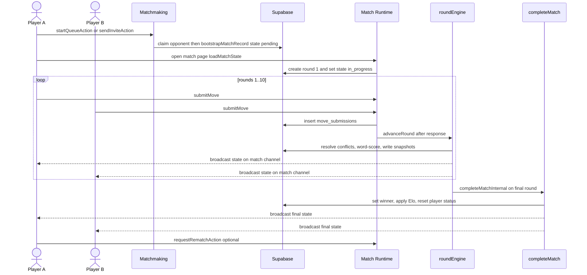

# Workflow: End-to-End Match

This page walks the full control flow of a single match: a player enters the
lobby, auto-queues or sends an invite, a match record is created, players play
rounds of submit / resolve / reveal, the match completes and Elo is applied, and
either player may request a rematch. Each step is a thin Next.js **server
action** or server module that owns the authoritative mutation; both clients see
the result through a Supabase Realtime broadcast on the `match:<matchId>`
channel. This page links to the owning system pages rather than re-explaining
their internals:

- Lobby entry, queueing, and invites — [Matchmaking & Lobby](../architecture/matchmaking-lobby.md)
- Rounds, timers, self-heal, and state loading — [Match Runtime](../architecture/match-runtime.md)
- Word scoring and freezes — [Scoring](../concepts/scoring.md) and [Frozen Tiles](../concepts/frozen-tiles.md)
- Winner determination and Elo — [Rating & Results](../concepts/rating-and-results.md)
- Realtime broadcast and the safety poll — [Realtime & Presence](../architecture/realtime-and-presence.md)

## End-to-end sequence

Sequence from lobby queueing through match creation, per-round resolution, match completion with Elo, and an optional rematch.

## Step 1 — Enter the lobby and find an opponent

A player reaches a match in one of two ways, both guarded by
`readLobbySession()` and executed with a Supabase service-role client:

- **Auto-queue.** `startQueueAction` delegates to `startAutoQueue`, which first
  short-circuits to any existing active match, then marks the caller
  `matchmaking`, selects the longest-waiting available candidate, and
  **atomically claims** that opponent with a conditional
  `update(status = in_match).eq(status, "matchmaking")`. If the conditional
  update returns no rows the opponent was already taken, so the caller stays
  queued; otherwise it proceeds to create the match. This CAS-style claim is the
  server-authoritative boundary that prevents two players from matching the same
  opponent.
- **Direct invite.** `sendInviteAction` → `sendDirectInvite` writes a
  `match_invitations` row with a TTL (default `PLAYTEST_INVITE_EXPIRY_SECONDS`,
  30s). `respondInviteAction` → `respondToInvite` creates the match only on
  `accepted`, sets both players `in_match`, and stamps `match_id` back onto the
  invitation.

Both paths call `bootstrapMatchRecord`, which upserts a `matches` row in state
`pending` with a random `board_seed`, `player_a_id` / `player_b_id`, and
`round_limit` (default 10). See [Matchmaking & Lobby](../architecture/matchmaking-lobby.md)
for queue selection, presence, and status transitions.

## Step 2 — Match creation is lazily finalized on first load

`bootstrapMatchRecord` leaves the match `pending`; no round exists yet. The
match becomes playable the first time either player opens
`/match/[matchId]`. The page component authenticates, runs best-effort
reconnect handling, then calls `loadMatchState`. When it sees `state === "pending"`,
`loadMatchState` **upserts round 1** (`board_snapshot_before` generated from the
board seed, `state = "collecting"`, `started_at = now`) and flips the match to
`in_progress` with `current_round = 1`. This makes match start idempotent and
self-healing: whichever player loads first triggers it, and the upsert
`onConflict "match_id,round_number"` tolerates a concurrent second loader.

The page then renders `MatchClient`, which subscribes to the
`match:<matchId>` Realtime channel and runs a 2-second background safety poll
against `/api/match/[matchId]/state` alongside the broadcast, so a dropped
broadcast never leaves a client stuck. See [Match Runtime](../architecture/match-runtime.md).

## Step 3 — Rounds: submit, resolve, reveal

Each round is a `collecting → resolving → completed` lifecycle driven by two
submissions.

**Submit (`submitMove`).** The server is authoritative for every gate: it
rate-limits (30 moves/min), verifies the caller is a player in an `in_progress`
match, requires the round to be `collecting`, enforces the player's
server-side clock via `isClockExpired`, rejects out-of-bounds, self-swap,
frozen-tile, and duplicate submissions, then inserts a `move_submissions` row.
It returns the swapped board only for optimistic UI; the authoritative board
does not change until the round resolves. After the response it uses Next.js
`after()` to broadcast state (so the opponent sees the submitter's timer pause),
run the instant-scoring fast path, and then call `advanceRound` — sequenced so
instant scoring reads a consistent view before advancement.

**Resolve (`advanceRound` in `roundEngine`).** This is the core round engine.
It reloads match and round, and only proceeds while the round is still
`collecting`. It synthesizes a timeout submission for an absent player whose
clock has expired, and completes the match immediately if **both** clocks have
flagged. Once two submissions are present it:

1. Resolves overlapping-tile conflicts first-come-first-served
   (`resolveConflicts`) and applies accepted swaps to the board.
2. **Compare-and-swaps** the round from `collecting` to `resolving`
   (`update(...).eq(state, "collecting")`). If the update touches zero rows a
   concurrent `advanceRound` already won, and this caller exits cleanly. This
   CAS serializes the two near-simultaneous `after()` hooks and prevents
   duplicate `word_score_entries`.
3. Computes word scores against the **round-start freeze map**
   (`rounds.frozen_tiles_before`, not the live `matches.frozen_tiles` the
   instant-scoring fast path mutates mid-round), persists the word engine's
   authoritative `board_snapshot_after`, and marks submissions
   `accepted` / `rejected_invalid`.
4. Deducts elapsed time from each player's timer and computes game-over
   (`nextRound > 10` or both timers exhausted). If the game continues it inserts
   the next round using the word engine's final board and post-round freeze map
   as the baseline.

Word scoring and freeze semantics live in [Scoring](../concepts/scoring.md) and
[Frozen Tiles](../concepts/frozen-tiles.md).

**Reveal.** For non-terminal rounds `advanceRound` fire-and-forgets
`publishRoundSummary` and `publishMatchState`; clients derive the per-round
reveal animation from that summary. For the terminal round it **awaits**
`publishRoundSummary` (bounded by a 3s outer timeout) so the round-10 scoreboard
snapshot is durably written before the `after()` hook can be terminated, then
finalizes the match. Broadcast delivery itself is best-effort: `publishMatchState`
bounds channel subscription to 2s and the client safety poll self-heals on miss.
If word scoring throws, the round is deliberately **left in `resolving`** so the
runtime's stuck-round recovery can roll it forward idempotently on the next state
read — see [Match Runtime](../architecture/match-runtime.md).

## Step 4 — Completion and Elo

`completeMatchInternal` is the single authoritative finalizer, invoked by
`advanceRound` at game over and also by timeout, resignation, disconnect, and
claim flows via `reason`. It is idempotent: if the match is already `completed`
it returns the existing result. Otherwise it reads the latest
`scoreboard_snapshots` row, determines the winner with `determineMatchWinner`
(score first, frozen-tile count as tiebreaker) unless a `forcedWinnerId` is
supplied, and writes `state = "completed"` with `winner_id` and `ended_reason`.

It then applies **Elo**: it loads both players' `elo_rating` and `games_played`,
derives each K-factor, computes new ratings via `calculateElo`, and persists the
deltas. Rating changes are skipped for `abandoned` matches (no winner, no
meaningful delta) and failures are logged without blocking completion. Finally
it resets both players to `available` in the lobby, writes a match log, and
broadcasts the final state. The scoring math and rating model are documented in
[Rating & Results](../concepts/rating-and-results.md).

`completeMatchAction` is the participant-facing wrapper that authenticates and
verifies the caller is in the match before delegating to
`completeMatchInternal`. The completed match's round-by-round chart is served by
the `/match/[matchId]/summary` page from the scoreboard snapshots written during
resolution.

## Step 5 — Optional rematch

From the finished match either player may call `requestRematchAction`. It
authenticates, rate-limits (5/min), validates the match is in a rematchable
state, and either records a pending request or — if the opponent already
requested — detects the **simultaneous** case and immediately accepts, creating
a new match linked by `rematch_of` (via `bootstrapMatchRecord`). The new match
re-enters this workflow at Step 2. Rematch requests, acceptance, and expiry are
detailed in the rematch flow under [Match Runtime](../architecture/match-runtime.md).

## Invariants worth remembering

- Every state mutation runs server-side under a service-role client; clients
  never write match state directly. Optimistic UI in `submitMove` is display
  only.
- A match is created `pending` and only becomes `in_progress` when the first
  loader materializes round 1 — this lazy start is idempotent.
- Round advancement is serialized by a CAS on `round.state`; the losing
  concurrent caller exits without side effects.
- Word scoring uses the round-start freeze snapshot, decoupling it from the
  instant-scoring fast path's mid-round writes to `matches.frozen_tiles`.
- Match completion is idempotent and is the only place winner and Elo are
  written; broadcasts are best-effort and backed by the client safety poll.
