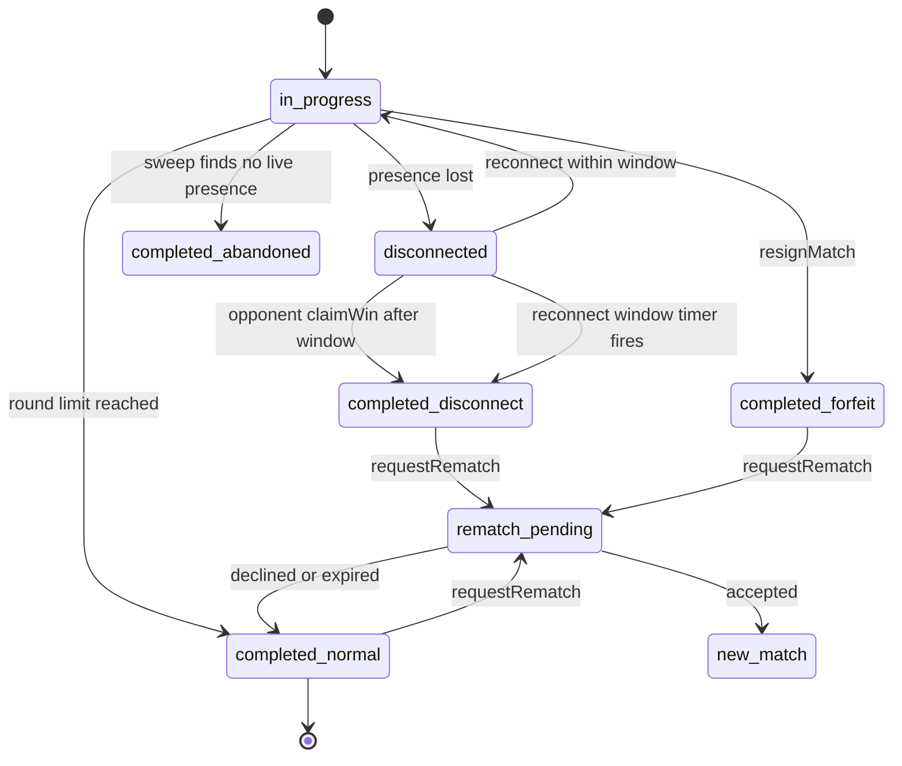
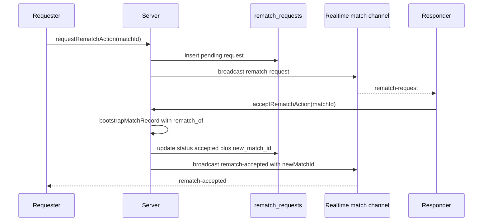

# Workflow: Rematch, Disconnect & Resignation

This page documents two adjacent flows that begin once a match is underway:

- **Ending a live match early** — when a player loses their connection, deliberately quits, or a match is left with nobody present. Covers heartbeat-based presence detection, the in-memory disconnect tracker, `claimWin`, `resignMatch`, and the pg_cron sweep of abandoned matches.
- **Rematch negotiation** — the post-game request / respond / cancel handshake, series (best-of) tracking through the `rematch_of` chain, and the realtime rematch broadcast.

The end state of every early-exit flow is a **completed** match, which then feeds
winner determination and Elo through [Elo Rating & Match Results](../concepts/rating-and-results.md).
The in-round mechanics that precede these flows live in
[Match & Round Runtime](../architecture/match-runtime.md).

## Match lifecycle states

Caption: the match state machine covering active play, the transient
disconnected view, and the disconnect / resign / sweep / rematch exits. Note that
`disconnected` is a **derived view flag** surfaced in the polled snapshot, not a
stored `matches.state` value — the row stays `in_progress` until it is finalized.

## Disconnect detection

A match row is `in_progress` in the database, but a player's client can vanish
without cleanly ending the match. Wottle detects this loss of presence through
two independent channels, consulted in priority order when
`loadMatchState` builds each polled snapshot.

### Fast path — the in-memory disconnect store

`lib/match/disconnectStore.ts` is a **per-process** `Map` keyed by
`matchId:playerId`. It records the timestamp at which a player first lost their
connection (`recordDisconnect`), and exposes synchronous helpers
(`getDisconnectRecord`, `getDisconnectedAt`, `clearDisconnect`). It deliberately
lives outside any `"use server"` file so it can export non-async helpers and the
`RECONNECT_WINDOW_MS` constant.

The store is populated by `handlePlayerDisconnect` (see below), which is invoked
from the fast client signals: the `pagehide` → `navigator.sendBeacon` beacon to
`/api/match/[matchId]/disconnect`, the Realtime `system: CLOSED` handler, and the
surviving client's presence `onOpponentLeave` callback.

Because this store is per-process, it can false-positive or miss entirely on a
multi-instance deployment (Vercel). It is the fast path for the common
tab-close case, not the source of truth.

### Fallback — shared heartbeats

`lib/match/heartbeatRepository.ts` provides the instance-independent fallback
(issue #164) backed by the `match_heartbeats` table:

- `recordHeartbeat` upserts the caller's `(match_id, player_id)` row with a fresh
  `last_seen_at` on **every** state poll. It is invoked (fire-and-forget) from
  `GET /api/match/[matchId]/state`; failures are logged and swallowed so the poll
  still returns the snapshot.
- `findStaleParticipant` returns the id of a participant whose `last_seen_at` is
  older than `HEARTBEAT_STALE_MS` (10s), or whose heartbeat row is missing.
  Matches created within a `GRACE_WINDOW_MS` (also 10s) are skipped so a
  not-yet-landed first poll is not mistaken for a drop.

`loadMatchState` combines both sources as
`inMemoryDisconnect ?? staleFromHeartbeat` and returns the result as the
snapshot's `disconnectedPlayerId`. Clients render the "opponent disconnected"
modal from that field. See
[Realtime & Presence](../architecture/realtime-and-presence.md) for the presence
and polling substrate.

### handlePlayerDisconnect / handlePlayerReconnect

`handlePlayerDisconnect(matchId, playerId)`:

1. Requires an authenticated lobby session and verifies the player participates
   in the match; returns early (no-op) if the match is not `in_progress`.
2. Calls `recordDisconnect` and broadcasts a state snapshot carrying
   `disconnectedPlayerId` on the `match:<id>` Realtime channel.
3. Schedules a `setTimeout` for `RECONNECT_WINDOW_MS` (90s). When it fires, if
   `clearDisconnect` still finds a record (the player never reconnected), it
   finalizes the match via `completeMatchInternal(matchId, "disconnect", winnerId)`,
   awarding the still-connected opponent.
4. Writes a `disconnect` match-log event.

`handlePlayerReconnect` clears the record and re-broadcasts a clean snapshot if
the player returns inside the 90s window; if the window already elapsed it only
clears the record to keep the store tidy.

## Ending a live match early

### claimWin

`claimWinAction(matchId)` lets the **surviving** player force completion when
their opponent has been gone long enough, without waiting for the disconnect
timer. It is a discriminated-union-returning Server Action guarded by a rate
limit of one claim per minute (`match:claim-win`). It:

1. Rejects unauthenticated callers and non-participants (`forbidden`).
2. Returns `already_completed` if the match is already `completed`.
3. Looks up the opponent's disconnect timestamp via `getDisconnectedAt`; returns
   `not_disconnected` when the opponent is present.
4. Returns `too_early` with `remainingMs` if less than `RECONNECT_WINDOW_MS` has
   elapsed since the disconnect.
5. Otherwise calls `completeMatchInternal(matchId, "disconnect", selfId)`,
   awarding the claimer, and returns `ok`.

Because `claimWin` reads the same `disconnectStore`, it shares the per-process
scope caveat: on a serverless deployment the claim path only works when the same
instance recorded the disconnect.

### resignMatch

`resignMatch(matchId)` is a deliberate forfeit by a participant. Rate-limited to
five attempts per minute (`match:resign`), it validates participation and that
the match is not already `completed`, then directly updates the row to
`state = "completed"`, `winner_id = opponent`, `ended_reason = "forfeit"`. It
resets both players to `available`, writes a `match.forfeit` log event, publishes
the final snapshot, and reports the result to observability with zeroed scores.

Note that `resignMatch` writes the completion **inline** rather than routing
through `completeMatchInternal`; it does not itself apply Elo. `claimWin` and the
disconnect-timeout path do route through `completeMatchInternal`, which applies
Elo for non-`abandoned` reasons.

### completeMatchInternal and ended reasons

`completeMatchInternal(matchId, reason, forcedWinnerId?)` is the shared
finalizer. It is idempotent: if the match is already `completed` it returns the
existing result without re-writing. Winner selection depends on the reason:

- `abandoned` → no winner (`winner_id = null`); there is no reliable signal for
  who "should" have won, and Elo is **skipped**.
- an explicit `forcedWinnerId` (disconnect / claim-win) → that player wins
  regardless of score, treating connection loss as a forfeit.
- otherwise → `determineMatchWinner` computes the winner from the latest
  scoreboard snapshot and frozen-tile counts.

It then persists the completion, applies Elo (except for `abandoned`), resets
both players to `available`, writes a match-log event, publishes the final state,
and emits a result to observability. The `matches.ended_reason` CHECK constraint
permits `round_limit`, `timeout`, `disconnect`, `forfeit`, `draw`, and
`abandoned`.

### Stale-match sweep (abandoned matches)

When both clients vanish, no surviving player exists to run the disconnect timer
or claim a win. A pg_cron job closes this gap. The SQL function
`find_orphaned_matches()` returns ids of `in_progress` matches where **neither**
player has a live (`expires_at > now()`) `lobby_presence` row. A pg_cron schedule
(guarded so it is skipped where `pg_cron`/`pg_net` are unavailable) invokes
`POST /api/cron/sweep-stale-matches` every 30 seconds via `pg_net`, authenticated
with the `CRON_SECRET` bearer token.

The route fetches orphaned ids through `findOrphanedMatches` and finalizes each
with `completeMatchInternal(id, "abandoned")` — so abandoned matches complete
with **no winner and no Elo change**. The full operational setup and verification
steps live in
[Database Migrations & Scheduled Jobs](../operations/migrations-and-cron.md).

## Rematch negotiation

Rematch is only available on a **completed** match, and only between its two
participants. State lives in the `rematch_requests` table
(`lib/match/rematchRepository.ts`), and every transition is mirrored to clients
over the `match:<id>` Realtime channel by `broadcastRematchEvent`
(`event: "rematch"`).

Caption: the happy-path rematch handshake; both players are routed into the newly
bootstrapped match linked by `rematch_of`.

### requestRematch

`requestRematchAction(matchId)` validates the request through
`validateRematchRequest` (match must be `completed`, caller must be a
participant, no already-processed or duplicate pending request). It is
rate-limited (`match:rematch`, five per minute). Two outcomes:

- **Simultaneous rematch** — if the opponent already has a pending request and
  the caller is its responder (`detectSimultaneousRematch`), the request is
  accepted immediately: a new match is bootstrapped and `rematch-accepted` is
  broadcast, returning `{ status: "accepted", matchId }`.
- Otherwise it inserts a `pending` request, broadcasts `rematch-request`, and
  returns `{ status: "pending" }`.

### respond (accept / decline) and expiry

`respondToRematch.ts` exposes `acceptRematchAction` and `declineRematchAction`
(with a deprecated `respondToRematchAction(matchId, accept)` shim). Both share
`validateAndFetchRequest`, which requires the caller to be the request's
**responder**, requires the request to still be `pending`, and enforces a
`REMATCH_TIMEOUT_MS` of 30 seconds: a request older than that is marked
`expired`, broadcast as `rematch-expired`, and returns `{ status: "expired" }`.

- **Accept** bootstraps a new match via `bootstrapMatchRecord` with
  `rematchOf = matchId`, updates the request to `accepted` (storing
  `new_match_id`), sets both players `in_match`, logs `match.rematch.created`,
  and broadcasts `rematch-accepted` with the `newMatchId`.
- **Decline** updates the request to `declined`, logs `match.rematch.declined`,
  and broadcasts `rematch-declined`.

### cancel

`cancelRematchAction(matchId)` (FR-018) is a fire-and-forget cleanup for when the
**requester** navigates away. It silently no-ops unless the caller is the
requester and the request is still `pending`; otherwise it marks the request
`expired` and broadcasts `rematch-expired`.

### Series (best-of) tracking

A new match created by accepting a rematch stores `rematch_of` pointing at the
previous match, forming a backward-linked chain. `fetchMatchChainForSeries`
walks that chain (cycle-guarded) from a given match, and the pure helpers in
`rematchService.ts` derive display data:

- `walkRematchChain` orders the chain oldest → newest.
- `deriveSeriesContext` counts, from the caller's perspective, the current
  game number (`chain.length`), `currentPlayerWins`, `opponentWins`, and `draws`
  (a `null` winner is a draw).

This is what powers the "Game N — you 2, them 1" series header across a rematch
run.

## Invariants and failure semantics

- The reconnect window (`RECONNECT_WINDOW_MS = 90s`) is authoritative for both
  the disconnect timeout and the earliest allowed `claimWin`; the two paths race
  and `completeMatchInternal`'s idempotency makes a double-finalize safe.
- Heartbeat staleness (`HEARTBEAT_STALE_MS = 10s`) only surfaces the
  `disconnectedPlayerId` view flag — it does **not** by itself finalize a match;
  finalization comes from the disconnect timer, `claimWin`, resignation, or the
  sweep.
- `disconnectStore` and its 90s `setTimeout` are per-process and best-effort; the
  pg_cron sweep is the durable backstop for matches whose in-process timer never
  runs (redeploy, cold instance, both players gone).
- `abandoned` is the only early-exit reason that produces no winner and no Elo
  delta.
- A rematch can only be created once per source match; the validation and the
  30s expiry prevent stale or duplicate acceptances.

## Testing

`tests/unit/lib/match/rematchService.test.ts` covers the pure rematch helpers —
simultaneous-rematch detection, request validation edge cases, chain walking, and
series-context derivation — independently of Supabase, which is why that logic
lives in `rematchService.ts` rather than inline in the Server Actions.
