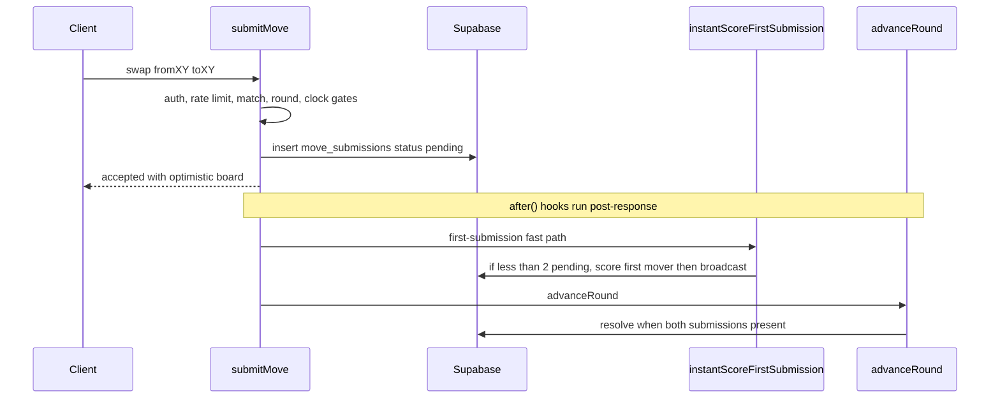

# Workflow: Round Submission & Resolution

This workflow deep-dives the path a single tile swap travels from a client
`submitMove` call to a resolved, revealed round. It covers the validation gates,
the second-submission trigger that resolves a round, conflict resolution and the
`ignored_same_move` case, synthesized timeout passes for absent or flagged
players, the instant-scoring reveal fast path, `publishRoundSummary`, and
`recoverStuckRound` for rounds that stall mid-pipeline.

**Game-rules guardrail.** This page documents the *runtime mechanics* of
resolution — the order of gates, which server action fires next, and how state
transitions and timers are enforced. The *substance* of scoring, word
validation, and tile freezing lives in the game-rules concept pages: see
[Scoring & Cross-Validation](../concepts/scoring.md) and the
[Frozen Tiles Mechanic](../concepts/frozen-tiles.md). For the broader match
lifecycle (match states, clock model, completion, Elo) see
[Match & Round Runtime](../architecture/match-runtime.md). Where this page says
"score the round" or "freeze tiles," treat those pages as authoritative for
*what* the rules are; here we cover *when and how* the runtime invokes them.

Everything below is server-authoritative: all engine writes go through the
Supabase `service_role` client, and the round `phase`
(`collecting → resolving → completed`) is the serialization point.

## Submitting a move: validation gates in order

[`submitMove`](repo://app/actions/match/submitMove.ts#L17-L235) is the single
entrypoint for a player's swap. It validates in a strict order and short-circuits
on the first failing gate, so a rejected move never touches the board:

1. **Session / auth** — [`readLobbySession`](repo://app/actions/match/submitMove.ts#L24-L28)
   must return a session; otherwise `{ error: "Unauthorized" }`.
2. **Rate limit** — [`assertWithinRateLimit`](repo://app/actions/match/submitMove.ts#L31-L37)
   caps submissions at 30 per 60 s per user under scope `match:submit-move`.
3. **Match state** — the match must load and be `in_progress`, and the caller
   must be `player_a_id` or `player_b_id`
   ([match gate](repo://app/actions/match/submitMove.ts#L40-L57)).
4. **Round state** — the current round must load and be in `collecting`;
   otherwise it is "no longer accepting submissions"
   ([round gate](repo://app/actions/match/submitMove.ts#L60-L73)).
5. **Clock expiry** — if the caller's server-authoritative timer has run out
   ([`isClockExpired`](repo://lib/match/clockEnforcer.ts#L22-L28) against
   `rounds.started_at`), the submission is rejected *and* `advanceRound` is fired
   so the server can synthesize a timeout for the expired player or end the match
   ([clock gate](repo://app/actions/match/submitMove.ts#L78-L90)).
6. **Move application** — only now are coordinates bounds-checked, the
   same-tile swap rejected, and frozen tiles enforced (FR-014): a swap touching
   any coordinate in `matches.frozen_tiles` is rejected
   ([validation](repo://app/actions/match/submitMove.ts#L100-L137)). A duplicate
   submission for the round is rejected both by an explicit check and by the
   `(round_id, player_id)` unique constraint (Postgres `23505`)
   ([duplicate handling](repo://app/actions/match/submitMove.ts#L139-L178)).

Once the row is inserted with `status: "pending"`, `submitMove` returns
`{ status: "accepted" }` with an optimistically swapped board for immediate
visual feedback — the authoritative `board_snapshot_before` does not change until
the round resolves
([optimistic board](repo://app/actions/match/submitMove.ts#L190-L234)).

### Post-response hooks

`submitMove` defers three side effects into Next.js `after()` hooks so they run
post-response at full Vercel CPU priority instead of being throttled as
fire-and-forget:

- A first `after()` broadcasts state so clients see the submitting player's timer
  pause ([state broadcast](repo://app/actions/match/submitMove.ts#L180-L188)).
- A second `after()` runs the instant-scoring fast path and then `advanceRound`,
  **sequentially in that order** and under independent `try/catch`
  ([resolution hook](repo://app/actions/match/submitMove.ts#L205-L228)). Ordering
  matters: `instantScoreFirstSubmission` no-ops in ≤5 ms once a second submission
  is present, so sequencing costs nothing in the happy path, but it must run
  before `advanceRound` so the fast path's race-window check reads a consistent
  view of `move_submissions`. An instant-scoring failure is caught and cannot
  block `advanceRound`.

Caption: The submit-move path — synchronous gates and response, then the
sequential instant-scoring and advanceRound hooks that run after the response.

## Resolution: the second submission triggers advanceRound

A round resolves when [`advanceRound`](repo://lib/match/roundEngine.ts#L140-L516)
observes that both players are accounted for. It is idempotent-by-guard: it
re-loads match and round, exits early unless the round is still `collecting`,
then gathers `pending` submissions
([load and guard](repo://lib/match/roundEngine.ts#L144-L192)).

The resolution pipeline, in order:

1. **Both-flagged check** — if fewer than 2 submissions exist but both players'
   clocks have expired, the match ends immediately via
   `completeMatchInternal(matchId, "timeout")` (the chess "mutual flag" case)
   ([both-flagged](repo://lib/match/roundEngine.ts#L194-L211)).
2. **Timeout synthesis** — `maybeSynthesizeTimeoutPass` may append a synthetic
   pass for an absent player whose clock expired (see below).
3. **Wait** — if still fewer than 2 submissions, return `{ status: "waiting" }`
   ([wait](repo://lib/match/roundEngine.ts#L221-L224)).
4. **Conflict resolution** — timeout submissions are filtered out (they lock no
   tiles), and the rest run through
   [`resolveConflicts`](repo://lib/match/conflictResolver.ts#L8-L47).
5. **CAS lock** — the round is flipped `collecting → resolving` with a
   compare-and-swap update on `state = 'collecting'`. This serializes concurrent
   `advanceRound` callers — both players submitting near-simultaneously queue two
   `after()` hooks, and without the CAS both would pass the state check and run
   scoring twice, producing duplicate `word_score_entries`
   ([CAS lock](repo://lib/match/roundEngine.ts#L266-L292)).
6. **Word scoring** — `computeWordScoresForRound` scores against the *round-start*
   freeze baseline (`rounds.frozen_tiles_before`, falling back to
   `matches.frozen_tiles`) and returns the authoritative final board and merged
   freeze map ([scoring baseline](repo://lib/match/roundEngine.ts#L294-L340)).
7. **Persist and complete** — the word engine's `scoringFinalBoard` is persisted
   as `board_snapshot_after`, submission statuses are batched to `accepted` /
   `rejected_invalid`, and the round is marked `completed`
   ([persist](repo://lib/match/roundEngine.ts#L342-L378)).
8. **Timer deduction** — each player's stored timer is reduced by the elapsed
   time from `rounds.started_at` to their submission
   ([deduct](repo://lib/match/roundEngine.ts#L380-L391)).
9. **Advance or end** — the game is over when `nextRound > 10` or both timers hit
   zero. If not over, round N+1 is inserted seeded from `scoringFinalBoard` and
   the post-round freeze snapshot; then the match is advanced
   ([advance](repo://lib/match/roundEngine.ts#L393-L446)).
10. **Publish** — round summary and match state are broadcast. For terminal
    rounds this is a bounded `await` (a 3 s outer guard wrapping
    `publishRoundSummary`'s internal 2 s subscribe timeout) so the round-10 chart
    entry survives Vercel `after()` termination; for non-terminal rounds it is
    fire-and-forget ([publish](repo://lib/match/roundEngine.ts#L448-L504)).

### Why round N+1 uses the scored board, not the raw swapped board

`advanceRound` seeds round N+1 from the word engine's `scoringFinalBoard`, not the
blindly-applied `boardAfter`. The two diverge whenever a same-round move is
rejected mid-pipeline because an earlier player's word froze tiles the later move
would have touched; seeding from `boardAfter` would leave the next round showing
letters from a swap that "didn't actually happen"
([seeding rationale](repo://lib/match/roundEngine.ts#L398-L426)).

### Conflict resolution and same-move handling

[`resolveConflicts`](repo://lib/match/conflictResolver.ts#L8-L47) sorts
submissions by timestamp and applies **first-come-first-served** tile locking:
each accepted move locks its `from` and `to` coordinates, and any later move that
overlaps a locked tile is rejected with reason `"Tile conflict with earlier
submission"` and status `rejected_invalid`.

Two *identical* swaps are a distinct case. When the second player submits the
exact same move signature as an already-accepted counterpart,
[`registerSubmission`](repo://lib/match/stateMachine.ts#L12-L52) marks the later
submission `ignored_same_move` rather than `rejected_invalid` — the earlier valid
submission wins and the duplicate is ignored, not treated as a scoring error.
This status is a first-class member of the `move_submissions.status` enum
(`pending`, `accepted`, `rejected_invalid`, `ignored_same_move`, `timeout`).

## Timeout handling

Timeouts are enforced against the server-authoritative clock, never the client's
local timer. [`isClockExpired`](repo://lib/match/clockEnforcer.ts#L22-L28)
compares `rounds.started_at` plus the stored per-player remaining time to now.

**Per-player rejection at submit time.** If a player tries to submit after their
own clock expired, gate 5 of `submitMove` rejects the move and fires
`advanceRound` in the background so the server can resolve the round rather than
leaving it stuck ([clock gate](repo://app/actions/match/submitMove.ts#L78-L90)).

**Synthesized timeout pass for an absent player.** When exactly one submission
exists and the *absent* player's clock has expired,
[`maybeSynthesizeTimeoutPass`](repo://lib/match/roundEngine.ts#L80-L115) inserts a
`status: "timeout"` submission (coordinates `0,0→0,0`) for that player and appends
it in-memory. This lets the round reach the two-submission threshold and resolve
even though one player never acted. Timeout submissions are excluded from
conflict resolution because they lock no tiles
([filter](repo://lib/match/roundEngine.ts#L226-L240)).

**Both-flagged (mutual flag).** If fewer than two submissions exist but *both*
clocks are expired, `advanceRound` completes the match immediately with reason
`"timeout"` rather than waiting for a second submission that can never arrive
([both-flagged](repo://lib/match/roundEngine.ts#L194-L211)).

**Client-triggered dual timeout.**
[`triggerTimeoutCheck`](repo://app/actions/match/triggerTimeoutCheck.ts#L14-L29)
is a thin authenticated server action the client calls when it locally detects
both clocks have expired. The client cannot end the match itself; it asks the
server to run `advanceRound`, whose both-flagged branch performs the completion.
Errors are swallowed because `advanceRound` may throw if the match already
completed.

## Instant-scoring reveal fast path

The instant-scoring fast path reveals the first mover's words *while the round is
still collecting*, so the opponent sees partial results before submitting.
[`instantScoreFirstSubmission`](repo://lib/match/instantScoring.ts#L102-L286) runs
in `submitMove`'s `after()` hook and is always best-effort — its return value is
ignored and it never blocks the caller.

Its control flow:

- **Race-window check (FR-007)** — if the round is no longer `collecting`, or ≥2
  pending submissions already exist, or 0 exist, it returns
  `deferred-to-combined` without doing scoring work, leaving resolution to
  `advanceRound` ([race window](repo://lib/match/instantScoring.ts#L170-L189)).
- **Score the first mover only** — it scores against the same round-start freeze
  baseline the combined path uses, so `advanceRound`'s later re-derivation
  reproduces the same words instead of rejecting the first mover's swap on tiles
  it just froze ([baseline](repo://lib/match/instantScoring.ts#L200-L253)).
- **Pre-write guard** — after warming the dictionary it re-reads the round state
  and aborts before any write if the round left `collecting`, because scoring
  writes are delete-then-insert and a late write would wipe the canonical
  combined entries ([pre-write guard](repo://lib/match/instantScoring.ts#L217-L233)).
- **Broadcast** — on success it calls `publishMatchState`, and `loadMatchState`
  derives a `partialSummary` from the freshly-written `word_score_entries`
  ([broadcast](repo://lib/match/instantScoring.ts#L261-L286)).

The whole fast path is bounded by an internal 5 s timeout
(`INSTANT_SCORING_TIMEOUT_MS`), sized to absorb a cold dictionary load on
serverless; on timeout or throw it logs `instant-scoring.failed` and returns
`{ status: "failed" }`, and the combined path runs normally
([timeout](repo://lib/match/instantScoring.ts#L34-L124)).

## Publishing the round summary

[`publishRoundSummary`](repo://app/actions/match/publishRoundSummary.ts#L21-L178)
assembles the round's `word_score_entries`, the previous round's totals, and the
accepted moves; aggregates them via `aggregateRoundSummary`; persists a
`scoreboard_snapshots` row via `recordScoreSnapshot`; and broadcasts a
`round-summary` Realtime event. The broadcast is bounded by a 2 s subscribe
timeout (`BROADCAST_SUBSCRIBE_TIMEOUT_MS`) — the authoritative DB writes are what
matter, and clients self-heal on read, so broadcast delivery is best-effort.

The scoreboard snapshot is what the summary page's round-by-round chart reads,
which is why `advanceRound` awaits `publishRoundSummary` on the *terminal* round
and why recovery backfills missing snapshots (below).

Word scoring itself flows through
[`computeWordScoresForRound`](repo://app/actions/match/publishRoundSummary.ts#L296-L391),
which wraps the pipeline in `withRetry` (up to 3 attempts, FR-026). On exhaustion
it cancels the match via `completeMatchInternal(matchId, "error")` and broadcasts
a `match-error` event to both players.

## Stuck-round recovery

If `advanceRound` stalls after entering `resolving` (for example a `Promise.all`
throw, word-scoring failure, or Vercel `after()` termination), the round cannot be
recovered by re-running `advanceRound` — its `state !== "collecting"` guard makes
it exit early. Instead
[`recoverStuckRound`](repo://lib/match/recoverStuckRound.ts#L75-L120) rolls the
pipeline forward idempotently. It is dispatched from
[`loadMatchState`](repo://lib/match/stateLoader.ts#L463-L484) on the client's next
`/state` poll when it detects one of three stuck shapes:

- **Shape A — `round.state = "resolving"`** older than the 10 s staleness
  threshold: scoring is finalized idempotently (guarded by checking
  `word_score_entries`) and the round is marked `completed`, then it falls through
  to Shape B ([finalize resolving](repo://lib/match/recoverStuckRound.ts#L157-L225)).
- **Shape B — `round.state = "completed"` while `match.state = "in_progress"`**:
  the missing `scoreboard_snapshots` row is backfilled, round N+1 is created
  *before* the match is advanced (creating it is not optional — otherwise
  `current_round` points at a non-existent round and every `submitMove` returns
  "Round not found", O-79), and terminal rounds call `completeMatchInternal`
  ([finalize completed](repo://lib/match/recoverStuckRound.ts#L227-L297)).
- **Shape C — `match.state = "completed"` with `winner_id IS NULL`**: the final
  round's snapshot is backfilled and `completeMatchInternal` is re-invoked; it
  early-returns when `winner_id` is already set
  ([shape C](repo://lib/match/recoverStuckRound.ts#L81-L94)).

Every step is idempotent on repeat invocation: re-scoring is skipped when
`word_score_entries` already exist, duplicate round-N+1 inserts (unique violation
`23505`) are treated as success, and `completeMatchInternal` short-circuits once a
winner is set. Both self-heal dispatchers share a per-match dedup set, so only one
background repair is ever in flight
([dispatch](repo://lib/match/stateLoader.ts#L58-L79)).

## Invariants and failure semantics

- The round `phase` is the serialization point: the `collecting → resolving` CAS
  guarantees at most one caller runs the scoring pipeline per round, preventing
  duplicate `word_score_entries`.
- Both the fast path and the combined path score against the *same* round-start
  freeze baseline, so their word sets agree and the combined re-derivation never
  wipes the first mover's own entries.
- A word-scoring failure deliberately leaves the round in `resolving` rather than
  persisting an unscored board; `recoverStuckRound` Shape A rolls it forward on
  the next poll ([abort rationale](repo://lib/match/roundEngine.ts#L325-L340)).
- Timers are always deducted from the server-authoritative `rounds.started_at`
  baseline, and timeout passes never lock tiles or contribute words.
