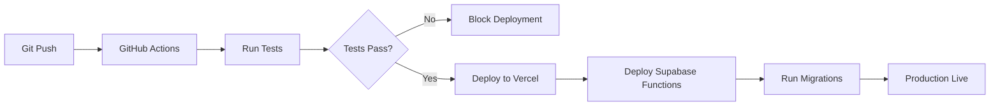

# Wottle – Technical Architecture Proposal

**Document Version:** 1.0
**Date:** 2025-11-02
**Prepared by:** Technical Game Design Lead
**Based on:** Wottle MVP PRD v1.0

---

## Table of Contents

1. [Executive Summary](#1-executive-summary)
2. [System Architecture Overview](#2-system-architecture-overview)
3. [Frontend Architecture](#3-frontend-architecture)
4. [Backend Architecture](#4-backend-architecture)
5. [Data Models & Database Schema](#5-data-models--database-schema)
6. [Game Engine Design](#6-game-engine-design)
7. [Real-Time Communication](#7-real-time-communication)
8. [Dictionary & Word Validation System](#8-dictionary--word-validation-system)
9. [Matchmaking & Lobby System](#9-matchmaking--lobby-system)
10. [Timer & Clock Management](#10-timer--clock-management)
11. [State Management & Synchronization](#11-state-management--synchronization)
12. [API Design](#12-api-design)
13. [Performance Optimization](#13-performance-optimization)
14. [Security Architecture](#14-security-architecture)
15. [Error Handling & Resilience](#15-error-handling--resilience)
16. [Testing Strategy](#16-testing-strategy)
17. [Deployment & Infrastructure](#17-deployment--infrastructure)
18. [Monitoring & Observability](#18-monitoring--observability)
19. [Future Extensibility](#19-future-extensibility)
20. [Implementation Roadmap](#20-implementation-roadmap)

---

## 1. Executive Summary

This document outlines the technical architecture for Wottle, a real-time 2-player competitive word game. The architecture is designed to meet strict performance requirements (<200ms move RTT, <50ms word validation), support real-time gameplay with chess-clock timing, and scale to handle concurrent matches while maintaining fairness and security.

**Key Technical Challenges:**
- Real-time synchronization of game state between players
- Sub-50ms word validation against 18k+ word dictionary
- Server-authoritative game logic to prevent cheating
- Complex turn mechanics (simultaneous start → turn-based)
- Mobile-responsive UI with animations (150-250ms swaps, 600-800ms highlights)
- Reconnection handling within 10-second window

**Proposed Stack:**
- **Frontend:** Next.js 16 (App Router), React 18+, TypeScript 5.x, Tailwind CSS 4.x, Framer Motion
- **Backend:** Supabase (PostgreSQL 15+, Edge Functions, Realtime)
- **Real-time:** Supabase Realtime (WebSocket-based) with fallback to REST polling
- **Hosting:** Vercel (Frontend), Supabase Cloud (Backend)
- **Dictionary:** In-memory Trie structure with binary search fallback

---

## 2. System Architecture Overview

### 2.1 High-Level Architecture

```
┌────────────────────────────────────────────────────────────────┐
│                         Client Layer                           │
│  ┌──────────────┐                          ┌──────────────┐    │
│  │   Player 1   │                          │   Player 2   │    │
│  │  (Browser)   │                          │  (Browser)   │    │
│  └──────┬───────┘                          └───────┬──────┘    │
│         │                                          │           │
│         └──────────────────┬───────────────────────┘           │
│                            │                                   │
│                    HTTPS/WSS (TLS 1.3)                         │
│                            │                                   │
└────────────────────────────┼───────────────────────────────────┘
                             │
┌────────────────────────────┼───────────────────────────────────┐
│                    API Gateway Layer                           │
│                   (Supabase Edge Network)                      │
│                            │                                   │
│         ┌──────────────────┼──────────────────┐                │
│         │                  │                  │                │
│    ┌────▼────┐      ┌──────▼─────┐    ┌──────▼─────┐           │
│    │ REST API│      │  Realtime  │    │    Auth    │           │
│    │   HTTP  │      │   Server   │    │   (JWT)    │           │
│    └────┬────┘      └──────┬─────┘    └──────┬─────┘           │
│         │                  │                 │                 │
└─────────┼──────────────────┼─────────────────┼─────────────────┘
          │                  │                 │
┌─────────┼──────────────────┼─────────────────┼─────────────────┐
│         │         Application Layer          │                 │
│         │                  │                 │                 │
│    ┌────▼────────────┐ ┌───▼──────────────┐  │                 │
│    │ Edge Functions  │ │ Realtime Channels│  │                 │
│    │  (Deno)         │ │(Presence/Broadcast) │                 │
│    │                 │ │                  │  │                 │
│    │ • Move Handler  │ └───┬──────────────┘  │                 │
│    │ • Board Gen     │     │                 │                 │
│    │ • Validation    │     │                 │                 │
│    │ • Matchmaking   │     │                 │                 │
│    └────┬────────────┘     │                 │                 │
│         │                  │                 │                 │
└─────────┼──────────────────┼─────────────────┼─────────────────┘
          │                  │                 │
┌─────────┼──────────────────┼─────────────────┼─────────────────┐
│         │          Data Layer                │                 │
│         │                  │                 │                 │
│    ┌────▼──────────────────▼─────────────────▼─────┐           │
│    │         PostgreSQL 15 (Supabase)              │           │
│    │                                               │           │
│    │  Tables: users, matches, boards, moves,       │           │
│    │          dictionaries, ratings, presence      │           │
│    │                                               │           │
│    │  Row-Level Security (RLS) enabled             │           │
│    └───────────────────────────────────────────────┘           │
│                                                                │
└────────────────────────────────────────────────────────────────┘

┌────────────────────────────────────────────────────────────────┐
│                      External Services                         │
│                                                                │
│    ┌──────────────┐         ┌──────────────┐                   │
│    │   Vercel     │         │   Sentry     │                   │
│    │  (Hosting)   │         │  (Logging)   │                   │
│    └──────────────┘         └──────────────┘                   │
└────────────────────────────────────────────────────────────────┘
```

### 2.2 Architectural Principles

1. **Server-Authoritative:** All game logic executes server-side; clients are view-only
2. **Eventually Consistent:** Real-time updates with server reconciliation
3. **Optimistic UI:** Client predicts moves while awaiting server confirmation
4. **Fail-Safe:** Degraded experience on connection loss, not complete failure
5. **Stateless Functions:** Edge functions are stateless; state persists in DB
6. **Idempotent Operations:** Moves identified by sequence number; duplicates ignored

### 2.3 Data Flow

**Move Execution Flow:**
```
Player 1 Client                  Supabase Backend                Player 2 Client
      │                                  │                              │
      │ 1. Swap tiles (A5↔D12)           │                              │
      ├─────────────────────────────────>│                              │
      │                                  │ 2. Validate move (turn, frozen)
      │                                  │ 3. Apply swap to board       │
      │                                  │ 4. Scan 8 directions         │
      │                                  │ 5. Validate words (Trie)     │
      │                                  │ 6. Calculate score           │
      │                                  │ 7. Freeze tiles              │
      │                                  │ 8. Update DB (atomic)        │
      │                                  │ 9. Broadcast via Realtime    │
      │ 10. Receive board update         │                              │
      │<─────────────────────────────────┤─────────────────────────────>│ 11. Receive board update
      │ 12. Animate swap (150-250ms)     │                              │ 12. Animate swap
      │ 13. Highlight words (600-800ms)  │                              │ 13. Highlight words
      │ 14. Update score display         │                              │ 14. Update score display
```

---

## 3. Frontend Architecture

### 3.1 Technology Stack

- **Framework:** Next.js 16 (App Router with React Server Components)
- **UI Library:** React 18+ with TypeScript 5.x
- **Styling:** Tailwind CSS 4.x + CSS Modules for complex animations
- **Animation:** Framer Motion for declarative animations + CSS transforms for 60 FPS performance
- **State Management:**
  - Zustand for global client state (lobby, user profile)
  - React Context for game state (scoped to match)
  - Jotai for atomic state (timer display, selected tiles)
- **Real-time Client:** Supabase JS Client v2 (Realtime subscriptions)
- **Form Validation:** Zod for type-safe schemas
- **Testing:** Vitest + React Testing Library + Playwright (E2E)

### 3.2 Directory Structure

```
/app
  /(auth)
    /login
      page.tsx              # Landing page with username entry
  /(game)
    /lobby
      page.tsx              # Lobby with user list & matchmaking
      components/
        UserList.tsx
        MatchmakingButton.tsx
        InvitationModal.tsx
    /match/[matchId]
      page.tsx              # Game board view
      components/
        GameBoard.tsx       # 16x16 grid
        Tile.tsx            # Individual letter tile
        PlayerInfo.tsx      # Timer + score display
        ScoreDelta.tsx      # Animated score popup
        MoveHistory.tsx     # Optional move list
  /layout.tsx               # Root layout with providers

/components
  /ui                       # Shadcn-style reusable components
    Button.tsx
    Modal.tsx
    Toast.tsx
  /game                     # Game-specific components
    LetterTile.tsx
    Timer.tsx
    ScoreBoard.tsx

/lib
  /supabase
    client.ts               # Browser client
    server.ts               # Server client (RSC)
  /game-engine
    board.ts                # Board generation & validation
    word-finder.ts          # 8-direction word scanning
    scorer.ts               # Scoring calculation
    trie.ts                 # Dictionary Trie structure
  /hooks
    useRealtimeSubscription.ts
    useGameState.ts
    useTimer.ts
    useSwapAnimation.ts
  /stores
    lobbyStore.ts           # Zustand store for lobby
    userStore.ts            # User profile & auth
  /utils
    animations.ts           # Animation configs
    constants.ts            # Game constants (BOARD_SIZE, etc.)
  /types
    game.ts                 # TypeScript types for game entities
    database.ts             # Generated Supabase types

/styles
  globals.css               # Tailwind imports + custom properties
  animations.css            # Complex keyframe animations

/public
  /sounds                   # Optional audio feedback
    swap.mp3
    word-found.mp3
    invalid.mp3
```

### 3.3 Component Architecture

**Key Components:**

1. **`<GameBoard>`** (16x16 Grid Container)
   - Renders 256 `<Tile>` components
   - Manages tile selection state (first/second tile)
   - Handles drag-and-drop + click-to-swap interactions
   - Mobile: Touch event handlers with 44×44px minimum targets
   - Responsive: Scales grid to fit viewport, enables scroll/zoom on mobile

2. **`<Tile>`** (Individual Letter Tile)
   - Props: `letter`, `position`, `isFrozen`, `ownedBy`, `isSelected`, `isHighlighted`
   - Visual states: Default, Selected, Frozen (colored overlay), Highlighted (word found)
   - Animations: Swap (transform translate), Shake (invalid), Highlight (pulsing glow)
   - Performance: React.memo to prevent unnecessary re-renders

3. **`<Timer>`** (Chess Clock Display)
   - Displays mm:ss countdown
   - Color: Green (active), neutral (paused)
   - Updates every 100ms for smooth countdown
   - Receives time from server via Realtime; client-side interpolation for smoothness

4. **`<ScoreDelta>`** (Transient Score Popup)
   - Displays breakdown: "+18 letters, +3 length, +2 combo"
   - Auto-dismiss after 2-3 seconds
   - Positioned near player's score display

5. **`<LobbyUserList>`** (Real-time User Presence)
   - Subscribes to `presence` channel
   - Displays: username, Elo (if ranked), status (available/in-game)
   - Click to invite user to match

### 3.4 State Management Strategy

**Zustand Store (Global App State):**
```typescript
// lib/stores/lobbyStore.ts
interface LobbyStore {
  users: User[]
  currentUser: User | null
  matchmakingStatus: 'idle' | 'searching' | 'matched'
  setUsers: (users: User[]) => void
  enterMatchmaking: () => void
  exitMatchmaking: () => void
}
```

**React Context (Game Match State):**
```typescript
// app/(game)/match/[matchId]/GameContext.tsx
interface GameState {
  matchId: string
  board: LetterGrid  // 16x16 array
  players: [Player, Player]
  currentTurn: 'white' | 'black' | 'simultaneous'
  moveHistory: Move[]
  frozenTiles: Map<Position, PlayerId>
  claimedWords: Map<PlayerId, Set<string>>
}

interface GameActions {
  swapTiles: (pos1: Position, pos2: Position) => Promise<void>
  syncFromServer: (update: GameStateUpdate) => void
}
```

**Jotai Atoms (Ephemeral UI State):**
```typescript
// lib/stores/gameAtoms.ts
export const selectedTilesAtom = atom<[Position | null, Position | null]>([null, null])
export const isAnimatingAtom = atom<boolean>(false)
export const highlightedWordsAtom = atom<HighlightedWord[]>([])
```

### 3.5 Animation Implementation

**Tile Swap Animation (150-250ms):**
```typescript
// components/game/Tile.tsx using Framer Motion
<motion.div
  layout
  transition={{ duration: 0.2, ease: 'easeInOut' }}
  style={{ x, y }}  // Animate position change
/>
```

**Word Highlight (600-800ms pulsing):**
```css
/* styles/animations.css */
@keyframes word-highlight {
  0% { box-shadow: 0 0 0 rgba(var(--player-color), 0); }
  30% { box-shadow: 0 0 20px rgba(var(--player-color), 0.8); }
  70% { box-shadow: 0 0 20px rgba(var(--player-color), 0.8); }
  100% { box-shadow: 0 0 0 rgba(var(--player-color), 0); }
}

.tile-highlighted {
  animation: word-highlight 0.7s ease-in-out;
}
```

**Invalid Swap Shake (300-400ms):**
```typescript
// hooks/useInvalidSwapAnimation.ts
const controls = useAnimation()
const shakeInvalidSwap = () => {
  controls.start({
    x: [0, -4, 4, -4, 4, 0],
    transition: { duration: 0.35 }
  })
}
```

### 3.6 Mobile Optimizations

1. **Touch Handling:**
   - Prevent double-tap zoom: `touch-action: manipulation` CSS
   - 44×44px minimum touch targets (iOS guidelines)
   - Visual feedback on touch (scale up 1.05x on first selection)

2. **Responsive Grid:**
   - CSS Grid with `grid-template-columns: repeat(16, minmax(0, 1fr))`
   - Max tile size: `min(calc(100vw / 16), 48px)`
   - Scrollable container for small screens

3. **Performance:**
   - `will-change: transform` for animating tiles
   - RequestAnimationFrame for smooth timer updates
   - Debounce pinch-to-zoom events (100ms)

---

## 4. Backend Architecture

### 4.1 Technology Stack

- **Database:** PostgreSQL 15+ (Supabase-managed)
- **Serverless Functions:** Supabase Edge Functions (Deno runtime)
- **Real-time:** Supabase Realtime (WebSocket protocol)
- **Authentication:** Supabase Auth (JWT-based)
- **File Storage:** Not required for MVP (future: replays, avatars)

### 4.2 Edge Functions Structure

**Core Functions:**

1. **`create-match`** (POST /functions/v1/create-match)
   - Input: `{ player1Id, player2Id, mode: 'ranked' | 'casual', seed?: number }`
   - Logic:
     1. Validate both players exist and available
     2. Generate board with seed (deterministic)
     3. Create match record in `matches` table
     4. Create initial `boards` record
     5. Assign White/Black roles randomly
     6. Initialize clocks (300s each)
     7. Return match_id + initial board state
   - Performance: <200ms (PRD requirement)

2. **`execute-move`** (POST /functions/v1/execute-move)
   - Input: `{ matchId, playerId, from: Position, to: Position, moveNumber: number }`
   - Logic:
     1. Validate player's turn (or simultaneous phase)
     2. Validate tiles not frozen
     3. Apply swap to board
     4. Scan 8 directions from swapped positions
     5. Validate words against Trie
     6. Calculate score (base + length + combo)
     7. Check word uniqueness (player-specific)
     8. Freeze claimed tiles
     9. Update clocks (pause current, add +3s increment)
     10. Store move in `moves` table
     11. Update `boards` and `matches` tables atomically
     12. Broadcast update via Realtime
   - Performance: <50ms validation (PRD requirement)
   - Idempotency: `moveNumber` ensures duplicate requests ignored

3. **`generate-board`** (Internal utility function)
   - Input: `{ seed: number, languageId: string }`
   - Output: `LetterGrid (16x16 array)`
   - Logic:
     1. Seed random number generator
     2. Place letters by weighted frequency distribution
     3. Ensure all alphabet letters appear ≥1×
     4. Embed ≥6 seed words solvable in ≤2 swaps
     5. Validate ≥20 total possible words
     6. Anti-clustering: spread seed words across grid
   - Performance: <200ms (PRD requirement)
   - Retry: Up to 3 attempts if validation fails

4. **`validate-words`** (Internal utility function)
   - Input: `{ board: LetterGrid, positions: Position[], direction: Direction }`
   - Output: `{ words: ValidWord[], score: number }`
   - Logic:
     1. Extract letter sequences in 8 directions
     2. Check each sequence ≥3 letters against Trie
     3. Return matched words with positions
   - Performance: O(n) where n = tiles scanned (~32 max per move)
   - Trie lookup: O(m) where m = word length (avg ~6 letters)
   - Total: <10ms typically

5. **`matchmaking`** (POST /functions/v1/matchmaking)
   - Input: `{ userId, mode: 'ranked' | 'casual' }`
   - Logic:
     1. Add user to `matchmaking_queue` table with timestamp
     2. Query for opponent within Elo range (±200, expanding ±50 every 10s)
     3. If match found: Create match via `create-match`, remove both from queue
     4. If no match: Return waiting status
   - Performance: <100ms query
   - Cleanup: Remove stale queue entries (>60s) via cron

6. **`handle-disconnection`** (Triggered by Realtime presence)
   - Input: `{ matchId, playerId }`
   - Logic:
     1. Pause disconnected player's clock
     2. Update match status to 'paused'
     3. Start 10-second reconnection timer (server-side)
     4. If timer expires: Resume clock; forfeit on time expiry
     5. Broadcast pause state to opponent

### 4.3 Database Functions

**PostgreSQL Functions (stored procedures for complex logic):**

1. **`calculate_elo_change(winner_elo, loser_elo, k_factor)`**
   - Standard Elo formula: `winner_delta = k * (1 - expected_score)`
   - K-factor: 32 for new players (<10 games), 24 for intermediate, 16 for experienced
   - Returns: `{ winner_new_elo, loser_new_elo }`

2. **`finalize_match(match_id)`**
   - Determines winner by score, then frozen tiles, then draw
   - Updates player Elo (if ranked)
   - Stores result in `ratings` history table
   - Updates match status to 'completed'
   - Atomic transaction

3. **`check_board_lockup(board_state, frozen_tiles)`**
   - Counts unfrozen tiles
   - Returns true if <24 unfrozen (PRD safeguard)
   - Called after each move

---

## 5. Data Models & Database Schema

### 5.1 Schema Design

**Tables:**

```sql
-- Users & Authentication
CREATE TABLE users (
  id UUID PRIMARY KEY DEFAULT gen_random_uuid(),
  username TEXT UNIQUE NOT NULL,
  email TEXT UNIQUE,  -- Optional for MVP
  elo_rating INTEGER DEFAULT 1200,
  games_played INTEGER DEFAULT 0,
  created_at TIMESTAMPTZ DEFAULT now(),
  last_seen TIMESTAMPTZ DEFAULT now(),
  CONSTRAINT username_length CHECK (char_length(username) >= 3 AND char_length(username) <= 20)
);

CREATE INDEX idx_users_elo ON users(elo_rating DESC);
CREATE INDEX idx_users_last_seen ON users(last_seen DESC);

-- Matches
CREATE TABLE matches (
  id UUID PRIMARY KEY DEFAULT gen_random_uuid(),
  player_white_id UUID REFERENCES users(id) NOT NULL,
  player_black_id UUID REFERENCES users(id) NOT NULL,
  mode TEXT NOT NULL CHECK (mode IN ('ranked', 'casual', 'challenge')),
  status TEXT DEFAULT 'active' CHECK (status IN ('active', 'paused', 'completed', 'abandoned')),
  current_turn TEXT DEFAULT 'simultaneous' CHECK (current_turn IN ('white', 'black', 'simultaneous', 'finished')),

  -- Scores
  score_white INTEGER DEFAULT 0,
  score_black INTEGER DEFAULT 0,
  frozen_tiles_white INTEGER DEFAULT 0,
  frozen_tiles_black INTEGER DEFAULT 0,

  -- Timing
  clock_white_seconds INTEGER DEFAULT 300,  -- 5:00 minutes
  clock_black_seconds INTEGER DEFAULT 300,
  time_increment_seconds INTEGER DEFAULT 3,
  last_move_at TIMESTAMPTZ DEFAULT now(),

  -- Board
  board_seed INTEGER NOT NULL,
  language_id TEXT DEFAULT 'is' CHECK (language_id IN ('is', 'en')),  -- Future extensibility

  -- Metadata
  winner_id UUID REFERENCES users(id),
  win_reason TEXT CHECK (win_reason IN ('score', 'time', 'resignation', 'lockup')),
  created_at TIMESTAMPTZ DEFAULT now(),
  completed_at TIMESTAMPTZ,

  CONSTRAINT different_players CHECK (player_white_id != player_black_id)
);

CREATE INDEX idx_matches_status ON matches(status, created_at DESC);
CREATE INDEX idx_matches_player_white ON matches(player_white_id, created_at DESC);
CREATE INDEX idx_matches_player_black ON matches(player_black_id, created_at DESC);

-- Boards (current board state per match)
CREATE TABLE boards (
  match_id UUID PRIMARY KEY REFERENCES matches(id) ON DELETE CASCADE,
  grid JSONB NOT NULL,  -- 16x16 array: [[{letter: 'A', frozen: false, owner: null}, ...], ...]
  frozen_positions JSONB DEFAULT '{}',  -- Map of "x,y" -> player_id for quick lookups
  updated_at TIMESTAMPTZ DEFAULT now()
);

-- Moves (history of all moves in a match)
CREATE TABLE moves (
  id UUID PRIMARY KEY DEFAULT gen_random_uuid(),
  match_id UUID REFERENCES matches(id) ON DELETE CASCADE NOT NULL,
  player_id UUID REFERENCES users(id) NOT NULL,
  move_number INTEGER NOT NULL,  -- Per-player move counter (1-10)

  -- Swap details
  from_position JSONB NOT NULL,  -- {x: number, y: number}
  to_position JSONB NOT NULL,

  -- Words found
  words_found JSONB DEFAULT '[]',  -- [{word: string, positions: Position[], direction: string}, ...]
  new_words_only JSONB DEFAULT '[]',  -- Words that weren't already claimed by this player

  -- Scoring
  score_base INTEGER DEFAULT 0,
  score_length_bonus INTEGER DEFAULT 0,
  score_combo_bonus INTEGER DEFAULT 0,
  score_total INTEGER DEFAULT 0,

  -- Timing
  time_remaining_ms INTEGER NOT NULL,  -- Player's clock after this move
  created_at TIMESTAMPTZ DEFAULT now(),

  CONSTRAINT unique_move_per_player UNIQUE (match_id, player_id, move_number)
);

CREATE INDEX idx_moves_match ON moves(match_id, move_number);

-- Dictionaries (language word lists)
CREATE TABLE dictionaries (
  id TEXT PRIMARY KEY,  -- e.g., 'is_nouns', 'en_scrabble'
  language TEXT NOT NULL,
  name TEXT NOT NULL,
  words JSONB NOT NULL,  -- Array of words (for backup; Trie is in-memory)
  letter_values JSONB NOT NULL,  -- Map of letter -> point value
  letter_frequencies JSONB NOT NULL,  -- Map of letter -> frequency weight for board gen
  word_count INTEGER NOT NULL,
  created_at TIMESTAMPTZ DEFAULT now()
);

-- Insert Icelandic dictionary (example)
INSERT INTO dictionaries (id, language, name, words, letter_values, letter_frequencies, word_count)
VALUES (
  'is_nouns',
  'is',
  'Icelandic Nouns (Nominative Singular)',
  '["hestur", "köttur", ...]',  -- Full word list loaded from file
  '{"a":1,"á":4,"b":3,"d":2,"ð":5,"e":1,"é":6,"f":3,"g":2,"h":4,"i":1,"í":4,"j":8,"k":2,"l":1,"m":3,"n":1,"o":2,"ó":5,"p":3,"r":1,"s":1,"t":1,"u":1,"ú":4,"v":4,"x":10,"y":4,"ý":7,"þ":4,"æ":6,"ö":6}',
  '{"a":10,"á":3,"b":4,"d":6,"ð":3,"e":8,"é":2,"f":4,"g":5,"h":3,"i":9,"í":3,"j":1,"k":5,"l":7,"m":5,"n":7,"o":4,"ó":2,"p":3,"r":9,"s":8,"t":7,"u":6,"ú":2,"v":4,"x":0.1,"y":2,"ý":0.5,"þ":2,"æ":2,"ö":2}',
  18000
);

-- Ratings history (for Elo tracking)
CREATE TABLE ratings (
  id UUID PRIMARY KEY DEFAULT gen_random_uuid(),
  user_id UUID REFERENCES users(id) NOT NULL,
  match_id UUID REFERENCES matches(id) NOT NULL,
  elo_before INTEGER NOT NULL,
  elo_after INTEGER NOT NULL,
  elo_change INTEGER NOT NULL,
  result TEXT CHECK (result IN ('win', 'loss', 'draw')),
  created_at TIMESTAMPTZ DEFAULT now()
);

CREATE INDEX idx_ratings_user ON ratings(user_id, created_at DESC);

-- Matchmaking queue
CREATE TABLE matchmaking_queue (
  user_id UUID PRIMARY KEY REFERENCES users(id) ON DELETE CASCADE,
  mode TEXT NOT NULL CHECK (mode IN ('ranked', 'casual')),
  elo_rating INTEGER NOT NULL,  -- Cached from users table for fast queries
  joined_at TIMESTAMPTZ DEFAULT now()
);

CREATE INDEX idx_matchmaking_elo ON matchmaking_queue(mode, elo_rating);

-- Presence (real-time user status)
-- Managed by Supabase Realtime; no persistent table needed

-- Claimed Words (track which words each player has found per match)
CREATE TABLE claimed_words (
  match_id UUID REFERENCES matches(id) ON DELETE CASCADE,
  player_id UUID REFERENCES users(id),
  word TEXT NOT NULL,
  claimed_at TIMESTAMPTZ DEFAULT now(),
  PRIMARY KEY (match_id, player_id, word)
);

CREATE INDEX idx_claimed_words_match ON claimed_words(match_id);
```

### 5.2 Row-Level Security (RLS) Policies

```sql
-- Enable RLS on all tables
ALTER TABLE users ENABLE ROW LEVEL SECURITY;
ALTER TABLE matches ENABLE ROW LEVEL SECURITY;
ALTER TABLE boards ENABLE ROW LEVEL SECURITY;
ALTER TABLE moves ENABLE ROW LEVEL SECURITY;
ALTER TABLE claimed_words ENABLE ROW LEVEL SECURITY;

-- Users: Can only read own profile; admins can read all
CREATE POLICY "Users can view own profile"
  ON users FOR SELECT
  USING (auth.uid() = id);

CREATE POLICY "Users can update own profile"
  ON users FOR UPDATE
  USING (auth.uid() = id);

-- Matches: Players can read matches they're in
CREATE POLICY "Players can view own matches"
  ON matches FOR SELECT
  USING (auth.uid() IN (player_white_id, player_black_id));

-- Boards: Players can read boards for their matches
CREATE POLICY "Players can view own match boards"
  ON boards FOR SELECT
  USING (
    match_id IN (
      SELECT id FROM matches
      WHERE auth.uid() IN (player_white_id, player_black_id)
    )
  );

-- Moves: Players can view moves for their matches
CREATE POLICY "Players can view own match moves"
  ON moves FOR SELECT
  USING (
    match_id IN (
      SELECT id FROM matches
      WHERE auth.uid() IN (player_white_id, player_black_id)
    )
  );

-- Dictionaries: Public read (no writes from clients)
CREATE POLICY "Dictionaries are publicly readable"
  ON dictionaries FOR SELECT
  TO authenticated
  USING (true);
```

### 5.3 Database Triggers

```sql
-- Update last_seen timestamp on user activity
CREATE OR REPLACE FUNCTION update_user_last_seen()
RETURNS TRIGGER AS $$
BEGIN
  UPDATE users SET last_seen = now() WHERE id = NEW.player_id;
  RETURN NEW;
END;
$$ LANGUAGE plpgsql;

CREATE TRIGGER trigger_update_last_seen
  AFTER INSERT ON moves
  FOR EACH ROW
  EXECUTE FUNCTION update_user_last_seen();

-- Auto-update match scores when move is inserted
CREATE OR REPLACE FUNCTION update_match_score()
RETURNS TRIGGER AS $$
BEGIN
  UPDATE matches
  SET
    score_white = score_white + CASE WHEN NEW.player_id = player_white_id THEN NEW.score_total ELSE 0 END,
    score_black = score_black + CASE WHEN NEW.player_id = player_black_id THEN NEW.score_total ELSE 0 END,
    last_move_at = now()
  WHERE id = NEW.match_id;
  RETURN NEW;
END;
$$ LANGUAGE plpgsql;

CREATE TRIGGER trigger_update_match_score
  AFTER INSERT ON moves
  FOR EACH ROW
  EXECUTE FUNCTION update_match_score();
```

---

## 6. Game Engine Design

### 6.1 Core Modules

**1. Board Generator (`lib/game-engine/board.ts`)**

```typescript
interface BoardGenConfig {
  seed: number
  size: 16  // Fixed for MVP
  languageId: string
  minSeedWords: 6
  maxSwapsToSolve: 2
  minTotalWords: 20
}

class BoardGenerator {
  private rng: SeededRandom
  private dictionary: Trie
  private letterFrequencies: Map<string, number>

  generate(config: BoardGenConfig): LetterGrid {
    const startTime = performance.now()

    // 1. Initialize empty 16x16 grid
    const grid = this.createEmptyGrid()

    // 2. Place letters by weighted distribution
    this.populateGrid(grid, this.letterFrequencies)

    // 3. Ensure all alphabet letters appear ≥1×
    this.ensureCompleteness(grid)

    // 4. Embed seed words (greedy placement)
    this.embedSeedWords(grid, config.minSeedWords)

    // 5. Validate constraints
    const wordCount = this.countPossibleWords(grid)
    if (wordCount < config.minTotalWords) {
      throw new Error('Insufficient words generated')
    }

    const elapsed = performance.now() - startTime
    if (elapsed > 200) {
      console.warn(`Board generation took ${elapsed}ms (exceeds 200ms target)`)
    }

    return grid
  }

  private embedSeedWords(grid: LetterGrid, targetCount: number): void {
    const seedWords = this.selectSeedWords(targetCount)
    const placedWords: PlacedWord[] = []

    for (const word of seedWords) {
      const placement = this.findPlacementForWord(grid, word, placedWords)
      if (placement) {
        this.placeWordInGrid(grid, word, placement)
        placedWords.push({ word, ...placement })
      }
    }
  }

  // Ensure seed words are spread across grid (anti-clustering)
  private findPlacementForWord(
    grid: LetterGrid,
    word: string,
    existing: PlacedWord[]
  ): Placement | null {
    // Try random positions; reject if too close to existing words
    const maxAttempts = 100
    for (let i = 0; i < maxAttempts; i++) {
      const placement = this.randomPlacement(grid, word.length)
      const minDistance = 4  // Minimum tile distance between seed words

      if (existing.every(p => this.distance(placement, p) >= minDistance)) {
        return placement
      }
    }
    return null
  }
}
```

**2. Word Finder (`lib/game-engine/word-finder.ts`)**

```typescript
type Direction = 'N' | 'NE' | 'E' | 'SE' | 'S' | 'SW' | 'W' | 'NW'

interface FoundWord {
  word: string
  positions: Position[]
  direction: Direction
  isNew: boolean  // Not already claimed by this player
}

class WordFinder {
  private trie: Trie

  // Find all words in 8 directions from given positions
  findWordsFromPositions(
    grid: LetterGrid,
    positions: Position[],
    claimedWords: Set<string>
  ): FoundWord[] {
    const allWords: FoundWord[] = []
    const directions: Direction[] = ['N', 'NE', 'E', 'SE', 'S', 'SW', 'W', 'NW']

    // For each affected position, scan all 8 directions
    for (const pos of positions) {
      for (const dir of directions) {
        // Scan forward and backward in this direction
        const forwardSeq = this.scanDirection(grid, pos, dir, 'forward')
        const backwardSeq = this.scanDirection(grid, pos, dir, 'backward')

        // Combine to get full sequence
        const fullSequence = [...backwardSeq.reverse(), ...forwardSeq.slice(1)]

        // Find all valid substrings ≥3 letters
        const words = this.extractValidWords(fullSequence, claimedWords)
        allWords.push(...words)
      }
    }

    // Deduplicate (same word may be found from different positions)
    return this.deduplicateWords(allWords)
  }

  private scanDirection(
    grid: LetterGrid,
    start: Position,
    dir: Direction,
    mode: 'forward' | 'backward'
  ): LetterTile[] {
    const tiles: LetterTile[] = []
    const delta = this.getDelta(dir, mode)

    let { x, y } = start
    while (this.inBounds(x, y, grid)) {
      tiles.push(grid[y][x])
      x += delta.dx
      y += delta.dy
    }

    return tiles
  }

  private extractValidWords(
    sequence: LetterTile[],
    claimedWords: Set<string>
  ): FoundWord[] {
    const words: FoundWord[] = []

    // Sliding window of size 3 to MAX_WORD_LENGTH
    for (let start = 0; start < sequence.length; start++) {
      for (let end = start + 3; end <= sequence.length; end++) {
        const substring = sequence.slice(start, end)
        const word = substring.map(t => t.letter).join('').toLowerCase()

        if (this.trie.has(word)) {
          words.push({
            word,
            positions: substring.map(t => t.position),
            direction: substring[0].direction,
            isNew: !claimedWords.has(word)
          })
        }
      }
    }

    return words
  }
}
```

**3. Scorer (`lib/game-engine/scorer.ts`)**

```typescript
interface ScoreResult {
  baseScore: number
  lengthBonus: number
  comboBonus: number
  total: number
  breakdown: string  // For display: "+18 letters, +3 length, +2 combo"
}

class Scorer {
  private letterValues: Map<string, number>

  calculateScore(words: FoundWord[]): ScoreResult {
    const newWords = words.filter(w => w.isNew)

    if (newWords.length === 0) {
      return { baseScore: 0, lengthBonus: 0, comboBonus: 0, total: 0, breakdown: '' }
    }

    // Base score: sum of letter values
    const baseScore = newWords.reduce((sum, w) => {
      return sum + this.wordValue(w.word)
    }, 0)

    // Length bonus: (word_length - 2) × 5 per word
    const lengthBonus = newWords.reduce((sum, w) => {
      return sum + (w.word.length - 2) * 5
    }, 0)

    // Multi-word combo bonus
    const n = newWords.length
    let comboBonus = 0
    if (n === 2) comboBonus = 2
    else if (n === 3) comboBonus = 5
    else if (n >= 4) comboBonus = 7 + (n - 4)

    const total = baseScore + lengthBonus + comboBonus

    return {
      baseScore,
      lengthBonus,
      comboBonus,
      total,
      breakdown: `+${baseScore} letters, +${lengthBonus} length, +${comboBonus} combo`
    }
  }

  private wordValue(word: string): number {
    return word.split('').reduce((sum, letter) => {
      return sum + (this.letterValues.get(letter.toLowerCase()) || 0)
    }, 0)
  }
}
```

**4. Trie (Dictionary Structure) (`lib/game-engine/trie.ts`)**

```typescript
class TrieNode {
  children: Map<string, TrieNode> = new Map()
  isEndOfWord: boolean = false
}

class Trie {
  private root: TrieNode = new TrieNode()
  private wordCount: number = 0

  // Build trie from word list (runs once on server startup)
  build(words: string[]): void {
    const startTime = performance.now()

    for (const word of words) {
      this.insert(word.toLowerCase())
    }

    const elapsed = performance.now() - startTime
    console.log(`Trie built with ${this.wordCount} words in ${elapsed}ms`)
  }

  insert(word: string): void {
    let node = this.root

    for (const char of word) {
      if (!node.children.has(char)) {
        node.children.set(char, new TrieNode())
      }
      node = node.children.get(char)!
    }

    if (!node.isEndOfWord) {
      node.isEndOfWord = true
      this.wordCount++
    }
  }

  // O(m) lookup where m = word length
  has(word: string): boolean {
    let node = this.root

    for (const char of word.toLowerCase()) {
      if (!node.children.has(char)) {
        return false
      }
      node = node.children.get(char)!
    }

    return node.isEndOfWord
  }

  // Optional: prefix search for autocomplete (future feature)
  findWordsWithPrefix(prefix: string): string[] {
    // ... implementation
  }
}
```

### 6.2 Move Validation Pipeline

**Edge Function: `execute-move`**

```typescript
// supabase/functions/execute-move/index.ts
import { serve } from 'https://deno.land/std/http/server.ts'
import { createClient } from '@supabase/supabase-js'

const trie = new Trie()  // Global in-memory Trie (loaded on cold start)
const wordFinder = new WordFinder(trie)
const scorer = new Scorer(letterValues)

serve(async (req) => {
  try {
    const { matchId, playerId, from, to, moveNumber } = await req.json()

    // 1. Fetch match and board
    const { data: match } = await supabase
      .from('matches')
      .select('*, boards(*)')
      .eq('id', matchId)
      .single()

    // 2. Validate turn
    if (!validateTurn(match, playerId)) {
      return new Response('Not your turn', { status: 403 })
    }

    // 3. Validate tiles not frozen
    if (match.boards.frozen_positions[`${from.x},${from.y}`] ||
        match.boards.frozen_positions[`${to.x},${to.y}`]) {
      return new Response('Cannot swap frozen tiles', { status: 400 })
    }

    // 4. Apply swap
    const newGrid = applySwap(match.boards.grid, from, to)

    // 5. Find words (performance-critical: <50ms)
    const startValidation = performance.now()
    const claimedWords = await getClaimedWords(matchId, playerId)
    const foundWords = wordFinder.findWordsFromPositions(newGrid, [from, to], claimedWords)
    const validationTime = performance.now() - startValidation

    if (validationTime > 50) {
      console.warn(`Word validation took ${validationTime}ms (exceeds 50ms target)`)
    }

    // 6. Calculate score
    const scoreResult = scorer.calculateScore(foundWords)

    // 7. Freeze tiles
    const newFrozenPositions = { ...match.boards.frozen_positions }
    foundWords.filter(w => w.isNew).forEach(w => {
      w.positions.forEach(pos => {
        newFrozenPositions[`${pos.x},${pos.y}`] = playerId
      })
    })

    // 8. Update clocks
    const isWhite = playerId === match.player_white_id
    const newClock = (isWhite ? match.clock_white_seconds : match.clock_black_seconds) + 3

    // 9. Atomic DB update
    await supabase.rpc('execute_move_transaction', {
      p_match_id: matchId,
      p_player_id: playerId,
      p_move_number: moveNumber,
      p_from: from,
      p_to: to,
      p_words_found: foundWords,
      p_score: scoreResult,
      p_new_grid: newGrid,
      p_new_frozen: newFrozenPositions,
      p_new_clock: newClock
    })

    // 10. Broadcast via Realtime
    await supabase.channel(`match:${matchId}`).send({
      type: 'broadcast',
      event: 'move',
      payload: {
        player: playerId,
        from,
        to,
        words: foundWords.filter(w => w.isNew),
        score: scoreResult,
        newGrid,
        frozenPositions: newFrozenPositions
      }
    })

    return new Response(JSON.stringify({ success: true, score: scoreResult }))

  } catch (error) {
    console.error('Move execution error:', error)
    return new Response(error.message, { status: 500 })
  }
})
```

---

## 7. Real-Time Communication

### 7.1 Supabase Realtime Channels

**Channel Structure:**

1. **`lobby:presence`** (Presence channel for online users)
   - Tracks all logged-in users
   - Payload: `{ userId, username, elo, status: 'available' | 'in-game' }`
   - Updates on login/logout/match start/match end

2. **`match:{matchId}`** (Broadcast channel per game)
   - Subscribes both players when match starts
   - Events:
     - `move`: Board update after player swaps tiles
     - `pause`: Opponent disconnected
     - `resume`: Opponent reconnected
     - `end`: Match completed
   - Payload includes full game state for reconciliation

### 7.2 Client Subscription Pattern

```typescript
// hooks/useRealtimeSubscription.ts
import { useEffect } from 'react'
import { supabase } from '@/lib/supabase/client'

export function useMatchSubscription(matchId: string, onUpdate: (payload: any) => void) {
  useEffect(() => {
    const channel = supabase.channel(`match:${matchId}`)

    channel
      .on('broadcast', { event: 'move' }, ({ payload }) => {
        onUpdate(payload)
      })
      .on('broadcast', { event: 'pause' }, ({ payload }) => {
        // Show "Opponent disconnected" message
        onUpdate({ type: 'pause', ...payload })
      })
      .subscribe((status) => {
        if (status === 'SUBSCRIBED') {
          console.log('Connected to match channel')
        }
      })

    return () => {
      supabase.removeChannel(channel)
    }
  }, [matchId, onUpdate])
}
```

### 7.3 Optimistic Updates

**Client-Side Flow:**

1. Player swaps tiles → **Immediately animate swap on client** (optimistic)
2. Send request to `execute-move` function
3. Await server response:
   - **Success:** Server broadcasts update; client reconciles (should match optimistic state)
   - **Failure:** Rollback optimistic update; show error; restore previous board state

**Example:**

```typescript
// components/game/GameBoard.tsx
const handleSwap = async (from: Position, to: Position) => {
  // Optimistic update
  setIsAnimating(true)
  const optimisticGrid = applySwapLocally(grid, from, to)
  setGrid(optimisticGrid)

  try {
    const response = await fetch('/api/execute-move', {
      method: 'POST',
      body: JSON.stringify({ matchId, playerId, from, to, moveNumber })
    })

    if (!response.ok) {
      // Rollback
      setGrid(previousGrid)
      showError('Invalid move')
    }
    // Server will broadcast; subscription handler updates state
  } catch (error) {
    // Network error: rollback
    setGrid(previousGrid)
    showError('Connection error')
  } finally {
    setIsAnimating(false)
  }
}
```

### 7.4 Reconnection Handling

**Server-Side (Edge Function triggered by Realtime presence):**

```typescript
// When player disconnects from Realtime channel
supabase.channel(`match:${matchId}`).on('presence', { event: 'leave' }, ({ key }) => {
  const playerId = key

  // Pause player's clock
  await supabase.rpc('pause_player_clock', { match_id: matchId, player_id: playerId })

  // Broadcast pause to opponent
  await supabase.channel(`match:${matchId}`).send({
    type: 'broadcast',
    event: 'pause',
    payload: { disconnectedPlayer: playerId }
  })

  // Set 10-second timer
  setTimeout(async () => {
    // Check if player reconnected
    const { data: match } = await supabase.from('matches').select('status').eq('id', matchId).single()
    if (match.status === 'paused') {
      // Resume clock (player forfeits if time expires)
      await supabase.rpc('resume_player_clock', { match_id: matchId, player_id: playerId })
    }
  }, 10000)
})
```

**Client-Side:**

```typescript
// Detect connection loss and attempt reconnect
window.addEventListener('online', () => {
  // Resubscribe to Realtime channel
  supabase.channel(`match:${matchId}`).subscribe()

  // Fetch latest game state from server
  fetchMatchState(matchId).then(state => {
    reconcileLocalState(state)
  })
})
```

---

## 8. Dictionary & Word Validation System

### 8.1 Dictionary Loading Strategy

**Server Initialization (Edge Function cold start):**

1. Load dictionary from `dictionaries` table (18k words for Icelandic)
2. Build in-memory Trie structure (~10-20ms for 18k words)
3. Cache Trie in global variable (persists across function invocations within same instance)
4. Letter values and frequencies also cached in memory

**Performance:**

- Trie build time: <50ms for 18k words
- Memory usage: ~5-10MB for Icelandic Trie
- Lookup time: O(m) where m = word length (~6 chars avg) = ~6 operations

### 8.2 Word Validation Algorithm

**Pseudocode:**

```
function validateWord(word: string, trie: Trie): boolean {
  normalized = word.toLowerCase().normalize('NFC')  // Unicode normalization
  return trie.has(normalized)
}
```

**Edge Cases:**

- **Diacritics:** Treat Icelandic special characters (ð, þ, æ, etc.) as distinct letters
- **Case-insensitive:** "HESTUR" = "hestur"
- **Unicode normalization:** Ensure consistent character encoding (NFC)

### 8.3 Multi-Language Support

**Extensibility Design:**

1. Each language has separate dictionary entry in `dictionaries` table
2. Match stores `language_id` (e.g., 'is', 'en')
3. Board generation and validation use language-specific:
   - Word list (Trie)
   - Letter values (for scoring)
   - Letter frequencies (for board generation)
4. UI text translated via i18n library (next-intl)

**Future Languages:**

- English: Scrabble dictionary (~172k words)
- Danish: Similar to Icelandic
- Other languages: Plug in dictionary file + letter values/frequencies

---

## 9. Matchmaking & Lobby System

### 9.1 Lobby Presence System

**Implementation using Supabase Realtime Presence:**

```typescript
// Client: Join lobby on login
const presenceChannel = supabase.channel('lobby:presence')

presenceChannel
  .on('presence', { event: 'sync' }, () => {
    const state = presenceChannel.presenceState()
    const users = Object.values(state).flat()
    setLobbyUsers(users)
  })
  .on('presence', { event: 'join' }, ({ newPresences }) => {
    console.log('User joined:', newPresences)
  })
  .on('presence', { event: 'leave' }, ({ leftPresences }) => {
    console.log('User left:', leftPresences)
  })
  .subscribe(async (status) => {
    if (status === 'SUBSCRIBED') {
      await presenceChannel.track({
        userId: currentUser.id,
        username: currentUser.username,
        elo: currentUser.elo_rating,
        status: 'available'
      })
    }
  })
```

**Display:**

- Real-time list of online users with username, Elo, and status
- Sortable by Elo or username
- Click user to send challenge invitation

### 9.2 Matchmaking Algorithms

**1. Direct Invitation (Challenge Mode):**

```typescript
// Client: Send invitation
const sendChallenge = async (targetUserId: string) => {
  const { data } = await supabase.rpc('send_challenge', {
    from_user_id: currentUser.id,
    to_user_id: targetUserId,
    mode: 'challenge'
  })

  // Target user receives notification via Realtime
}

// Target user: Accept/decline
const acceptChallenge = async (invitationId: string) => {
  const { data } = await supabase.rpc('accept_challenge', { invitation_id: invitationId })
  // Creates match; both players redirected to game
}
```

**2. Immediate Rated Pairing:**

```typescript
// Edge Function: matchmaking
async function findMatch(userId: string, userElo: number) {
  // Add to queue
  await supabase.from('matchmaking_queue').insert({
    user_id: userId,
    mode: 'ranked',
    elo_rating: userElo,
    joined_at: new Date()
  })

  // Search for opponent within Elo range
  let eloRange = 200
  let opponent = null

  while (!opponent && eloRange <= 500) {
    const { data } = await supabase
      .from('matchmaking_queue')
      .select('*')
      .neq('user_id', userId)
      .gte('elo_rating', userElo - eloRange)
      .lte('elo_rating', userElo + eloRange)
      .order('joined_at', { ascending: true })
      .limit(1)
      .single()

    if (data) {
      opponent = data
    } else {
      // Expand range and retry
      await sleep(10000)  // Wait 10s
      eloRange += 50
    }
  }

  if (opponent) {
    // Remove both from queue
    await supabase.from('matchmaking_queue').delete().in('user_id', [userId, opponent.user_id])

    // Create match
    const match = await createMatch(userId, opponent.user_id, 'ranked')

    // Notify both players via Realtime
    return match
  }

  // If no match after expanding to ±500, send invitation to closest Elo
  return sendClosestEloInvitation(userId, userElo)
}
```

### 9.3 Invitation System

**Database Schema (ephemeral table):**

```sql
CREATE TABLE invitations (
  id UUID PRIMARY KEY DEFAULT gen_random_uuid(),
  from_user_id UUID REFERENCES users(id),
  to_user_id UUID REFERENCES users(id),
  mode TEXT,
  status TEXT DEFAULT 'pending' CHECK (status IN ('pending', 'accepted', 'declined', 'expired')),
  created_at TIMESTAMPTZ DEFAULT now(),
  expires_at TIMESTAMPTZ DEFAULT now() + INTERVAL '60 seconds'
);
```

**Expiration:** Invitations auto-expire after 60 seconds (cron job cleanup)

---

## 10. Timer & Clock Management

### 10.1 Server-Side Clock Authority

**Database Fields:**

```sql
matches {
  clock_white_seconds INTEGER DEFAULT 300,
  clock_black_seconds INTEGER DEFAULT 300,
  last_move_at TIMESTAMPTZ DEFAULT now()
}
```

**Clock Update Logic (in `execute-move` function):**

```typescript
function updateClock(match: Match, playerId: string): { newClock: number, opponentClock: number } {
  const isWhite = playerId === match.player_white_id
  const currentClock = isWhite ? match.clock_white_seconds : match.clock_black_seconds

  // Calculate elapsed time since last move
  const elapsed = (Date.now() - match.last_move_at.getTime()) / 1000
  const remainingTime = currentClock - elapsed

  // Add increment
  const newClock = remainingTime + match.time_increment_seconds

  return { newClock, opponentClock: isWhite ? match.clock_black_seconds : match.clock_white_seconds }
}
```

**Time Forfeit Check:**

```typescript
// Cron job (runs every 10 seconds)
async function checkTimeForfeits() {
  const { data: activeMatches } = await supabase
    .from('matches')
    .select('*')
    .eq('status', 'active')

  for (const match of activeMatches) {
    const elapsed = (Date.now() - match.last_move_at.getTime()) / 1000
    const whiteTime = match.clock_white_seconds - (match.current_turn === 'white' ? elapsed : 0)
    const blackTime = match.clock_black_seconds - (match.current_turn === 'black' ? elapsed : 0)

    if (whiteTime <= 0) {
      await forfeitMatch(match.id, match.player_black_id, 'time')
    } else if (blackTime <= 0) {
      await forfeitMatch(match.id, match.player_white_id, 'time')
    }
  }
}
```

### 10.2 Client-Side Clock Display

**Smooth Countdown (interpolation):**

```typescript
// hooks/useTimer.ts
export function useTimer(initialTime: number, isActive: boolean) {
  const [displayTime, setDisplayTime] = useState(initialTime)
  const lastServerUpdate = useRef(Date.now())

  useEffect(() => {
    if (!isActive) return

    const interval = setInterval(() => {
      const elapsed = (Date.now() - lastServerUpdate.current) / 1000
      setDisplayTime(Math.max(0, initialTime - elapsed))
    }, 100)  // Update every 100ms for smooth countdown

    return () => clearInterval(interval)
  }, [initialTime, isActive])

  // Sync with server updates
  useEffect(() => {
    lastServerUpdate.current = Date.now()
    setDisplayTime(initialTime)
  }, [initialTime])

  return displayTime
}
```

**Display Format:**

```typescript
function formatTime(seconds: number): string {
  const mins = Math.floor(seconds / 60)
  const secs = Math.floor(seconds % 60)
  return `${mins}:${secs.toString().padStart(2, '0')}`
}
```

---

## 11. State Management & Synchronization

### 11.1 Source of Truth Hierarchy

1. **Database (PostgreSQL):** Persistent source of truth
2. **Server (Edge Functions):** Authoritative game logic
3. **Client (React State):** View layer; reconciles with server

### 11.2 State Synchronization Flow

**Initial Load:**

```typescript
// On match page load
async function loadMatch(matchId: string) {
  // Fetch current match state from DB
  const { data } = await supabase
    .from('matches')
    .select('*, boards(*), moves(*)')
    .eq('id', matchId)
    .single()

  // Hydrate client state
  setGameState({
    board: data.boards.grid,
    scores: { white: data.score_white, black: data.score_black },
    clocks: { white: data.clock_white_seconds, black: data.clock_black_seconds },
    currentTurn: data.current_turn,
    frozenTiles: data.boards.frozen_positions
  })

  // Subscribe to real-time updates
  subscribeToMatch(matchId)
}
```

**Real-Time Updates:**

```typescript
// When server broadcasts move
function handleMoveUpdate(payload: MovePayload) {
  // Reconcile with optimistic state
  if (isOptimisticUpdatePending && payload.moveNumber === pendingMoveNumber) {
    // Optimistic update was correct; no action needed
    clearOptimisticState()
  } else {
    // Server state differs; apply server version (authoritative)
    setGameState({
      board: payload.newGrid,
      frozenTiles: payload.frozenPositions,
      scores: payload.scores,
      clocks: payload.clocks
    })
  }

  // Trigger animations
  animateSwap(payload.from, payload.to)
  highlightWords(payload.words)
}
```

### 11.3 Conflict Resolution

**Scenario:** Both players submit move during simultaneous phase

**Resolution:**

1. Server receives both requests nearly simultaneously
2. Database transaction ensures only one executes (row-level locking on `matches` table)
3. First request wins; second is rejected with 409 Conflict
4. Second player's client receives error; retries with updated board state

---

## 12. API Design

### 12.1 REST API Endpoints

**Authentication:**

```
POST /auth/v1/signup
Body: { username: string, password?: string }
Response: { user: User, session: Session }

POST /auth/v1/token
Body: { username: string, password?: string }
Response: { access_token: string, refresh_token: string }
```

**Matchmaking:**

```
POST /functions/v1/matchmaking
Headers: Authorization: Bearer <token>
Body: { mode: 'ranked' | 'casual' }
Response: { status: 'searching' | 'matched', matchId?: string }

POST /functions/v1/send-challenge
Body: { toUserId: string, mode: string }
Response: { invitationId: string }

POST /functions/v1/accept-challenge
Body: { invitationId: string }
Response: { matchId: string }
```

**Game Actions:**

```
POST /functions/v1/create-match
Body: { player1Id: string, player2Id: string, mode: string, seed?: number }
Response: { matchId: string, initialBoard: LetterGrid }

POST /functions/v1/execute-move
Body: { matchId: string, playerId: string, from: Position, to: Position, moveNumber: number }
Response: { success: boolean, score: ScoreResult, words: FoundWord[] }

POST /functions/v1/resign
Body: { matchId: string, playerId: string }
Response: { success: boolean, winnerId: string }

GET /functions/v1/match/:matchId
Response: { match: Match, board: Board, moves: Move[] }
```

**Lobby:**

```
GET /rest/v1/users?select=*&order=elo_rating.desc
Response: User[]
```

### 12.2 Real-Time Events (Supabase Channels)

**Lobby Presence:**

```typescript
Channel: 'lobby:presence'
Event: 'sync' | 'join' | 'leave'
Payload: { userId, username, elo, status }
```

**Match Updates:**

```typescript
Channel: 'match:{matchId}'
Event: 'move'
Payload: {
  player: string,
  from: Position,
  to: Position,
  words: FoundWord[],
  score: ScoreResult,
  newGrid: LetterGrid,
  frozenPositions: Record<string, string>
}

Event: 'pause'
Payload: { disconnectedPlayer: string }

Event: 'resume'
Payload: { reconnectedPlayer: string }

Event: 'end'
Payload: { winnerId: string, reason: string, finalScores: { white: number, black: number } }
```

---

## 13. Performance Optimization

### 13.1 Performance Targets (from PRD)

| Metric | Target | Strategy |
|--------|--------|----------|
| Move RTT | <200ms | Edge functions + optimistic UI |
| Word validation | <50ms | In-memory Trie lookup |
| Board generation | <200ms | Seeded RNG + caching patterns |
| Match length | 10-20min | Enforced by 10-move limit + clocks |
| Reconnect window | ≤10s | Server-side pause + client retry |
| Frame rate (animations) | 60 FPS | CSS transforms + GPU acceleration |

### 13.2 Database Query Optimization

**Indexes:**

```sql
CREATE INDEX idx_matches_status ON matches(status, created_at DESC);
CREATE INDEX idx_moves_match ON moves(match_id, move_number);
CREATE INDEX idx_matchmaking_elo ON matchmaking_queue(mode, elo_rating);
```

**Query Patterns:**

1. **Fetch active match:** `SELECT * FROM matches WHERE id = $1` (primary key lookup = O(1))
2. **Fetch moves:** `SELECT * FROM moves WHERE match_id = $1 ORDER BY move_number` (indexed)
3. **Matchmaking search:** `SELECT * FROM matchmaking_queue WHERE mode = $1 AND elo_rating BETWEEN $2 AND $3 ORDER BY joined_at LIMIT 1` (indexed)

**Connection Pooling:**

- Supabase provides built-in connection pooling (PgBouncer)
- Edge functions reuse connections across invocations

### 13.3 Frontend Optimizations

**React Performance:**

1. **Memoization:**
   ```typescript
   const Tile = React.memo(({ letter, isFrozen, onClick }) => {
     // Only re-renders if props change
   })
   ```

2. **Virtual Rendering (if needed for move history):**
   - Use `react-window` for long move lists
   - Not critical for MVP (10 moves max)

3. **Code Splitting:**
   ```typescript
   const GameBoard = lazy(() => import('@/components/game/GameBoard'))
   ```

4. **Lazy Loading Dictionaries:**
   - Dictionary loaded server-side only (not sent to client)
   - Client only receives validation results

**Animation Performance:**

- Use `transform` and `opacity` for 60 FPS (GPU-accelerated)
- Avoid `width`, `height`, `top`, `left` (triggers layout reflow)
- Example:
  ```css
  .tile-swap {
    transform: translate(var(--x), var(--y));
    transition: transform 0.2s ease-in-out;
    will-change: transform;
  }
  ```

### 13.4 Caching Strategy

**Server-Side:**

1. **Dictionary Trie:** Cached in Edge Function global scope (persists across invocations)
2. **Letter values/frequencies:** Cached in memory
3. **Match state:** Fetched from DB; no caching (real-time consistency required)

**Client-Side:**

1. **Static assets:** Next.js automatically caches JS/CSS bundles
2. **User profile:** Cached in Zustand store
3. **Match state:** Not cached (always from Realtime subscription)

---

## 14. Security Architecture

### 14.1 Authentication & Authorization

**Supabase Auth (JWT-based):**

1. User logs in with username (password optional for MVP)
2. Supabase issues JWT token (access token + refresh token)
3. Client stores token in HttpOnly cookie (Next.js middleware)
4. All API requests include token in `Authorization: Bearer <token>` header
5. Edge functions validate token via `supabase.auth.getUser()`

**Row-Level Security (RLS):**

- Enforces data access at database level
- Users can only read/update their own matches
- See Section 5.2 for RLS policies

### 14.2 Input Validation

**Server-Side Validation (Edge Functions):**

```typescript
import { z } from 'zod'

const MoveSchema = z.object({
  matchId: z.string().uuid(),
  playerId: z.string().uuid(),
  from: z.object({ x: z.number().min(0).max(15), y: z.number().min(0).max(15) }),
  to: z.object({ x: z.number().min(0).max(15), y: z.number().min(0).max(15) }),
  moveNumber: z.number().int().min(1).max(10)
})

// In execute-move function
const input = MoveSchema.parse(await req.json())
```

**Client-Side Validation (pre-flight checks):**

- UI prevents invalid moves (e.g., frozen tiles not selectable)
- Not relied upon for security (server re-validates)

### 14.3 Anti-Cheating Measures

1. **Server-Authoritative Logic:** All move validation and scoring on server
2. **No Client-Side Dictionary:** Word list not exposed to client
3. **Move Sequence Numbers:** Prevent replay attacks (duplicate move submissions ignored)
4. **Clock Enforcement:** Server-side timing prevents time manipulation
5. **Rate Limiting:** Edge Functions have built-in rate limiting (60 requests/min per user)

### 14.4 Network Security

1. **HTTPS/WSS Only:** All traffic encrypted with TLS 1.3
2. **CORS Policy:** Restrict API access to known origins (Vercel domain)
3. **JWT Expiration:** Access tokens expire after 1 hour; refresh tokens after 7 days
4. **Secrets Management:** API keys stored in environment variables (Vercel secrets)

---

## 15. Error Handling & Resilience

### 15.1 Error Categories

**1. Client Errors (4xx):**

- `400 Bad Request`: Invalid move (frozen tiles, out of bounds, etc.)
- `403 Forbidden`: Not player's turn
- `404 Not Found`: Match doesn't exist
- `409 Conflict`: Concurrent move attempt during simultaneous phase

**2. Server Errors (5xx):**

- `500 Internal Server Error`: Unexpected failure (logged to Sentry)
- `503 Service Unavailable`: Database connection failure

### 15.2 Error Handling Patterns

**Edge Function Error Handling:**

```typescript
try {
  // Move execution logic
} catch (error) {
  if (error instanceof ValidationError) {
    return new Response(error.message, { status: 400 })
  } else if (error instanceof TurnError) {
    return new Response('Not your turn', { status: 403 })
  } else {
    // Log to Sentry
    console.error('Unexpected error:', error)
    Sentry.captureException(error)
    return new Response('Internal server error', { status: 500 })
  }
}
```

**Client-Side Error Handling:**

```typescript
// components/game/GameBoard.tsx
const handleSwap = async (from: Position, to: Position) => {
  try {
    const response = await fetch('/api/execute-move', { ... })

    if (!response.ok) {
      const errorText = await response.text()

      if (response.status === 400) {
        showInvalidSwapAnimation(from, to)
        toast.error(errorText)
      } else if (response.status === 403) {
        toast.error("It's not your turn!")
      } else {
        toast.error('An error occurred. Please try again.')
      }

      rollbackOptimisticUpdate()
    }
  } catch (networkError) {
    // Network failure
    toast.error('Connection lost. Reconnecting...')
    attemptReconnect()
  }
}
```

### 15.3 Graceful Degradation

**Scenario: Realtime WebSocket fails**

1. Client detects connection loss (Supabase Realtime status = 'CLOSED')
2. Fallback to REST polling every 2 seconds:
   ```typescript
   const fallbackInterval = setInterval(async () => {
     const { data } = await supabase.from('matches').select('*, boards(*)').eq('id', matchId).single()
     updateGameState(data)
   }, 2000)
   ```
3. Display banner: "Using slow connection mode"
4. Attempt WebSocket reconnect every 10 seconds

**Scenario: Board generation times out**

1. Retry with new seed (up to 3 attempts)
2. If all fail: Cancel match; return players to lobby with error message

---

## 16. Testing Strategy

### 16.1 Unit Tests

**Backend (Deno Test):**

```typescript
// lib/game-engine/trie.test.ts
Deno.test('Trie.has() returns true for valid words', () => {
  const trie = new Trie()
  trie.build(['hestur', 'köttur', 'hundur'])

  assertEquals(trie.has('hestur'), true)
  assertEquals(trie.has('HESTUR'), true)  // Case-insensitive
  assertEquals(trie.has('invalid'), false)
})

// lib/game-engine/scorer.test.ts
Deno.test('Scorer calculates correct combo bonus', () => {
  const scorer = new Scorer(letterValues)
  const words = [
    { word: 'hestur', isNew: true },
    { word: 'köttur', isNew: true }
  ]

  const result = scorer.calculateScore(words)
  assertEquals(result.comboBonus, 2)  // 2 words = +2 bonus
})
```

**Frontend (Vitest + React Testing Library):**

```typescript
// components/game/Tile.test.tsx
import { render, screen } from '@testing-library/react'
import { Tile } from './Tile'

test('Tile displays letter', () => {
  render(<Tile letter="A" position={{ x: 0, y: 0 }} />)
  expect(screen.getByText('A')).toBeInTheDocument()
})

test('Frozen tile has colored overlay', () => {
  const { container } = render(<Tile letter="A" isFrozen={true} ownedBy="player1" />)
  expect(container.querySelector('.tile-frozen')).toHaveClass('border-player1')
})
```

### 16.2 Integration Tests

**Match Flow (E2E with Playwright):**

```typescript
// tests/e2e/match-flow.spec.ts
test('Complete match flow', async ({ page }) => {
  // 1. Login
  await page.goto('/login')
  await page.fill('input[name="username"]', 'player1')
  await page.click('button[type="submit"]')

  // 2. Start match (mocked matchmaking)
  await page.goto('/lobby')
  await page.click('text=Start a game')

  // Wait for match to start
  await page.waitForURL(/\/match\/.+/)

  // 3. Make a move
  await page.click('[data-tile="0,0"]')  // Select first tile
  await page.click('[data-tile="1,1"]')  // Swap with second tile

  // 4. Verify animation and score update
  await page.waitForSelector('.tile-swap', { state: 'visible' })
  const scoreElement = await page.textContent('[data-testid="player-score"]')
  expect(parseInt(scoreElement)).toBeGreaterThan(0)
})
```

### 16.3 Performance Tests

**Load Testing (Artillery.io):**

```yaml
# artillery.yml
config:
  target: 'https://wottle.com'
  phases:
    - duration: 300  # 5 minutes
      arrivalRate: 10  # 10 new users per second
scenarios:
  - name: 'Matchmaking and game'
    flow:
      - post:
          url: '/functions/v1/matchmaking'
          json:
            mode: 'casual'
      - think: 2
      - post:
          url: '/functions/v1/execute-move'
          json:
            matchId: '{{ matchId }}'
            from: { x: 0, y: 0 }
            to: { x: 1, y: 1 }
```

**Metrics to Monitor:**

- Move RTT: p50, p95, p99 latencies
- Word validation time
- Database query performance
- WebSocket connection success rate

---

## 17. Deployment & Infrastructure

### 17.1 Hosting Architecture

**Frontend (Vercel):**

- Next.js 16 app deployed to Vercel
- Automatic deployments from `main` branch (GitHub integration)
- Edge Network for CDN (static assets)
- Environment variables for Supabase URL + API keys

**Backend (Supabase Cloud):**

- PostgreSQL database (managed)
- Edge Functions (Deno runtime on Cloudflare Workers)
- Realtime server (WebSocket)
- Authentication service

### 17.2 Environment Configuration

**Development:**

```env
# .env.local
NEXT_PUBLIC_SUPABASE_URL=https://xxx.supabase.co
NEXT_PUBLIC_SUPABASE_ANON_KEY=eyJ...
SUPABASE_SERVICE_ROLE_KEY=eyJ...  # Server-side only
DATABASE_URL=postgresql://...
```

**Production:**

- Secrets stored in Vercel environment variables
- Supabase production instance (separate from dev)
- Enable RLS policies
- CORS restricted to production domain

### 17.3 Deployment Pipeline



**CI/CD Steps:**

1. Push to `main` branch
2. GitHub Actions runs unit + integration tests
3. If tests pass: Vercel auto-deploys frontend
4. Supabase CLI deploys Edge Functions (`supabase functions deploy`)
5. Database migrations applied (`supabase db push`)

### 17.4 Rollback Strategy

**Frontend Rollback:**

- Vercel supports instant rollback to previous deployment (one-click in dashboard)

**Database Rollback:**

- Database migrations use versioning (e.g., `20250101_add_moves_table.sql`)
- Rollback script: `supabase db reset --to <version>`
- Critical: Test migrations in staging first

---

## 18. Monitoring & Observability

### 18.1 Logging

**Backend Logs (Supabase Edge Functions):**

- All `console.log()` output captured in Supabase dashboard
- Structured logging with JSON:
  ```typescript
  console.log(JSON.stringify({
    event: 'move_executed',
    matchId,
    playerId,
    validationTime: 42,
    wordsFound: 3
  }))
  ```

**Frontend Logs:**

- Browser console in development
- Production: Send errors to Sentry (see below)

### 18.2 Error Tracking (Sentry)

**Setup:**

```typescript
// lib/sentry.ts
import * as Sentry from '@sentry/nextjs'

Sentry.init({
  dsn: process.env.SENTRY_DSN,
  environment: process.env.NODE_ENV,
  tracesSampleRate: 0.1,  // 10% of transactions for performance monitoring
})
```

**Error Capture:**

```typescript
try {
  await executeMove(...)
} catch (error) {
  Sentry.captureException(error, {
    tags: { matchId, playerId },
    extra: { from, to }
  })
}
```

### 18.3 Performance Monitoring

**Metrics to Track:**

| Metric | Tool | Alert Threshold |
|--------|------|----------------|
| Move RTT | Custom logging + Sentry | >300ms (p95) |
| Word validation time | Edge Function logs | >75ms |
| Database query time | Supabase dashboard | >100ms |
| Realtime latency | Supabase Realtime metrics | >500ms |
| Frontend FPS | Browser DevTools | <55 FPS |

**Custom Performance Marks:**

```typescript
// Edge Function
performance.mark('validation-start')
const words = wordFinder.findWords(...)
performance.mark('validation-end')
const duration = performance.measure('validation', 'validation-start', 'validation-end')
console.log(`Validation took ${duration.duration}ms`)
```

### 18.4 Dashboards

**Supabase Dashboard:**

- Real-time database metrics (queries/sec, connection count)
- Edge Function invocations and errors
- Realtime connections (active WebSockets)

**Custom Dashboard (Grafana or Supabase Observability):**

- Match creation rate (matches/hour)
- Average match duration
- User retention (day 1, day 7)
- Word validation performance (p50, p95, p99)

---

## 19. Future Extensibility

### 19.1 Multi-Language Support

**Design for Extensibility:**

1. **Dictionary Table:** Each language has separate entry with `language_id`
2. **Match Configuration:** Store `language_id` in `matches` table
3. **UI Localization:** Use `next-intl` for translating UI strings
4. **Letter Values:** Per-language configuration in `dictionaries.letter_values`

**Adding New Language:**

1. Prepare word list (TXT file, one word per line)
2. Define letter values and frequencies (JSON)
3. Insert into `dictionaries` table:
   ```sql
   INSERT INTO dictionaries (id, language, name, words, letter_values, letter_frequencies, word_count)
   VALUES ('en_scrabble', 'en', 'English Scrabble', '["aardvark", ...]', '{...}', '{...}', 172000)
   ```
4. Update UI to allow language selection in lobby

### 19.2 Game Modes

**Future Modes:**

1. **Blitz Mode:** 3+2 time control (faster games)
2. **Puzzle Mode:** Daily challenge with pre-generated board
3. **Team Mode:** 2v2 with shared boards
4. **Tournaments:** Bracket-style elimination

**Extensibility Points:**

- `matches.mode` field supports custom values
- Time control stored in `matches` table (configurable)
- Board generation algorithm accepts parameters

### 19.3 Social Features

**Roadmap:**

1. **Friend System:** Follow/unfollow users; challenge friends directly
2. **Chat:** In-game text chat (Supabase Realtime broadcast)
3. **Spectator Mode:** Watch live matches (read-only Realtime subscription)
4. **Replays:** Save match history; replay move-by-move
5. **Leaderboards:** Global and regional Elo rankings

**Database Extensions:**

```sql
CREATE TABLE friendships (
  user_id UUID REFERENCES users(id),
  friend_id UUID REFERENCES users(id),
  created_at TIMESTAMPTZ DEFAULT now(),
  PRIMARY KEY (user_id, friend_id)
);

CREATE TABLE chat_messages (
  id UUID PRIMARY KEY DEFAULT gen_random_uuid(),
  match_id UUID REFERENCES matches(id),
  sender_id UUID REFERENCES users(id),
  message TEXT NOT NULL,
  created_at TIMESTAMPTZ DEFAULT now()
);
```

### 19.4 Mobile Apps

**React Native Consideration:**

- Current codebase uses Next.js (web-focused)
- Share game engine logic (`lib/game-engine/`) via npm package
- Build separate React Native app for iOS/Android
- Use same Supabase backend (API compatibility)

**Alternative: PWA (Progressive Web App):**

- Add service worker for offline support
- Enable "Add to Home Screen" on mobile
- Faster than native app development for MVP+1

---

## 20. Implementation Roadmap

### 20.1 Phase 1: Core Infrastructure (Weeks 1-2)

**Deliverables:**

- [x] Supabase project setup (database, auth, Realtime)
- [x] Next.js 16 app scaffolding
- [x] Database schema implementation (all tables + RLS)
- [x] Trie structure + Icelandic dictionary loading
- [x] Basic authentication (username-only login)

**Testing:**

- Unit tests for Trie
- Database migrations applied successfully

---

### 20.2 Phase 2: Game Engine (Weeks 3-4)

**Deliverables:**

- [x] Board generation algorithm
- [x] Word finder (8-direction scanning)
- [x] Scoring system (base + length + combo)
- [x] Edge Function: `create-match`
- [x] Edge Function: `execute-move`

**Testing:**

- Unit tests for board generation, word finding, scoring
- Integration test: Create match → Execute move → Validate score

---

### 20.3 Phase 3: Frontend & Real-Time (Weeks 5-6)

**Deliverables:**

- [x] Lobby page with user presence
- [x] Game board component (16x16 grid)
- [x] Tile swap animations (150-250ms)
- [x] Word highlight animations (600-800ms)
- [x] Timer display with clock logic
- [x] Realtime subscriptions (lobby + match)

**Testing:**

- E2E test: Login → Join lobby → Start match → Make move
- Visual regression tests (Chromatic or Percy)

---

### 20.4 Phase 4: Matchmaking & Game Flow (Weeks 7-8)

**Deliverables:**

- [x] Matchmaking algorithm (Elo-based pairing)
- [x] Invitation system (challenge mode)
- [x] Reconnection handling (10-second window)
- [x] Game end conditions (move limit, time expiry, resignation)
- [x] Elo rating updates

**Testing:**

- E2E test: Full match from lobby to completion
- Test reconnection flow (simulate disconnect)

---

### 20.5 Phase 5: Polish & Launch (Weeks 9-10)

**Deliverables:**

- [x] Mobile responsive design (touch controls, scrolling, zoom)
- [x] Error handling (all edge cases from PRD Section 10)
- [x] Performance optimization (target <200ms RTT, <50ms validation)
- [x] Sentry integration for error tracking
- [x] Final E2E testing on staging environment
- [x] Production deployment (Vercel + Supabase)

**Testing:**

- Load testing (Artillery.io)
- User acceptance testing (internal playtest)
- Performance benchmarking

---

### 20.6 Post-Launch (Weeks 11+)

**Priorities:**

1. Monitor metrics (retention, match completion rate, performance)
2. Fix critical bugs (based on Sentry reports)
3. Gather user feedback
4. Plan Phase 2 features (tournaments, spectator mode, etc.)

---

## Appendix A: Key Performance Benchmarks

| Operation | Target | Measurement Method |
|-----------|--------|-------------------|
| Board generation | <200ms | `performance.now()` in Edge Function |
| Word validation | <50ms | `performance.now()` in `execute-move` |
| Move RTT (client → server → client) | <200ms | Client-side timestamp on send/receive |
| Trie lookup | O(m) where m = word length | Unit test with 10k lookups |
| Database query (fetch match) | <50ms | Supabase dashboard query stats |
| Realtime broadcast latency | <100ms | Custom logging (send timestamp in payload) |

---

## Appendix B: Database Migration Example

```sql
-- migrations/20250102_initial_schema.sql
CREATE TABLE users (
  id UUID PRIMARY KEY DEFAULT gen_random_uuid(),
  username TEXT UNIQUE NOT NULL,
  elo_rating INTEGER DEFAULT 1200,
  created_at TIMESTAMPTZ DEFAULT now()
);

CREATE TABLE matches (
  id UUID PRIMARY KEY DEFAULT gen_random_uuid(),
  player_white_id UUID REFERENCES users(id),
  player_black_id UUID REFERENCES users(id),
  status TEXT DEFAULT 'active',
  created_at TIMESTAMPTZ DEFAULT now()
);

-- Enable RLS
ALTER TABLE users ENABLE ROW LEVEL SECURITY;
ALTER TABLE matches ENABLE ROW LEVEL SECURITY;

-- Policies
CREATE POLICY "Users can view own profile"
  ON users FOR SELECT
  USING (auth.uid() = id);
```

**Apply Migration:**

```bash
supabase db push
```

---

## Appendix C: Code Organization Guidelines

**Naming Conventions:**

- **Files:** `kebab-case.ts` (e.g., `word-finder.ts`)
- **Components:** `PascalCase.tsx` (e.g., `GameBoard.tsx`)
- **Functions:** `camelCase` (e.g., `executeMove()`)
- **Constants:** `UPPER_SNAKE_CASE` (e.g., `BOARD_SIZE`)

**Folder Structure Rules:**

- `/app`: Next.js pages (App Router)
- `/components`: Reusable UI components
- `/lib`: Shared utilities and game logic (can be used server/client)
- `/supabase/functions`: Edge Functions (Deno runtime)
- `/tests`: Test files (co-located with source or in `/tests` directory)

**Import Order:**

1. External libraries (React, Next.js, Supabase)
2. Internal modules (`@/lib/...`, `@/components/...`)
3. Relative imports (`./...`)

---

## Conclusion

This technical architecture provides a comprehensive blueprint for implementing Wottle MVP. The architecture prioritizes:

1. **Performance:** Sub-200ms move RTT and sub-50ms validation via edge computing and in-memory data structures
2. **Fairness:** Server-authoritative logic prevents cheating; Elo-based matchmaking ensures balanced games
3. **Scalability:** Supabase's managed infrastructure scales automatically; stateless Edge Functions handle concurrent matches
4. **Extensibility:** Multi-language support and game mode variations designed from the start
5. **Reliability:** Reconnection handling, graceful degradation, and comprehensive error handling ensure robust gameplay

**Next Steps:**

1. Review and approve this architecture document
2. Begin Phase 1 implementation (infrastructure setup)
3. Establish development/staging/production environments
4. Set up CI/CD pipeline
5. Schedule weekly technical reviews to track progress against roadmap

**Questions or Clarifications:**

For any technical questions or needed clarifications, please refer to:

- Wottle MVP PRD (`wottle_prd.md`) for product requirements
- This document for implementation details
- Supabase documentation for platform-specific features
- Next.js 16 documentation for frontend patterns

---

**Document Status:** Draft v1.0
**Last Updated:** 2025-11-02
**Prepared By:** Technical Game Design Lead
**Approved By:** [Pending Review]
